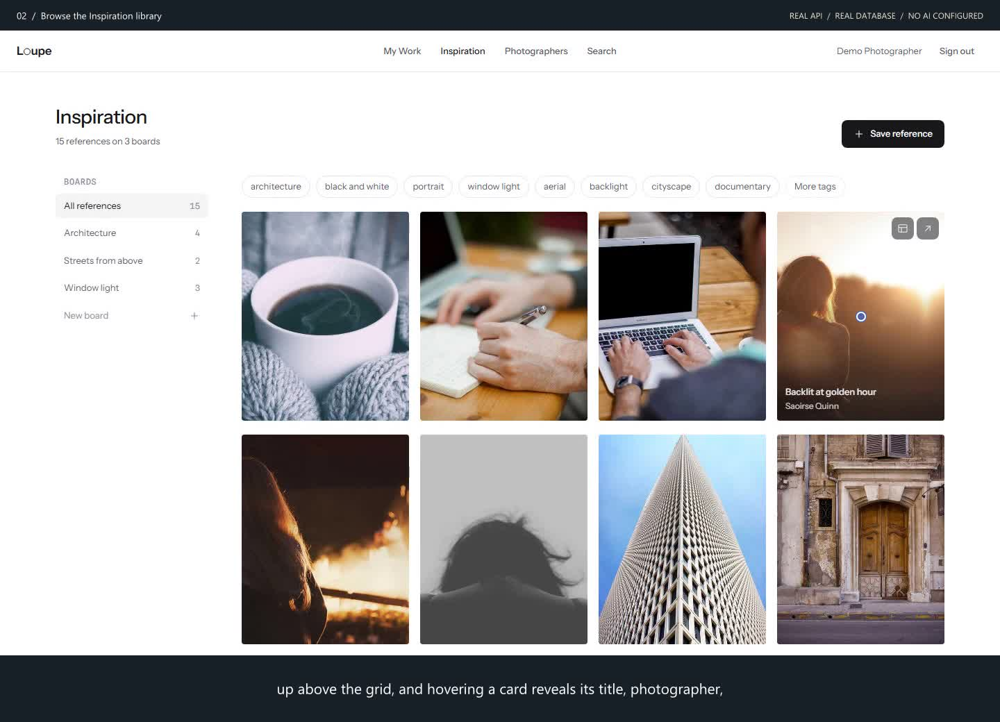

# Loupe

**Develop your photographic eye with actionable AI critiques and a private, searchable library of the work that inspires you.**

[](global.json)
[](frontend/package.json)
[](backend/README.md)
[](#testing)
[](CODE_OF_CONDUCT.md)

Loupe is a web platform for photographers who want to improve deliberately. Upload
a photograph with a brief, receive a structured critique that cites what is visible
in the frame, keep notes, and compare later attempts. Alongside your own work,
Loupe keeps an **Inspiration** library of reference images and photographer
portfolios — organised with boards, tags and keyword search — so the pictures
that move you are always one query away.

## Table of contents

- [Demo](#demo)
- [Features](#features)
- [Architecture](#architecture)
- [Repository layout](#repository-layout)
- [Getting started](#getting-started)
- [Configuration](#configuration)
- [Testing](#testing)
- [Documentation](#documentation)
- [Contributing](#contributing)
- [Security](#security)
- [Support](#support)
- [License](#license)

## Demo

**Inspiration library and keyword search** — a narrated, two-and-a-half-minute
walk through the real application against the real API, worker and database:
sign in, browse, upload a reference, organise it into boards, filter by tag, add
tags and notes, and find everything again with keyword search. Click the poster
to play (GitHub opens the MP4 in its video player).

[](docs/demo/inspiration/inspiration-tour.mp4)

| | |
| --- | --- |
| ▶ **Video** | [`docs/demo/inspiration/inspiration-tour.mp4`](docs/demo/inspiration/inspiration-tour.mp4) (142 s, 1440 × 1040, 12.9 MB, narrated and captioned) |
| 📖 **Chapters, transcript and how it was recorded** | [`docs/demo/inspiration/README.md`](docs/demo/inspiration/README.md) |
| 🎞 **All demo recordings** (critique, API + worker, design system) | [`docs/demo/README.md`](docs/demo/README.md) |

Everything in the recording is real, persisted state: no mocked product
responses, no fixtures, and no AI provider configured (the badge in the video
header says so).

## Features

| Area | What you can do |
| --- | --- |
| **My Work** | Upload photographs with a brief and feedback preferences, keep private notes, revisit saved critiques, and compare later attempts side by side. |
| **AI critique** | Structured feedback — strengths, technical observations, composition, three priority improvements and a practice exercise — that respects your intent, cites visible evidence and acknowledges uncertainty. Runs as durable background work with status, retry and regeneration. |
| **Inspiration library** | Save reference images by upload or from a link (with safe, robots-aware import and a manual fallback), keeping preview, source link, attribution and your own notes. |
| **Boards and tags** | Organise a reference into any number of boards; add, edit and categorise tags; filter the collection by tag; review AI-suggested descriptions and tags before they apply. |
| **Photographers** | Bookmark photographer portfolios, link references to them, and keep editable, grounded summaries. |
| **Search** | Keyword search across titles, notes, tags, attribution and photographers, combined with board and tag filters, paging and navigable URL state. Meaning (semantic) search is planned on the same surface. |
| **Privacy and durability** | Every library is private to its owner: local accounts, Loupe-issued JWTs in secure HttpOnly cookies with server-side revocation, private media storage, revision-protected edits, idempotent uploads and an audited deletion ledger. |

## Architecture

Loupe is three deliverables that share one design language:

```text
┌──────────────────────┐   HTTPS /api   ┌──────────────────────┐        ┌──────────────┐
│  loupe (Angular 22)  │ ─────────────▶ │  Loupe.Api (.NET 10) │ ─────▶ │  PostgreSQL  │
│  api · domain ·      │                │  MediatR · EF Core   │        │  + pgvector  │
│  components libs     │                └──────────┬───────────┘        └──────▲───────┘
└──────────────────────┘                           │ durable operations        │
        reads tokens from                          ▼                           │
┌──────────────────────┐                ┌──────────────────────┐               │
│  design-system       │                │  Loupe.Worker        │ ──────────────┘
│  (static Vite site)  │                │  critique · import · │   private media (libvips)
└──────────────────────┘                │  analysis · cleanup  │
                                        └──────────────────────┘
```

- **Backend** (`backend/`) — Clean Architecture with dependencies pointing inward:
  `Loupe.Domain` → `Loupe.Application` (commands, queries, handlers, validators,
  vertical slices) → `Loupe.Infrastructure` (EF Core/Npgsql, libvips imaging,
  safe outbound fetching) → `Loupe.Api` (thin controllers dispatching through
  MediatR 12.5.0) and `Loupe.Worker` (leased background operations).
  `Loupe.Admin` provisions accounts.
- **Frontend** (`frontend/`) — an Angular workspace: the `loupe` application plus
  `api` (contracts, injection tokens and HTTP adapters), `domain` (components that
  consume those contracts) and `components` (publishable presentational
  primitives). State lives in signals; every service is consumed through an
  interface and an `InjectionToken`.
- **Design system** (`design-system/`) — an independent static site that owns the
  `--lp-*` design tokens and the component reference; the front end mirrors the
  tokens at build time.
- **Acceptance** (`e2e/`) — Playwright (Chromium) with the Page Object Model;
  backend behaviour is proven by integration tests against the real API.

Engineering conventions — incremental delivery, acceptance-test-driven
development, one type per file, and the rest — are recorded in
[`AGENTS.md`](AGENTS.md).

## Repository layout

```text
loupe/
├── backend/            .NET solution: src/ (Domain, Application, Infrastructure, Api, Worker, Admin) and tests/
├── frontend/           Angular workspace: projects/loupe, projects/api, projects/domain, projects/components
├── design-system/      Standalone token and component reference site (Vite)
├── e2e/                Playwright acceptance suite (page-objects/, specs/) and demo recording scripts (demo/)
├── docs/
│   ├── specs/          L1 high-level and L2 detailed requirements with acceptance criteria
│   ├── detailed-designs/  Per-subsystem design documents with rendered diagrams
│   ├── demo/           Demo recordings, posters, chapters and the reproducible recording harness
│   ├── mocks/          Static visual mockups that seeded the design
│   └── operations/     Runbooks
├── tasks/              Implementation plan, checklist and evidence log
└── AGENTS.md           Engineering conventions for people and coding agents
```

## Getting started

### Prerequisites

| Tool | Version | Notes |
| --- | --- | --- |
| .NET SDK | 10.0.303+ | pinned in [`global.json`](global.json) |
| Node.js / npm | 24.18.x / 11 | see [`frontend/README.md`](frontend/README.md) |
| Docker Desktop | current, Linux containers | PostgreSQL, backend acceptance tests and the demo stack run in containers |
| PowerShell | 7+ | repository scripts |
| Playwright browsers | Chromium | `npx playwright install chromium` in `e2e/` and `design-system/` |

Windows note: the backend's image pipeline uses `NetVips`, whose prebuilt Windows
native package lacks HEVC support and crashes in this codebase; run the API,
worker and their tests in the provided Linux containers.

### Build

```powershell
# Backend
dotnet build backend/Loupe.slnx
dotnet format backend/Loupe.slnx --verify-no-changes --no-restore

# Frontend (mirrors design tokens, builds the three libraries, then the app)
cd frontend
npm ci
npm run build

# Design system
cd ../design-system
npm ci
npm run build
npm run preview        # http://127.0.0.1:4187
```

### Run the full stack locally

The quickest way to see Loupe running end to end is the demo harness, which
starts PostgreSQL, applies the real migrations, builds and runs `Loupe.Api` and
`Loupe.Worker` in Linux containers, provisions local accounts, and serves the
Angular app over HTTPS with `/api` proxied same-origin:

```powershell
pwsh docs/demo/harness/setup.ps1              # then open https://localhost:4200
pwsh docs/demo/harness/teardown.ps1
```

The harness accepts `-Prefix`, `-DbPort`, `-ApiPort` and `-AppPort` so several
isolated stacks can coexist. It provisions the demo-only account
`photographer@example.com` / `local acceptance password`; never reuse those
credentials anywhere deployed. Production-style configuration, account
provisioning with `Loupe.Admin`, and the worker's operating model are described
in [`backend/README.md`](backend/README.md).

## Configuration

Runtime settings follow the Microsoft.Extensions configuration model
(`Section__Key` as environment variables). The essentials:

| Setting | Purpose |
| --- | --- |
| `ConnectionStrings__Library` | PostgreSQL connection string shared by API, worker and admin CLI |
| `Media__Root` | Absolute, private directory for uploaded and imported images |
| `Jwt__SigningKey` (`Jwt__Issuer`, `Jwt__Audience`) | Base64 key of ≥ 32 random bytes; keep it secret and stable across instances |
| `Browser__AllowedOrigins__0…` | Explicit HTTPS origins allowed to call the API from a browser |
| `Ai__Mode`, `Ai__Endpoint`, `Ai__Deployment`, `Ai__Model`, `Ai__ApiKey` | Azure OpenAI critique and metadata generation; omit to disable AI features (the app then reports "integration not configured", never sample output) |
| `Imports__Mode` | `Live` enables real, SSRF-checked retrieval of reference and portfolio URLs |
| `Cleanup__PollInterval` | Worker maintenance cadence (≤ 5 minutes) |

Supply secrets through your deployment's secret store; nothing in this repository
contains real credentials.

## Testing

| Suite | Command | Notes |
| --- | --- | --- |
| Backend integration tests | `./backend/Test.ps1` (`-Filter FullyQualifiedName~Search` to narrow) | Builds the acceptance container and runs xUnit against real PostgreSQL via Testcontainers |
| Frontend acceptance | `cd frontend && npm test` | Playwright (Chromium) with page objects; starts its own deterministic composition on port 4207 |
| Design system | `cd design-system && npm test` | Playwright, including accessibility checks |
| C# formatting | `dotnet format backend/Loupe.slnx --verify-no-changes --no-restore` | The frontend ships a Prettier configuration for editor formatting |

Tests prove behaviour, never structure: there are deliberately no architecture,
naming or traceability tests.

## Documentation

- [Requirements — L1 overview](docs/specs/L1.md) and [L2 acceptance criteria](docs/specs/L2.md)
- [Detailed designs by subsystem](docs/detailed-designs/) (C4, class and sequence diagrams)
- [Backend guide](backend/README.md) · [Frontend guide](frontend/README.md) · [Design system guide](design-system/README.md)
- [Demo recordings and the reproducible harness](docs/demo/README.md)
- [Operations runbooks](docs/operations/)
- [Engineering conventions (`AGENTS.md`)](AGENTS.md) and the [implementation plan](tasks/plan.md)

## Contributing

Contributions are welcome. Please read [CONTRIBUTING.md](CONTRIBUTING.md) for the
development workflow (small, acceptance-test-first slices), the conventions the
codebase enforces, and how pull requests are reviewed. This project follows the
[Contributor Covenant Code of Conduct](CODE_OF_CONDUCT.md).

## Security

Please do not report security vulnerabilities through public issues. See
[SECURITY.md](SECURITY.md) for how to report privately and what to expect.

## Support

Questions and bug reports go through GitHub Issues; see [SUPPORT.md](SUPPORT.md).

## License

This repository does not yet include a license file. Until one is added, all
rights are reserved by the author; please open an issue if you would like to use
Loupe beyond reading the source. Third-party packages retain their own licenses —
notably MediatR is pinned to 12.5.0, the last release under Apache-2.0.
