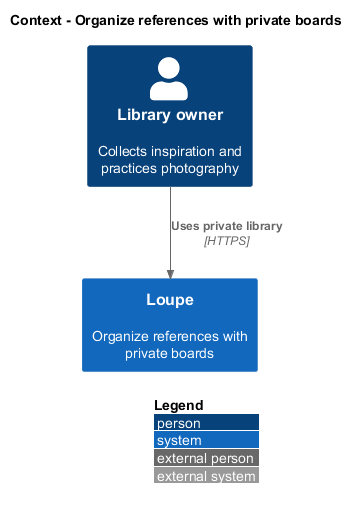
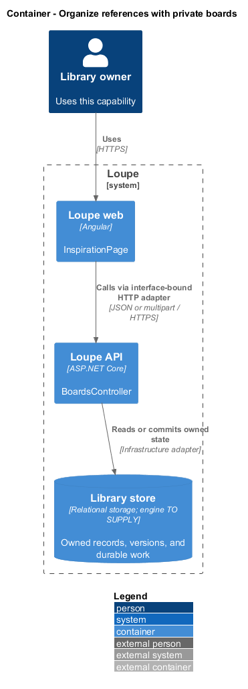
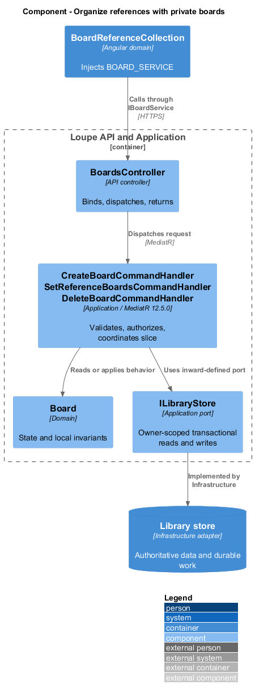
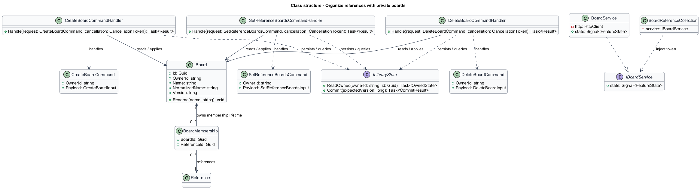
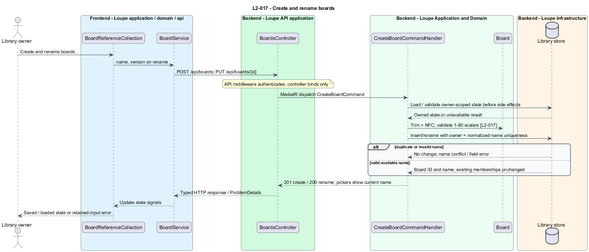
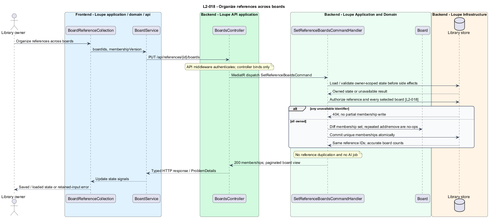
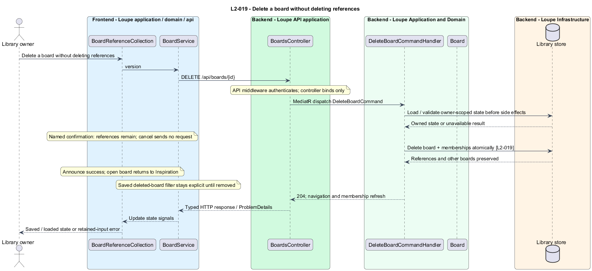

# Organize references with private boards

## Overview

A **board** — named private collection of reference memberships — groups inspiration without copying images. A **membership** — association between one board and one reference — permits the same reference to appear in several collections. Deleting a board removes associations, not the references themselves.

This is a proposed design for the defined requirements. Existing files are illustrative HTML mockups; the repository contains no corresponding production implementation.

## Description

`InspirationPage` lives in `frontend/projects/loupe` and owns routing and dialogs. `BoardReferenceCollection` lives in `frontend/projects/domain` and consumes `IBoardService` through `BOARD_SERVICE`. The contract and token share `board.service.contract.ts` in `frontend/projects/api`. `BoardService` is the separate production HTTP adapter. Composition substitutes a mock implementation under Playwright. State uses signals, and HTTP and observable conversion stay inside the adapter. Presentational controls in `components` consume inputs and emit outputs. Component class, template, and styles occupy separate files.

`BoardsController` lives in `backend/src/Loupe.Api/Controllers` under `Loupe.Api.Controllers`. It binds requests, dispatches MediatR **12.5.0**, and returns results. Requests, handlers, and validators live in the matching feature namespace in `Loupe.Application`. `Board` lives in `Loupe.Domain`; the domain references no other project. `ILibraryStore` and capability ports belong to Application. Infrastructure implements persistence and external adapters. Each type occupies its own named file.

`BoardReferenceCollection` injects `BOARD_SERVICE`; the application owns create, rename, and delete dialogs. `CreateBoardCommandHandler` and `RenameBoardCommandHandler` normalize names with trim, NFC, and invariant case-insensitive comparison while retaining display spelling. A unique `(OwnerId, NormalizedName)` constraint resolves concurrent duplicate names. Names contain 1–80 Unicode scalar values. Conflict and invalid-name errors leave prior state unchanged.

`SetReferenceBoardsCommandHandler` receives a reference identifier, expected membership version, and selected board identifiers. It authorizes the entire set before changing anything. `BoardMembership` uses a unique board/reference key. The transaction diffs the selected set, making repeated additions and removals idempotent. A foreign or missing identifier returns 404 without partial updates. No membership operation clones the reference or schedules AI.

`ListBoardsQueryHandler` sorts pickers by invariant case-insensitive ordinal name and identifier. `ListBoardReferencesQueryHandler` joins current owned memberships to references, returns an accurate membership count, and uses shared reference pagination. Empty boards offer an add-reference action. Rename preserves identifier and membership, so all reads show the new name immediately.

The delete dialog names the board and states that references remain. Cancellation sends no mutation. `DeleteBoardCommandHandler` removes the board and its memberships in one transaction. Foreign keys do not cascade from board to reference. Successful deletion refreshes navigation and pickers, announces success, and returns an open board page to Inspiration.

Search validates board filters against current ownership before running. A saved URL containing a deleted board returns an unavailable-filter result and offers explicit removal. It never silently broadens results. Board membership filters read authoritative data immediately and do not depend on vector reindexing.

The following contract surface names the proposed operations. Background commands run in the worker after a separate admission request; local evaluation commands run in the evaluation project.

| Application request | Entry point | Input |
| --- | --- | --- |
| `CreateBoardCommand` | `POST /api/boards; PUT /api/boards/{id}` | `name, version on rename` |
| `SetReferenceBoardsCommand` | `PUT /api/references/{id}/boards` | `boardIds, membershipVersion` |
| `DeleteBoardCommand` | `DELETE /api/boards/{id}` | `version` |

All operations inherit [shared contracts and open dependencies](../../README.md). Owner identity comes from authenticated server context, never from trusted client input. Mutations validate complete input before side effects and use conditional writes. API errors use the shared status mapping in [L2.md](../../../specs/L2.md#shared-acceptance-definitions). Visual implementation uses mirrored `--lp-` tokens and the specification's viewport matrix.

Implementation proceeds one behavior at a time using the linked Given-When-Then criteria. Each acceptance test first fails for its expected missing behavior. API integration tests cover persistence and failures. Playwright tests use one page object per screen and injected service mocks. Real-provider release checks supplement deterministic fixtures where applicable. Each acceptance file identifies L2 coverage and each test names its criterion. Regression checks pass before the next behavior starts; no architecture tests are introduced.

## Requirements

The table preserves source wording verbatim, including its use of “must”. Quoted requirements are the sole exception to the design prose's shall/should/may convention. Each linked source section also supplies the acceptance criteria; deployment choices and unexecuted release evidence remain explicitly identified.

| L2 ID | Refines (L1) | Requirement |
| --- | --- | --- |
| `L2-017` | `L1-005` | Users must be able to create and rename private boards with names unique within their own library using the shared normalization rules. |
| `L2-018` | `L1-005` | A reference must support zero or more board memberships. Membership changes must operate on the underlying reference without duplicating it or generating AI work. |
| `L2-019` | `L1-005` | Deleting a board must remove the board and its memberships while preserving all references. The UI must state that effect in its confirmation dialog. |

Acceptance criteria: [L2-017](../../../specs/L2.md#l2-017-create-and-rename-boards), [L2-018](../../../specs/L2.md#l2-018-organize-references-across-boards), [L2-019](../../../specs/L2.md#l2-019-delete-a-board-without-deleting-references).

## Diagrams

The context view places this capability within the owner's private Loupe library. External services appear only where the slice uses provider or source content.

The container view separates Angular interaction, the .NET API, and authoritative persistence. Durable background work appears where processing continues after admission.

The component view shows dispatch into Application handlers and inward-defined ports. Infrastructure supplies the persistence and provider implementations.

The class view names the proposed state, requests, handlers, and interface-bound frontend service. Typed associations and dependencies show which element owns behavior.

The create and rename boards sequence traces `L2-017` through its enforcing operations. The accompanying Description defines state changes and significant recovery paths.

The organize references across boards sequence traces `L2-018` through its enforcing operations. The accompanying Description defines state changes and significant recovery paths.

The delete a board without deleting references sequence traces `L2-019` through its enforcing operations. The accompanying Description defines state changes and significant recovery paths.

