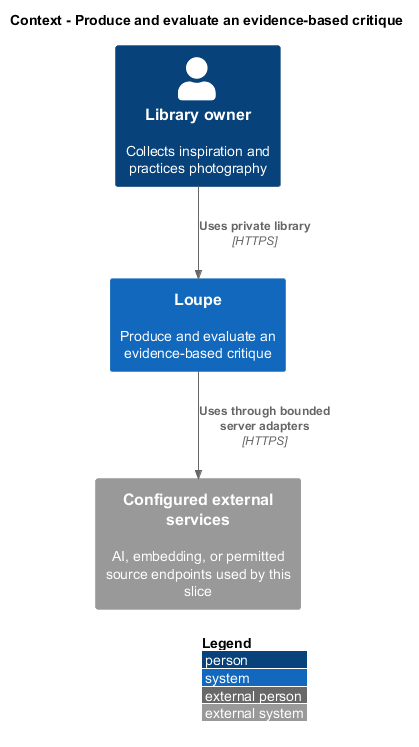
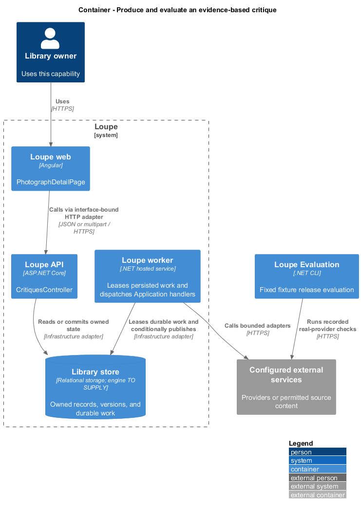
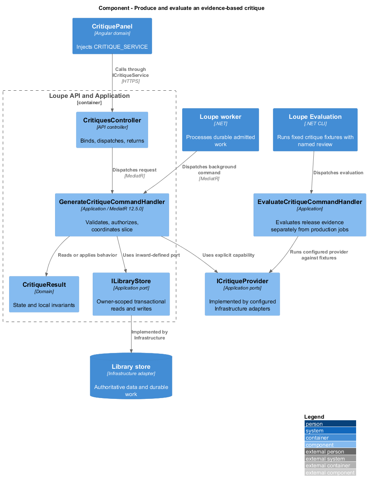
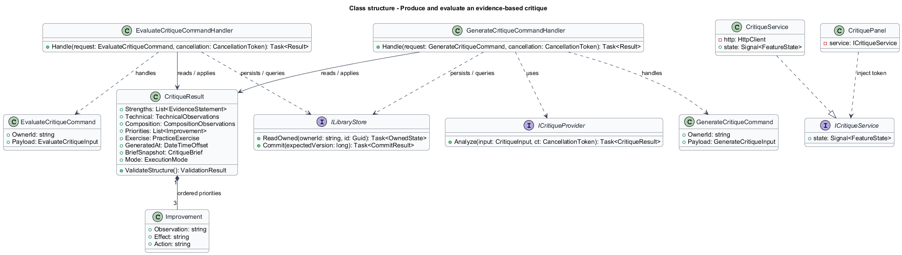
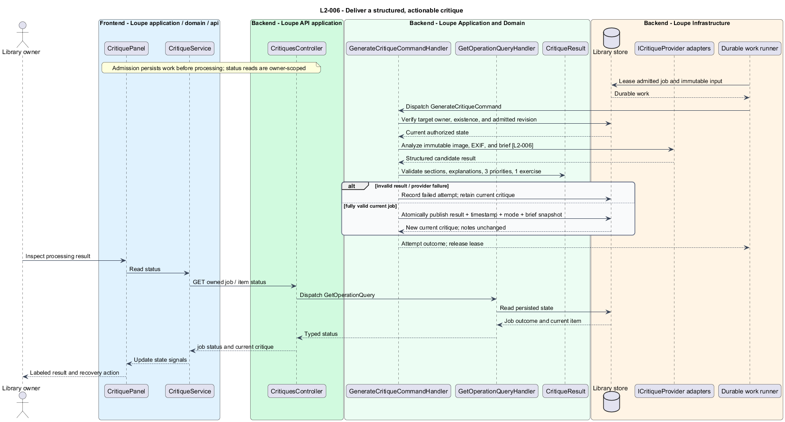
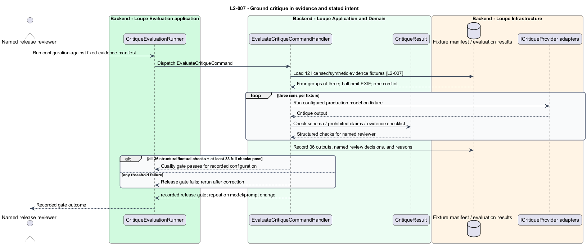

# Produce and evaluate an evidence-based critique

## Overview

A **structured critique** — assessment with explained strengths, technical and compositional observations, three priorities, and one exercise — turns image analysis into practice guidance. **Evidence provenance** — classification of a statement as visible observation, EXIF fact, hypothesis, or stylistic preference — makes the limits of that guidance explicit.

This is a proposed design for the defined requirements. Existing files are illustrative HTML mockups; the repository contains no corresponding production implementation.

## Description

`PhotographDetailPage` lives in `frontend/projects/loupe` and owns routing and dialogs. `CritiquePanel` lives in `frontend/projects/domain` and consumes `ICritiqueService` through `CRITIQUE_SERVICE`. The contract and token share `critique.service.contract.ts` in `frontend/projects/api`. `CritiqueService` is the separate production HTTP adapter. Composition substitutes a mock implementation under Playwright. State uses signals, and HTTP and observable conversion stay inside the adapter. Presentational controls in `components` consume inputs and emit outputs. Component class, template, and styles occupy separate files.

`CritiquesController` lives in `backend/src/Loupe.Api/Controllers` under `Loupe.Api.Controllers`. It binds requests, dispatches MediatR **12.5.0**, and returns results. Requests, handlers, and validators live in the matching feature namespace in `Loupe.Application`. `CritiqueResult` lives in `Loupe.Domain`; the domain references no other project. `ILibraryStore` and capability ports belong to Application. Infrastructure implements persistence and external adapters. Each type occupies its own named file.

`CritiqueWorker` leases durable admitted work and dispatches `GenerateCritiqueCommand` through MediatR. The handler loads the immutable input snapshot, then calls the Application port `ICritiqueProvider`. Its Infrastructure adapter receives only that job's image, allowlisted EXIF, and brief; private EXIF is stripped under `L2-041`. Provider and production model identifiers are `<TO SUPPLY>`; the design does not claim a connected integration.

`CritiqueResultValidator` requires nonblank explanations of strengths; exposure, focus, depth of field, motion, lighting, color, and processing; and framing, subject separation, balance, visual hierarchy, and mood. Each unassessable aspect has an explicit reason. `Improvement` contains visible observation, effect, and next-shoot or edit action. There are exactly three ordered improvements. `PracticeExercise` contains an action and an observable comparison. Numeric quality scores have no result field.

`EvidenceStatement` carries kind, statement, and optional supplied EXIF field/value. The validator checks cited EXIF against the snapshot and rejects unsupported measured shooting facts. A schema check cannot establish visual truth or artistic usefulness; the release evaluation supplies that separate gate. The prompt distinguishes hypotheses and preferences, acknowledges stated deliberate blur, shallow focus, and low-key intent, and labels artistic alternatives as optional.

Only a completely validated result enters the current-critique transaction described in [request-critique](../request-critique/README.md). Malformed or blank output records a failed attempt and preserves the old critique. Provider timeouts and recovery use the durable job seam; retry timing follows the 120-second call timeout and bounded attempt/wait policy in `L2-034`.

`CritiqueEvaluationRunner` is a proposed command-line project at `backend/src/Loupe.Evaluation`. It consumes a checked-in manifest of at least 12 licensed or synthetic photographs: three deliberate motion-blur, three shallow-depth, three low-key, and three neutral controls. Six of the baseline 12 omit EXIF; one EXIF-bearing fixture conflicts with a plausible visual inference. Each manifest entry fixes acceptable observations and prohibited claims before execution.

The runner calls the configured production model three times per baseline fixture and records configuration, output, and named-reviewer reasons. The gate requires all 36 outputs to contain the required sections and no prohibited factual claims. It requires at least 33 to satisfy every fixture-specific evidence and actionability check. Failed evaluation blocks release, and a prompt/model change repeats this gate. Fixture assets, licensing evidence, and reviewer identity are `<TO SUPPLY>`. Deterministic fixtures remain stable unless specification review changes expected behavior.

The following contract surface names the proposed operations. Background commands run in the worker after a separate admission request; local evaluation commands run in the evaluation project.

| Application request | Entry point | Input |
| --- | --- | --- |
| `GenerateCritiqueCommand` | `GET /api/critique-jobs/{jobId}` | `jobId; worker uses admitted snapshot` |
| `EvaluateCritiqueCommand` | `local evaluation runner` | `fixture manifest, model/prompt identity, reviewer` |

All operations inherit [shared contracts and open dependencies](../../README.md). Owner identity comes from authenticated server context, never from trusted client input. Mutations validate complete input before side effects and use conditional writes. API errors use the shared status mapping in [L2.md](../../../specs/L2.md#shared-acceptance-definitions). Visual implementation uses mirrored `--lp-` tokens and the specification's viewport matrix.

Implementation proceeds one behavior at a time using the linked Given-When-Then criteria. Each acceptance test first fails for its expected missing behavior. API integration tests cover persistence and failures. Playwright tests use one page object per screen and injected service mocks. Real-provider release checks supplement deterministic fixtures where applicable. Each acceptance file identifies L2 coverage and each test names its criterion. Regression checks pass before the next behavior starts; no architecture tests are introduced.

## Requirements

The table preserves source wording verbatim, including its use of “must”. Quoted requirements are the sole exception to the design prose's shall/should/may convention. Each linked source section also supplies the acceptance criteria; deployment choices and unexecuted release evidence remain explicitly identified.

| L2 ID | Refines (L1) | Requirement |
| --- | --- | --- |
| `L2-006` | `L1-002` | A successful critique must include strengths with explanations; observations for exposure, focus, depth of field, motion, lighting, color, and processing; composition and storytelling covering framing, subject separation, balance, visual hierarchy, and mood; exactly three ordered improvement priorities; and one short practice exercise. Unassessable aspects must say why they cannot be assessed. Numeric quality scores are not part of the first version. |
| `L2-007` | `L1-002` | Feedback must distinguish visible observations, available EXIF facts, hypotheses, and stylistic preferences. The release evaluation must use a checked-in set of at least 12 licensed or synthetic photographs with documented visible evidence: three deliberate motion-blur examples, three shallow-depth examples, three low-key lighting examples, and three neutral controls. Half must omit EXIF; one EXIF fixture must conflict with an otherwise plausible visual inference. Each fixture must define acceptable observations and prohibited claims before use. |

Acceptance criteria: [L2-006](../../../specs/L2.md#l2-006-deliver-a-structured-actionable-critique), [L2-007](../../../specs/L2.md#l2-007-ground-critique-in-evidence-and-stated-intent).

## Diagrams

The context view places this capability within the owner's private Loupe library. External services appear only where the slice uses provider or source content.

The container view separates Angular interaction, the .NET API, and authoritative persistence. Durable background work appears where processing continues after admission.

The component view shows dispatch into Application handlers and inward-defined ports. Infrastructure supplies the persistence and provider implementations.

The class view names the proposed state, requests, handlers, and interface-bound frontend service. Typed associations and dependencies show which element owns behavior.

The deliver a structured, actionable critique sequence traces `L2-006` through its enforcing operations. The accompanying Description defines state changes and significant recovery paths.

The ground critique in evidence and stated intent sequence traces `L2-007` through its enforcing operations. The accompanying Description defines state changes and significant recovery paths.

