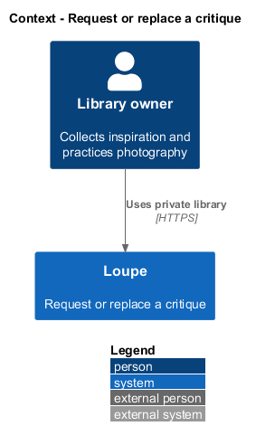
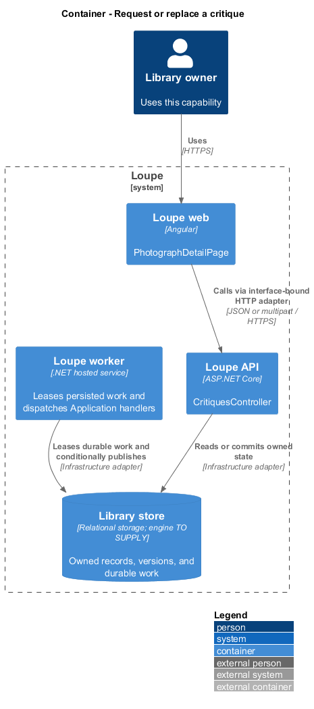
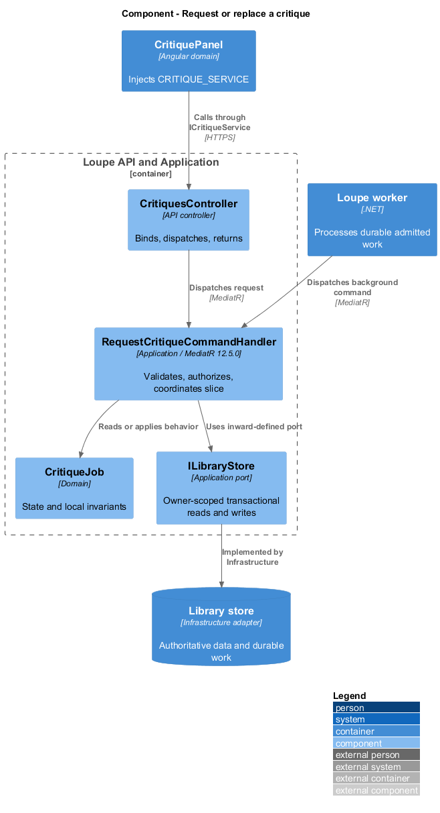
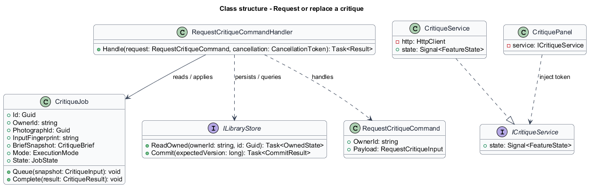
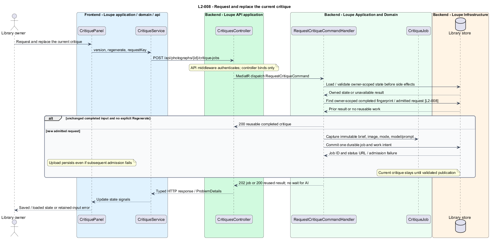

# Request or replace a critique

## Overview

A **critique job** — durable request to analyze a saved photograph and a snapshot of its brief — separates slow AI work from interaction. A replacement becomes current only after its entire result passes validation. The existing critique and personal notes remain available while replacement work runs.

This is a proposed design for the defined requirements. Existing files are illustrative HTML mockups; the repository contains no corresponding production implementation.

## Description

`PhotographDetailPage` lives in `frontend/projects/loupe` and owns routing and dialogs. `CritiquePanel` lives in `frontend/projects/domain` and consumes `ICritiqueService` through `CRITIQUE_SERVICE`. The contract and token share `critique.service.contract.ts` in `frontend/projects/api`. `CritiqueService` is the separate production HTTP adapter. Composition substitutes a mock implementation under Playwright. State uses signals, and HTTP and observable conversion stay inside the adapter. Presentational controls in `components` consume inputs and emit outputs. Component class, template, and styles occupy separate files.

`CritiquesController` lives in `backend/src/Loupe.Api/Controllers` under `Loupe.Api.Controllers`. It binds requests, dispatches MediatR **12.5.0**, and returns results. Requests, handlers, and validators live in the matching feature namespace in `Loupe.Application`. `CritiqueJob` lives in `Loupe.Domain`; the domain references no other project. `ILibraryStore` and capability ports belong to Application. Infrastructure implements persistence and external adapters. Each type occupies its own named file.

`CritiquePanel` exposes Request critique and explicit Regenerate. Before replacement, the application dialog states that success replaces the current critique and preserves notes. `RequestCritiqueCommand` carries photograph identifier, observed version, regenerate flag, and request key. `RequestCritiqueCommandHandler` loads the owned image and brief and computes a fingerprint over immutable image revision, normalized brief, mode, and configured prompt/model identity.

A non-Regenerate request matching completed inputs returns the saved result. Otherwise admission persists `CritiqueJob` and a durable work record atomically and returns 202 with an owner-scoped status URL. `GetCritiqueJobQueryHandler` supplies status without triggering another analysis. The frontend adapter polls while the job is pending and cancels polling on destruction or sign-out; aggregate status polling observes the shared read quota and reflects persisted states within five seconds under `L2-033`.

Repeated delivery of a request key resolves to one admission result. A different payload with the same key returns 409 under the shared failure contract. Keys persist for 24 hours under `L2-030`. Equivalent active jobs are reused even for Regenerate; incompatible active inputs conflict. Admission and retry follow `L2-034` and `L2-035`.

`CompleteCritiqueCommandHandler` commits the new result, timestamp, execution mode, and brief snapshot together after validation. Conditional publication checks the target still exists and the job still owns the admitted replacement. A late obsolete completion cannot replace a newer current result. Notes occupy a separate field and never appear in the publication update.

Upload-and-critique admits after photograph persistence. Failure of admission returns the saved photograph with an explicit unqueued result to the upload flow. The detail screen offers another request without repeating upload. Processing and quality validation are described in [produce-critique](../produce-critique/README.md).

The following contract surface names the proposed operations. Background commands run in the worker after a separate admission request; local evaluation commands run in the evaluation project.

| Application request | Entry point | Input |
| --- | --- | --- |
| `RequestCritiqueCommand` | `POST /api/photographs/{id}/critique-jobs` | `version, regenerate, requestKey` |

All operations inherit [shared contracts and open dependencies](../../README.md). Owner identity comes from authenticated server context, never from trusted client input. Mutations validate complete input before side effects and use conditional writes. API errors use the shared status mapping in [L2.md](../../../specs/L2.md#shared-acceptance-definitions). Visual implementation uses mirrored `--lp-` tokens and the specification's viewport matrix.

Implementation proceeds one behavior at a time using the linked Given-When-Then criteria. Each acceptance test first fails for its expected missing behavior. API integration tests cover persistence and failures. Playwright tests use one page object per screen and injected service mocks. Real-provider release checks supplement deterministic fixtures where applicable. Each acceptance file identifies L2 coverage and each test names its criterion. Regression checks pass before the next behavior starts; no architecture tests are introduced.

## Requirements

The table preserves source wording verbatim, including its use of “must”. Quoted requirements are the sole exception to the design prose's shall/should/may convention. Each linked source section also supplies the acceptance criteria; deployment choices and unexecuted release evidence remain explicitly identified.

| L2 ID | Refines (L1) | Requirement |
| --- | --- | --- |
| `L2-008` | `L1-002` | Users must explicitly request AI critique, either with upload or from the saved photograph. A replacement must commit only after complete validation. |

Acceptance criteria: [L2-008](../../../specs/L2.md#l2-008-request-and-replace-the-current-critique).

## Diagrams

The context view places this capability within the owner's private Loupe library. External services appear only where the slice uses provider or source content.

The container view separates Angular interaction, the .NET API, and authoritative persistence. Durable background work appears where processing continues after admission.

The component view shows dispatch into Application handlers and inward-defined ports. Infrastructure supplies the persistence and provider implementations.

The class view names the proposed state, requests, handlers, and interface-bound frontend service. Typed associations and dependencies show which element owns behavior.

The request and replace the current critique sequence traces `L2-008` through its enforcing operations. The accompanying Description defines state changes and significant recovery paths.

