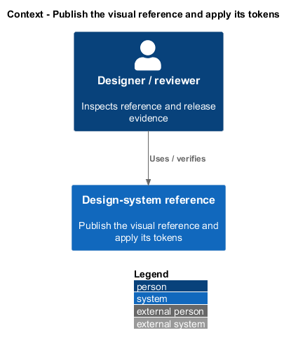
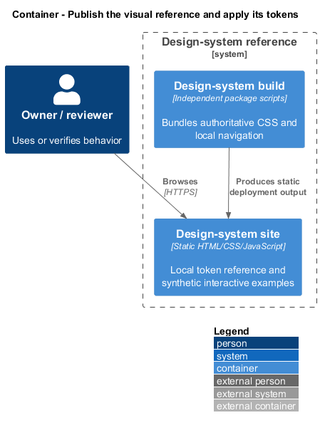
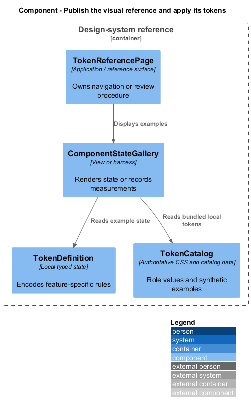
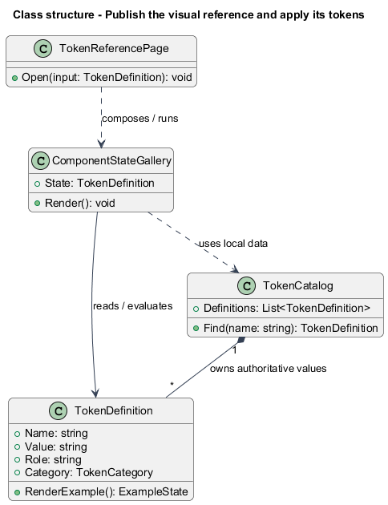
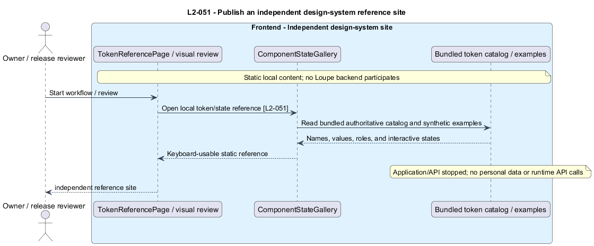
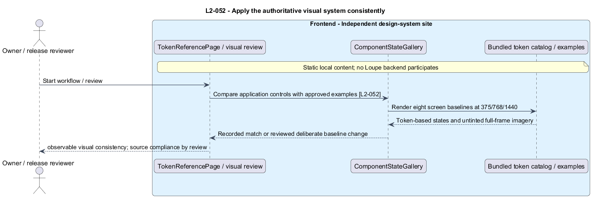

# Publish the visual reference and apply its tokens

## Overview

The **design-system site** — independent static reference for Loupe's visual language — documents authoritative `--lp-` tokens and component states. A **role token** — named CSS custom property expressing a visual purpose — gives application controls consistent color, spacing, sizing, and interaction states.

This is a proposed design for the defined requirements. Existing files are illustrative HTML mockups; the repository contains no corresponding production implementation.

## Description

This slice is an independent static reference and its build-time relationship to the application. It introduces no API controller, backend domain entity, or runtime application service dependency.

`design-system/` owns its package manifest, local source, behavioral tests, build output, and static deployment. `TokenCatalog` contains authoritative CSS properties for color, spacing, typography, radius, sizing, borders, elevation, motion, and focus. `TokenReferencePage` renders name, value, role, and visible examples. `ComponentStateGallery` demonstrates buttons, inputs/selects/text areas, cards, tags/status pills, navigation, dialogs, progress, notices, and empty/error states with applicable default, hover, focus, disabled, loading, selected, and error variants.

The site uses synthetic fixtures only and local navigation that resolves directly on its static host. It has no application login, API dependency, user data, personal images, or provider credentials, and remains usable with API/application stopped. Runtime examples do not import application libraries. The site applies the full viewport and WCAG/browser matrix, including grids demonstrating the exact documented breakpoints.

The frontend mirrors authoritative tokens through a build-time copy with source ownership documented in package scripts. A missing authored visual role is added to the design system first, then mirrored. Component styles consume role tokens; compiler, formatter, dependency tooling, and review enforce source constraints without architecture scans as tests. Breakpoints use an authoritative generated build-time value because CSS custom properties are not substituted into media-query conditions.

Application visual review compares equivalent controls at identical state and viewport against the site. Deterministic baselines cover My Work, critique, comparison, Inspiration, reference, Photographers, photographer detail, and Search at 375, 768, and 1440 pixels. Review records deliberate baseline changes. Dark, bright, saturated, and monochrome photographs retain their colors without tint/filter; surrounding controls remain readable and detail shows the complete frame. Focus, selected, processing, and error meaning stays consistent and never relies on color alone.

The existing `docs/mocks/assets/tokens.css` supplies a seed under the required prefix; approved production values and visual baselines are `<TO SUPPLY>`. The design-system-only install/build/serve commands are part of implementation's setup deliverable. Behavioral tests exercise published navigation and component interaction with API/application stopped; no source-layout test substitutes for the observable independent behavior.

The following table names local workflows or release procedures. These names identify behavior and do not imply additional network endpoints.

| Workflow | Entry point | Input |
| --- | --- | --- |
| `BrowseVisualReference` | `static design-system routes` | `token category or component state` |
| `CompareVisualSystem` | `visual release review` | `same state, viewport, deterministic content` |

The slice follows [shared architecture and acceptance rules](../../README.md). Where a workflow calls the private application, that feature retains its authorization and failure contracts. The static design-system site uses synthetic local content only.

Implementation proceeds one behavior at a time using the linked Given-When-Then criteria. Each acceptance test first fails for its expected missing behavior. API integration tests cover persistence and failures. Playwright tests use one page object per screen and injected service mocks. Real-provider release checks supplement deterministic fixtures where applicable. Each acceptance file identifies L2 coverage and each test names its criterion. Regression checks pass before the next behavior starts; no architecture tests are introduced.

## Requirements

The table preserves source wording verbatim, including its use of “must”. Quoted requirements are the sole exception to the design prose's shall/should/may convention. Each linked source section also supplies the acceptance criteria; deployment choices and unexecuted release evidence remain explicitly identified.

| L2 ID | Refines (L1) | Requirement |
| --- | --- | --- |
| `L2-051` | `L1-013` | The design system must deliver a static reference site from `design-system/`, with its own package, build, behavioral tests, and deployment output, usable while the application and API are stopped. It must document the authoritative `--lp-` tokens for color, spacing, typography, radius, sizing, borders, elevation, motion, and focus, with visual examples using synthetic content only. |
| `L2-052` | `L1-013` | The application must mirror the design-system tokens and render a calm, image-first interface with neutral surfaces, restrained typography, and spacing that separates content and controls. Every component stylesheet must use the authoritative `--lp-` role tokens for authored visual values; missing roles must be added to the design system first. Source compliance is a review obligation, not a source-scanning acceptance test. |

Acceptance criteria: [L2-051](../../../specs/L2.md#l2-051-publish-an-independent-design-system-reference-site), [L2-052](../../../specs/L2.md#l2-052-apply-the-authoritative-visual-system-consistently).

## Diagrams

The context view places this capability within the owner's private Loupe library. External services appear only where the slice uses provider or source content.

The container view separates Angular interaction, the .NET API, and authoritative persistence. Durable background work appears where processing continues after admission.

The component view shows the local UI or evaluation components and their real dependencies. The slice does not introduce a network call for behavior performed locally.

The class view names proposed local state and the components that render or evaluate it. Relationships distinguish state ownership from a dependency on an existing surface.

The publish an independent design-system reference site sequence traces `L2-051` through its enforcing operations. The accompanying Description defines state changes and significant recovery paths.

The apply the authoritative visual system consistently sequence traces `L2-052` through its enforcing operations. The accompanying Description defines state changes and significant recovery paths.

