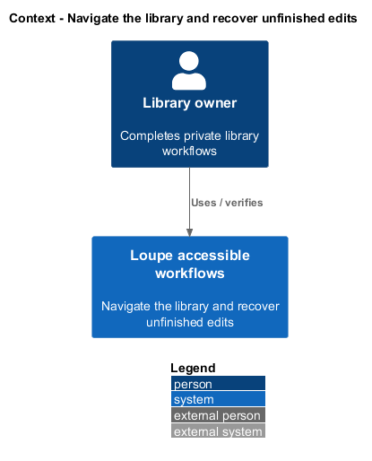
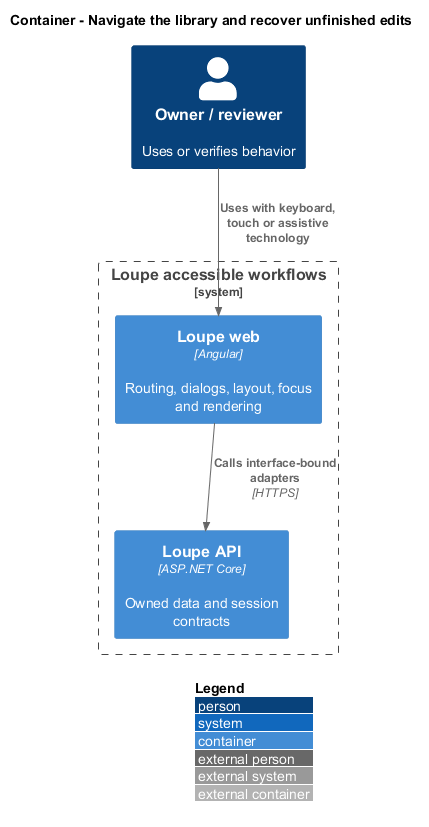
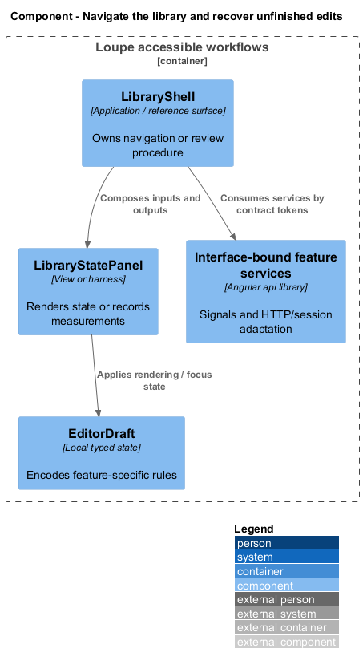
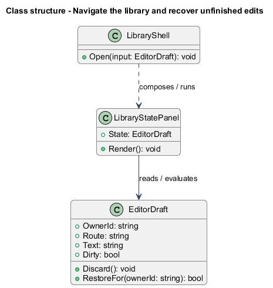
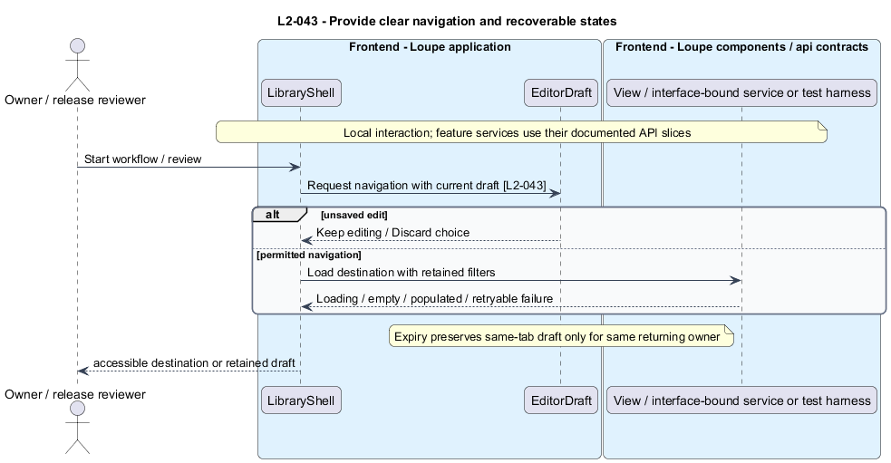

# Navigate the library and recover unfinished edits

## Overview

The **library shell** — application navigation and route host for My Work, Inspiration, Photographers, and Search — keeps workflows addressable. An **editor draft** — unsaved text held in current-tab memory — survives recoverable request failures without being mistaken for saved content.

This is a proposed design for the defined requirements. Existing files are illustrative HTML mockups; the repository contains no corresponding production implementation.

## Description

This slice composes existing vertical API contracts through application routing and presentational controls. Its layout and focus behavior run in the frontend; no layout or navigation API is introduced.

`LibraryShell` owns routes, page titles, active navigation, and the compact menu. Each owned detail supports direct navigation and reload. `UnknownRoutePage` offers return to library. `LibraryStatePanel` is presentational: its inputs distinguish initial loading, successful empty, populated, and failed states without injecting application services. My Work offers Upload photograph; Inspiration Save reference; Photographers Add photographer; Search explains query/filter entry.

Each feature adapter retains loaded content during retryable failures and preserves route filters on retry. Submitting marks only the relevant action pending and reuses the operation key on accidental duplicate activation. Unrelated navigation remains usable. Editors expose Save and acknowledgment-driven saved state.

`UnsavedChangesGuard` consumes `IEditorDraftService` through `EDITOR_DRAFT_SERVICE`, declared in `editor-draft.service.contract.ts`; its in-memory implementation lives separately in `api` without HTTP. Application dialogs offer Keep editing or Discard on in-app navigation and editor close. Browser unload uses its native available protection without requiring custom text.

Expiry suspends drafts in current-tab memory with the previous owner's identity and requests sign-in. The session service restores only after the same authenticated owner returns. A different owner, explicit sign-out, or tab close clears them. Drafts never enter local/session storage or a shared cache. The `LibraryShellPage` and each routed screen page object own their selectors and interactions; tests state navigation and recovery intent.

The following table names local workflows or release procedures. These names identify behavior and do not imply additional network endpoints.

| Workflow | Entry point | Input |
| --- | --- | --- |
| `NavigateLibrary` | `application routing` | `destination, dirty draft` |

The slice follows [shared architecture and acceptance rules](../../README.md). Where a workflow calls the private application, that feature retains its authorization and failure contracts. The static design-system site uses synthetic local content only.

Implementation proceeds one behavior at a time using the linked Given-When-Then criteria. Each acceptance test first fails for its expected missing behavior. API integration tests cover persistence and failures. Playwright tests use one page object per screen and injected service mocks. Real-provider release checks supplement deterministic fixtures where applicable. Each acceptance file identifies L2 coverage and each test names its criterion. Regression checks pass before the next behavior starts; no architecture tests are introduced.

## Requirements

The table preserves source wording verbatim, including its use of “must”. Quoted requirements are the sole exception to the design prose's shall/should/may convention. Each linked source section also supplies the acceptance criteria; deployment choices and unexecuted release evidence remain explicitly identified.

| L2 ID | Refines (L1) | Requirement |
| --- | --- | --- |
| `L2-043` | `L1-011` | The application must expose My Work, Inspiration, Photographers, and Search with directly addressable owned detail screens. Primary actions must be visible and named for their effect. Every data-driven view must distinguish initial loading, successful empty data, populated data, and failure. Editors must use explicit Save, and navigation away from unsaved edits must offer Keep editing or Discard. |

Acceptance criteria: [L2-043](../../../specs/L2.md#l2-043-provide-clear-navigation-and-recoverable-states).

## Diagrams

The context view places this capability within the owner's private Loupe library. External services appear only where the slice uses provider or source content.

The container view separates Angular interaction, the .NET API, and authoritative persistence. Durable background work appears where processing continues after admission.

The component view shows the local UI or evaluation components and their real dependencies. The slice does not introduce a network call for behavior performed locally.

The class view names proposed local state and the components that render or evaluate it. Relationships distinguish state ownership from a dependency on an existing surface.

The provide clear navigation and recoverable states sequence traces `L2-043` through its enforcing operations. The accompanying Description defines state changes and significant recovery paths.

