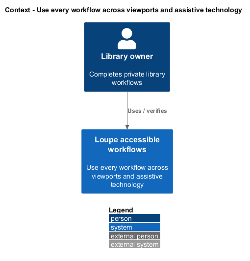
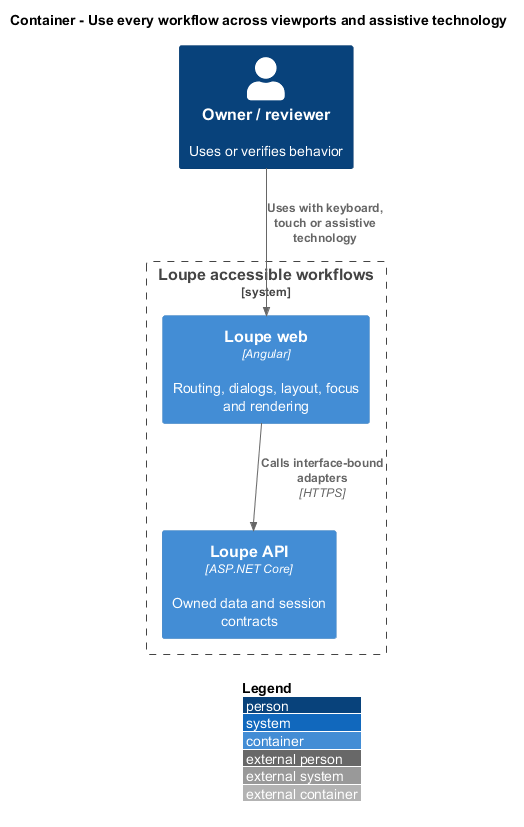
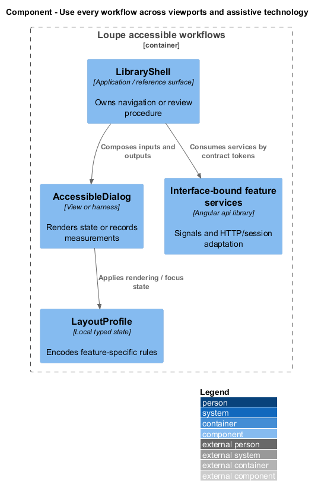
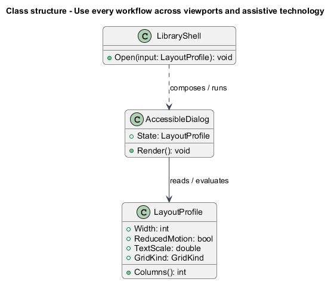
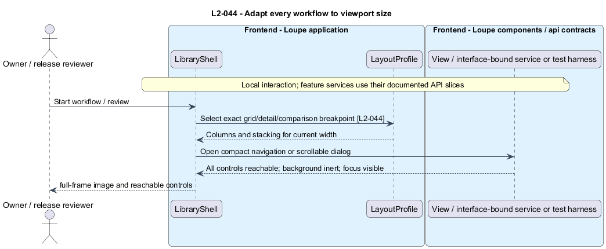
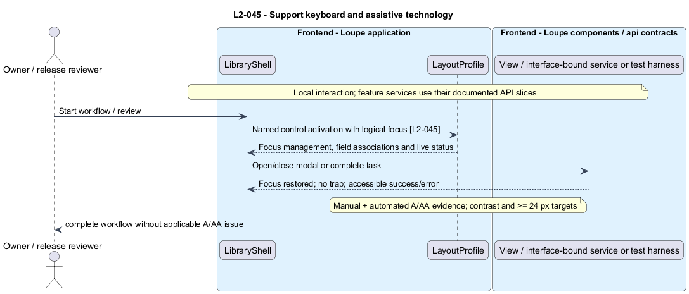
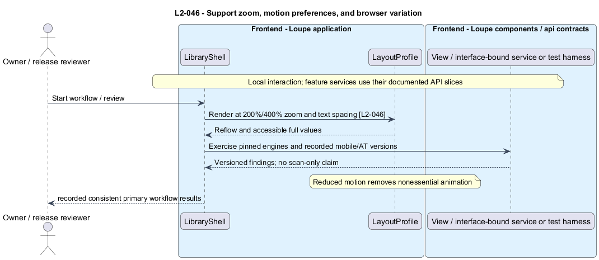

# Use every workflow across viewports and assistive technology

## Overview

An **accessible workflow** — complete task usable with keyboard, touch, zoom, and supported assistive technology — spans screens, dialogs, and pickers. A **layout profile** — rendering rules selected by viewport and collection type — preserves image visibility and reachable controls from mobile through desktop.

This is a proposed design for the defined requirements. Existing files are illustrative HTML mockups; the repository contains no corresponding production implementation.

## Description

This slice composes existing vertical API contracts through application routing and presentational controls. Its layout and focus behavior run in the frontend; no layout or navigation API is introduced.

CSS grid rules render My Work/Inspiration with one, two, three, four, and five columns across boundaries 576, 768, 992, and 1200 CSS pixels. Photographer/search grids use one, two, three, three, and four. Detail stacks below 992 and aligns image/metadata from 992. Comparison stacks below 768 and uses two columns from 768. Compact navigation below 992 exposes every main area, then closes and moves focus to destination main content. The Locations grid follows the image-grid columns, Find a location results follow the collection columns, and the location gallery and its details stack below 992 and sit alongside each other from 992 ([browse-locations](../../locations/browse-locations/README.md), [find-location](../../shoot-planning/find-location/README.md)).

`AccessibleDialog` is a presentational component with input/output state; application wrappers own actions. Focus enters the dialog, remains trapped, and returns to its trigger or the next relevant control after deletion. Escape cancels unless an acknowledged operation already executes. Scrollable dialog content, focus visibility, and reachable action controls remain usable at 375 x 667 and 844 x 390, including virtual keyboards. Background content is inert while modal. Full-frame images preserve aspect ratio and reserve layout space.

Native control semantics, explicit labels, associated field errors, and non-disruptive live status announcements support keyboard and screen readers. Images use active metadata or neutral title-based alt text; decorative icons are ignored. Focus remains visible and unobscured. Targets are at least 24 x 24 CSS pixels; drag actions have button alternatives. State and instructions do not depend only on color, hover, or position. Contrast is at least 4.5:1 for normal text, 3:1 for large text, and 3:1 for required non-text indicators. These are Loupe's workflow obligations under [WCAG 2.2 Level AA](https://www.w3.org/TR/WCAG22/).

The viewport matrix covers 320, 375, 575, 576, 767, 768, 991, 992, 1199, 1200, 1440, and 1920 at height 900, plus the two mobile sizes. All required controls remain reachable without horizontal page scrolling. At desktop width 1280, 200% and 400% zoom reflow content; increased text spacing and maximum-length values wrap or expose full values accessibly. Reduced-motion settings remove nonessential animation while retaining understandable progress.

`WorkflowAccessibilityRunner` combines pinned Playwright Chromium/Firefox/WebKit acceptance, automated scans, keyboard walkthroughs, and visual review. Manual releases record current stable iOS Safari and Android Chrome versions plus NVDA/Chromium on Windows and VoiceOver/Safari on iOS. All primary workflows, including HEIC previews and identity return, receive checks. External identity DOM is excluded, not the return flow. No applicable A/AA issue remains. Exact installed browser versions, visual baselines, and named reviewers are `<TO SUPPLY>` until implementation/release; no scan-only conformance is claimed.

The following table names local workflows or release procedures. These names identify behavior and do not imply additional network endpoints.

| Workflow | Entry point | Input |
| --- | --- | --- |
| `RenderResponsiveWorkflow` | `all app and design-system routes` | `viewport, collection kind` |
| `ExerciseAccessibleWorkflow` | `all complete workflows` | `keyboard/screen-reader input` |
| `VerifyBrowserWorkflow` | `release browser matrix` | `zoom, spacing, reduced motion, browser` |

The slice follows [shared architecture and acceptance rules](../../README.md). Where a workflow calls the private application, that feature retains its authorization and failure contracts. The static design-system site uses synthetic local content only.

Implementation proceeds one behavior at a time using the linked Given-When-Then criteria. Each acceptance test first fails for its expected missing behavior. API integration tests cover persistence and failures. Playwright tests use one page object per screen and injected service mocks. Real-provider release checks supplement deterministic fixtures where applicable. Each acceptance file identifies L2 coverage and each test names its criterion. Regression checks pass before the next behavior starts; no architecture tests are introduced.

## Requirements

The table preserves source wording verbatim, including its use of “must”. Quoted requirements are the sole exception to the design prose's shall/should/may convention. Each linked source section also supplies the acceptance criteria; deployment choices and unexecuted release evidence remain explicitly identified.

| L2 ID | Refines (L1) | Requirement |
| --- | --- | --- |
| `L2-044` | `L1-011` | All screens, editors, dialogs, and pickers must work at the shared viewport matrix. My Work, Inspiration, and Locations image grids use one column below 576 CSS pixels, two from 576-767, three from 768-991, four from 992-1199, and five from 1200 upward. Photographer/search collections, including Find a location results, use one, two, three, three, and four respectively. Detail image/metadata regions, including the location gallery and its details, stack below 992 and sit alongside each other from 992 upward; comparison follows L2-005. Compact navigation below 992 must still expose every main area through an accessible menu. (Updated 2026-09-12: Locations.) |
| `L2-045` | `L1-011` | Application and design-system screens must conform to WCAG 2.2 Level AA for their applicable content and complete workflows. Automated scans must be supplemented with keyboard, screen-reader, and visual checks; passing a scanner alone is not conformance evidence. |
| `L2-046` | `L1-011` | Acceptance must run in the Chromium, Firefox, and WebKit versions pinned by the repository's Playwright release. Release validation must also cover current stable Safari on iOS and Chrome on Android, recording exact versions. Manual screen-reader coverage must include NVDA with Chromium on Windows and VoiceOver with Safari on iOS. Only external-provider identity screens are outside Loupe's DOM tests; the return-to-application workflow remains in scope. |

Acceptance criteria: [L2-044](../../../specs/L2.md#l2-044-adapt-every-workflow-to-viewport-size), [L2-045](../../../specs/L2.md#l2-045-support-keyboard-and-assistive-technology), [L2-046](../../../specs/L2.md#l2-046-support-zoom-motion-preferences-and-browser-variation).

## Diagrams

The context view places this capability within the owner's private Loupe library. External services appear only where the slice uses provider or source content.

The container view separates Angular interaction, the .NET API, and authoritative persistence. Durable background work appears where processing continues after admission.

The component view shows the local UI or evaluation components and their real dependencies. The slice does not introduce a network call for behavior performed locally.

The class view names proposed local state and the components that render or evaluate it. Relationships distinguish state ownership from a dependency on an existing surface.

The adapt every workflow to viewport size sequence traces `L2-044` through its enforcing operations. The accompanying Description defines state changes and significant recovery paths.

The support keyboard and assistive technology sequence traces `L2-045` through its enforcing operations. The accompanying Description defines state changes and significant recovery paths.

The support zoom, motion preferences, and browser variation sequence traces `L2-046` through its enforcing operations. The accompanying Description defines state changes and significant recovery paths.

