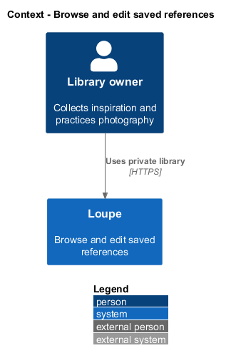
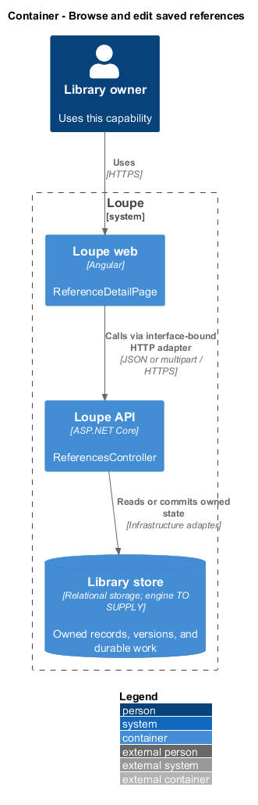
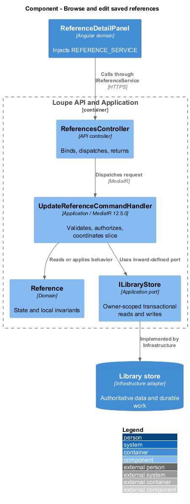
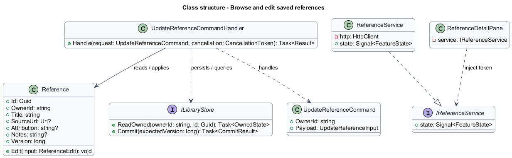
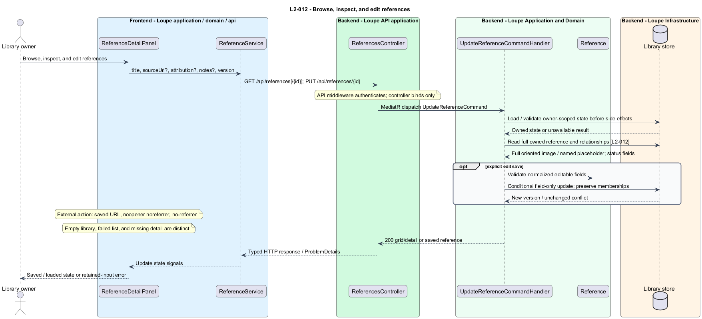

# Browse and edit saved references

## Overview

Inspiration presents **references** — saved images or links used as creative examples — in a grid and a detailed view. Each view preserves source context and distinguishes saved metadata from import, AI, and search-processing status.

This is a proposed design for the defined requirements. Existing files are illustrative HTML mockups; the repository contains no corresponding production implementation.

## Description

`ReferenceDetailPage` lives in `frontend/projects/loupe` and owns routing and dialogs. `ReferenceDetailPanel` lives in `frontend/projects/domain` and consumes `IReferenceService` through `REFERENCE_SERVICE`. The contract and token share `reference.service.contract.ts` in `frontend/projects/api`. `ReferenceService` is the separate production HTTP adapter. Composition substitutes a mock implementation under Playwright. State uses signals, and HTTP and observable conversion stay inside the adapter. Presentational controls in `components` consume inputs and emit outputs. Component class, template, and styles occupy separate files.

`ReferencesController` lives in `backend/src/Loupe.Api/Controllers` under `Loupe.Api.Controllers`. It binds requests, dispatches MediatR **12.5.0**, and returns results. Requests, handlers, and validators live in the matching feature namespace in `Loupe.Application`. `Reference` lives in `Loupe.Domain`; the domain references no other project. `ILibraryStore` and capability ports belong to Application. Infrastructure implements persistence and external adapters. Each type occupies its own named file.

`InspirationPage` composes `ReferenceCollection`, while `ReferenceDetailPage` composes `ReferenceDetailPanel`. Both domain components inject `REFERENCE_SERVICE`. Presentational image cards and placeholders accept plain display inputs and emit selection events. `ListReferencesQueryHandler` pages only owned references with the shared 24/100 limits and stable creation-date/identifier ordering.

`GetReferenceQueryHandler` returns the full oriented image or named link-only placeholder, title, source, attribution, optional photographer link, notes, active tags, board memberships, and separate import/AI/index states. Detail uses the complete image with full-frame fit, not only a cropped grid thumbnail. Related references load independently through [search-by-meaning](../../search/search-by-meaning/README.md), so similarity failure does not block the detail.

`UpdateReferenceCommandHandler` validates title, source, attribution, and notes, then conditionally updates those fields using `Version`. Memberships remain unchanged. Source edits also invalidate any source-dependent derived input. An error retains attempted text and returns the shared field or conflict response. A 409 retains the attempted edit and offers Reload latest before an intentional new submission under `L2-030`.

External links open the saved validated HTTP(S) URL with `noopener noreferrer` and a no-referrer policy. Photographer links navigate to owned application detail. Empty library, retryable list failure, and unavailable detail are distinct states. All recovery and unsaved-edit behavior follows `L2-043`.

The following contract surface names the proposed operations. Background commands run in the worker after a separate admission request; local evaluation commands run in the evaluation project.

| Application request | Entry point | Input |
| --- | --- | --- |
| `UpdateReferenceCommand` | `GET /api/references[/{id}]; PUT /api/references/{id}` | `title, sourceUrl?, attribution?, notes?, version` |

All operations inherit [shared contracts and open dependencies](../../README.md). Owner identity comes from authenticated server context, never from trusted client input. Mutations validate complete input before side effects and use conditional writes. API errors use the shared status mapping in [L2.md](../../../specs/L2.md#shared-acceptance-definitions). Visual implementation uses mirrored `--lp-` tokens and the specification's viewport matrix.

Implementation proceeds one behavior at a time using the linked Given-When-Then criteria. Each acceptance test first fails for its expected missing behavior. API integration tests cover persistence and failures. Playwright tests use one page object per screen and injected service mocks. Real-provider release checks supplement deterministic fixtures where applicable. Each acceptance file identifies L2 coverage and each test names its criterion. Regression checks pass before the next behavior starts; no architecture tests are introduced.

## Requirements

The table preserves source wording verbatim, including its use of “must”. Quoted requirements are the sole exception to the design prose's shall/should/may convention. Each linked source section also supplies the acceptance criteria; deployment choices and unexecuted release evidence remain explicitly identified.

| L2 ID | Refines (L1) | Requirement |
| --- | --- | --- |
| `L2-012` | `L1-003` | Inspiration must provide an image-first grid and detail screen showing full image or link-only placeholder, title, source, attribution, linked photographer, notes, tags, board memberships, and AI/import/index status. |

Acceptance criteria: [L2-012](../../../specs/L2.md#l2-012-browse-inspect-and-edit-references).

## Diagrams

The context view places this capability within the owner's private Loupe library. External services appear only where the slice uses provider or source content.

The container view separates Angular interaction, the .NET API, and authoritative persistence. Durable background work appears where processing continues after admission.

The component view shows dispatch into Application handlers and inward-defined ports. Infrastructure supplies the persistence and provider implementations.

The class view names the proposed state, requests, handlers, and interface-bound frontend service. Typed associations and dependencies show which element owns behavior.

The browse, inspect, and edit references sequence traces `L2-012` through its enforcing operations. The accompanying Description defines state changes and significant recovery paths.

