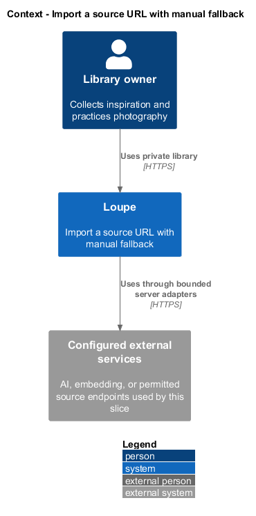
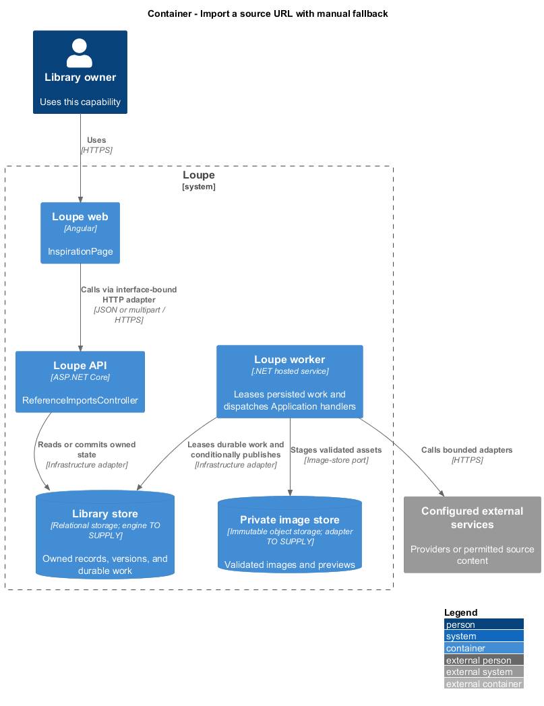
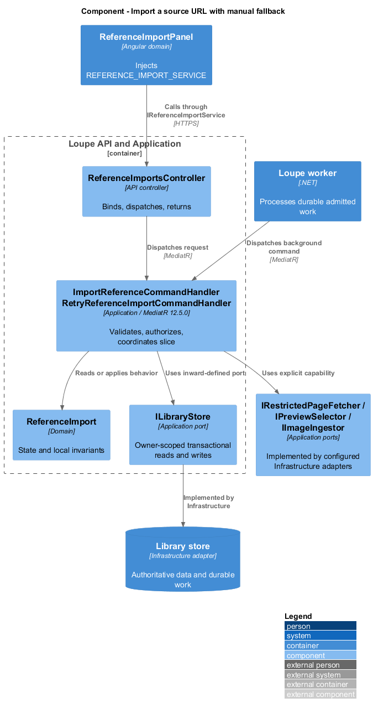
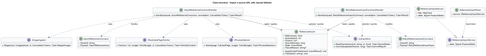
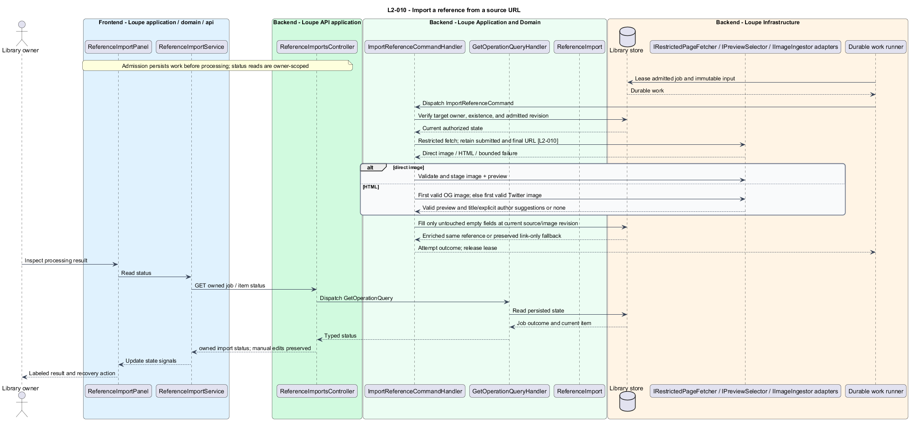
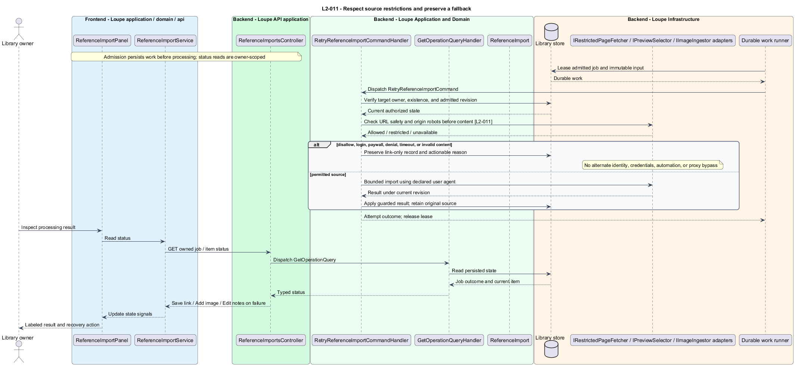
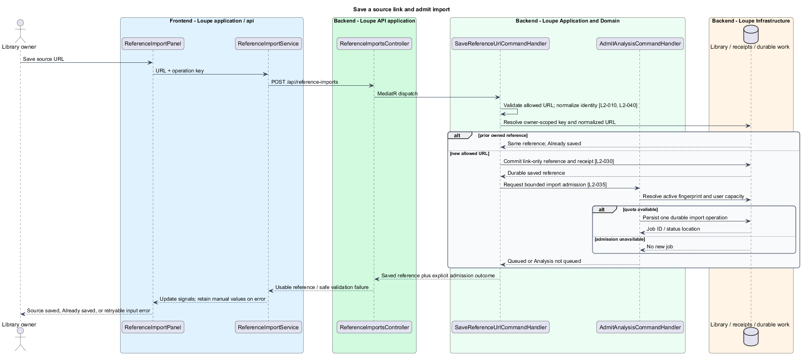

# Import a source URL with manual fallback

## Overview

A **source import** — bounded background retrieval of a submitted URL and its permitted preview — enriches a saved reference. It preserves the original link when a site blocks access or supplies no usable image. The importer honors site restrictions and offers manual editing on the same record.

This is a proposed design for the defined requirements. Existing files are illustrative HTML mockups; the repository contains no corresponding production implementation.

## Description

`InspirationPage` lives in `frontend/projects/loupe` and owns routing and dialogs. `ReferenceImportPanel` lives in `frontend/projects/domain` and consumes `IReferenceImportService` through `REFERENCE_IMPORT_SERVICE`. The contract and token share `reference-import.service.contract.ts` in `frontend/projects/api`. `ReferenceImportService` is the separate production HTTP adapter. Composition substitutes a mock implementation under Playwright. State uses signals, and HTTP and observable conversion stay inside the adapter. Presentational controls in `components` consume inputs and emit outputs. Component class, template, and styles occupy separate files.

`ReferenceImportsController` lives in `backend/src/Loupe.Api/Controllers` under `Loupe.Api.Controllers`. It binds requests, dispatches MediatR **12.5.0**, and returns results. Requests, handlers, and validators live in the matching feature namespace in `Loupe.Application`. `ReferenceImport` lives in `Loupe.Domain`; the domain references no other project. `ILibraryStore` and capability ports belong to Application. Infrastructure implements persistence and external adapters. Each type occupies its own named file.

`SaveReferenceUrlCommandHandler` validates the URL and upserts by owner plus normalized source. Normalization lowercases scheme and host, removes the default port and fragment, and preserves path and query, including tracking parameters. A database uniqueness constraint resolves concurrent duplicates to the existing owned reference with Already saved. No other owner's match is disclosed. The original submitted source remains separate from the final fetched URL.

The save transaction creates a link-only reference. Separate keyed admission persists the import job when quotas permit; admission failure leaves the source usable with Analysis not queued and a later request action. `ReferenceImportWorker` dispatches `ImportReferenceCommand`; `IRestrictedPageFetcher` performs the external reads. Each origin's robots.txt is checked for the declared Loupe importer user agent. A missing robots file permits retrieval, a matching disallow blocks it, and authentication errors, server errors, or timeout defer retrieval. Redirects and preview origins pass URL safety and robots checks independently before fetch. The proposed user agent is `Loupe/1.0`; the shared network budget is 30 seconds under `L2-040`.

A direct image response uses `IImageIngestor`. For HTML, `IPreviewSelector` inspects Open Graph image candidates in document order and selects the first valid candidate. If none is valid, it uses the first valid Twitter card image. No other image is auto-selected. Relative URLs resolve against the fetched page URL. Candidate validation includes restricted-fetch checks and the shared image limits; the aggregate budget is 30 seconds and five redirects, with decoded HTML capped at 2,000,000 bytes and robots at 512,000 under `L2-040`.

Accessible page title and explicit author metadata supply inspectable suggestions, never invented attribution. Completion fills only still-empty fields whose manual-edit marker has not changed since admission. This includes a deliberately cleared field: emptiness alone does not authorize overwriting a user edit. Manual image attachment increments its revision and prevents a late import from replacing it.

Authentication gates, paywalls, denials, robots blocks, timeout, oversized content, and missing previews preserve a link-only record with a specific reason and Save link, Add image, and Edit notes actions. No alternate identity, forwarded credentials, automation, or proxy bypass is used. Opening a previously imported record reads stored bytes even if the source later disappears. Every destination follows the public-address, actual-connection, port, and credential checks in [fetch-permitted-source](../../security/fetch-permitted-source/README.md).

The following contract surface names the proposed operations. Background commands run in the worker after a separate admission request; local evaluation commands run in the evaluation project.

| Application request | Entry point | Input |
| --- | --- | --- |
| `ImportReferenceCommand` | `POST /api/reference-imports` | `sourceUrl; worker loads source revision` |
| `RetryReferenceImportCommand` | `POST /api/reference-imports/{id}/retry` | `importId` |

All operations inherit [shared contracts and open dependencies](../../README.md). Owner identity comes from authenticated server context, never from trusted client input. Mutations validate complete input before side effects and use conditional writes. API errors use the shared status mapping in [L2.md](../../../specs/L2.md#shared-acceptance-definitions). Visual implementation uses mirrored `--lp-` tokens and the specification's viewport matrix.

Implementation proceeds one behavior at a time using the linked Given-When-Then criteria. Each acceptance test first fails for its expected missing behavior. API integration tests cover persistence and failures. Playwright tests use one page object per screen and injected service mocks. Real-provider release checks supplement deterministic fixtures where applicable. Each acceptance file identifies L2 coverage and each test names its criterion. Regression checks pass before the next behavior starts; no architecture tests are introduced.

## Requirements

The table preserves source wording verbatim, including its use of “must”. Quoted requirements are the sole exception to the design prose's shall/should/may convention. Each linked source section also supplies the acceptance criteria; deployment choices and unexecuted release evidence remain explicitly identified.

| L2 ID | Refines (L1) | Requirement |
| --- | --- | --- |
| `L2-010` | `L1-003` | The user must be able to save a source URL and request a bounded background import. A direct image URL imports that image; an HTML page uses its first valid Open Graph image or, if absent/invalid, its first valid Twitter card image. No other page images are selected automatically. Relative metadata image URLs resolve against the fetched page URL. The original submitted source and final fetched URL must both be retained. |
| `L2-011` | `L1-003` | Imports must not bypass authentication, paywalls, access denials, or applicable robots.txt restrictions. Each origin's robots.txt must be checked for the declared Loupe importer user agent: a missing file permits fetching, a matching disallow blocks it, and an authentication error, server error, or timeout prevents automated fetching until a later retry. Import failure must preserve a useful bookmark. |

Acceptance criteria: [L2-010](../../../specs/L2.md#l2-010-import-a-reference-from-a-source-url), [L2-011](../../../specs/L2.md#l2-011-respect-source-restrictions-and-preserve-a-fallback).

## Diagrams

The context view places this capability within the owner's private Loupe library. External services appear only where the slice uses provider or source content.

The container view separates Angular interaction, the .NET API, and authoritative persistence. Durable background work appears where processing continues after admission.

The component view shows dispatch into Application handlers and inward-defined ports. Infrastructure supplies the persistence and provider implementations.

The class view names the proposed state, requests, handlers, and interface-bound frontend service. Typed associations and dependencies show which element owns behavior.

The import a reference from a source url sequence traces `L2-010` through its enforcing operations. The accompanying Description defines state changes and significant recovery paths.

The respect source restrictions and preserve a fallback sequence traces `L2-011` through its enforcing operations. The accompanying Description defines state changes and significant recovery paths.

Source saving precedes background retrieval. Operation-key replay and normalized-source uniqueness resolve to the owned existing reference; admission failure leaves the link usable.

