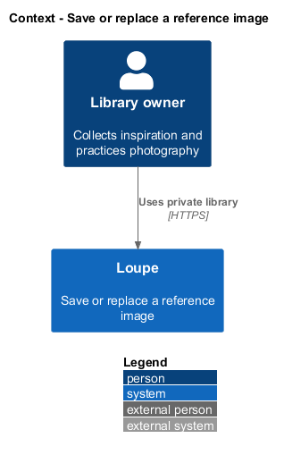
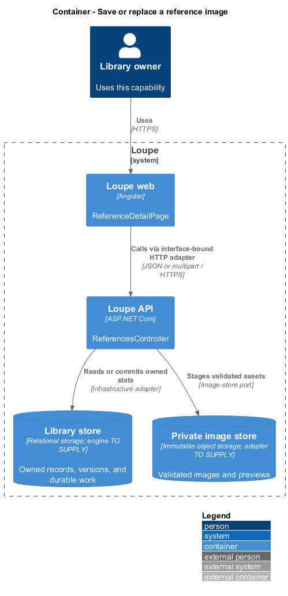
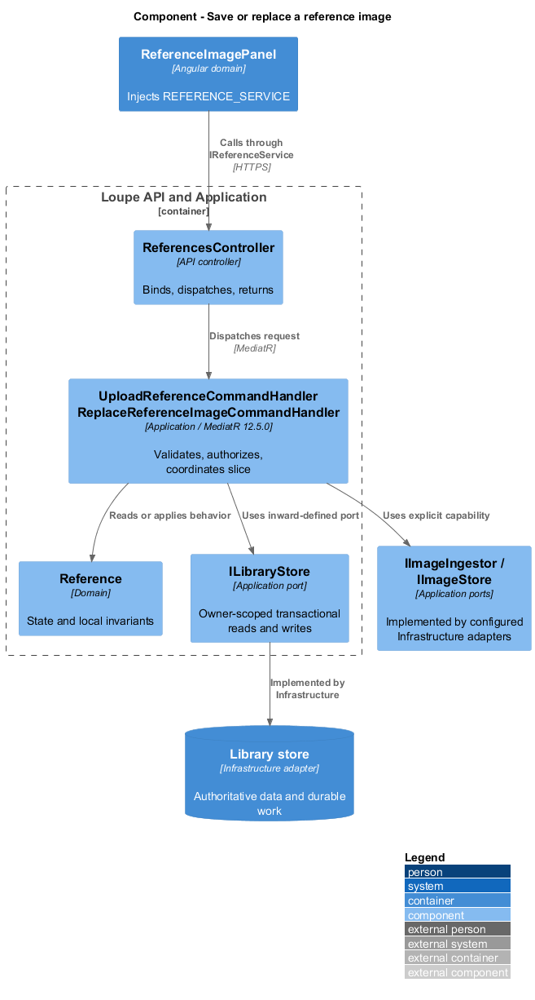
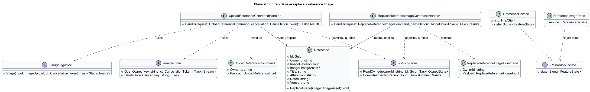
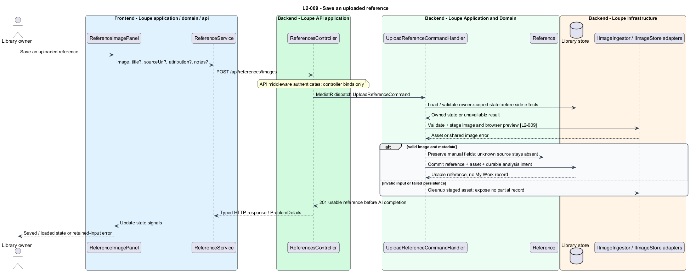
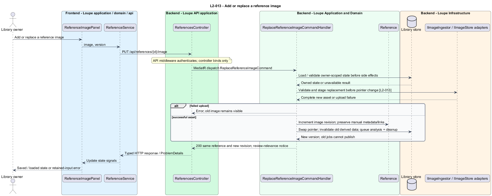

# Save or replace a reference image

## Overview

A **reference** — saved inspiration image or source link — belongs to Inspiration and never appears in My Work. A **link-only reference** — reference without a stored image — remains useful through its source and manual metadata. Adding or replacing an image preserves that reference's identity.

This is a proposed design for the defined requirements. Existing files are illustrative HTML mockups; the repository contains no corresponding production implementation.

## Description

`ReferenceDetailPage` lives in `frontend/projects/loupe` and owns routing and dialogs. `ReferenceImagePanel` lives in `frontend/projects/domain` and consumes `IReferenceService` through `REFERENCE_SERVICE`. The contract and token share `reference.service.contract.ts` in `frontend/projects/api`. `ReferenceService` is the separate production HTTP adapter. Composition substitutes a mock implementation under Playwright. State uses signals, and HTTP and observable conversion stay inside the adapter. Presentational controls in `components` consume inputs and emit outputs. Component class, template, and styles occupy separate files.

`ReferencesController` lives in `backend/src/Loupe.Api/Controllers` under `Loupe.Api.Controllers`. It binds requests, dispatches MediatR **12.5.0**, and returns results. Requests, handlers, and validators live in the matching feature namespace in `Loupe.Application`. `Reference` lives in `Loupe.Domain`; the domain references no other project. `ILibraryStore` and capability ports belong to Application. Infrastructure implements persistence and external adapters. Each type occupies its own named file.

`ReferenceImagePanel` injects `REFERENCE_SERVICE` and handles upload progress and retained form values. `UploadReferenceCommandHandler` accepts one validated image plus optional title, source URL, attribution, and notes. It reuses the bounded image-ingestion port described in [save-photograph](../../my-work/save-photograph/README.md). Absent attribution and source remain unknown, and no photographer is inferred.

The handler validates every supplied field before committing a reference. Source URL validation occurs without an automatic outbound fetch. Immutable image and preview objects are staged before database commit; failed mutations expose no partial reference. The committed record is usable immediately, independently of AI job success. Requested metadata analysis receives a durable job only when admission permits it under `L2-035`. Admission failure commits the reference without that job and returns Analysis not queued with a later action. Required semantic-maintenance intent remains durable independently of this requested-analysis quota. The upload sequence shows the admitted happy path.

`ReplaceReferenceImageCommandHandler` conditionally replaces an owned record's image after a successful upload and confirmation. Link-only attachment uses the same route without creating another reference. A storage or validation error leaves the old pointer untouched. Source, attribution, notes, active tags, boards, and photographer link remain unchanged.

Successful replacement increments `ImageRevision`, marks old visual suggestions noncurrent, and invalidates semantic input in the same transaction. A new analysis intent identifies the new revision. Reviewed metadata stays active, accompanied by a relevance-review notice. Every preview, suggestion, and vector publication checks its input revision so a late old-image job cannot change current data.

The former image objects become cleanup candidates only after the new reference commits. Cleanup checks that no current record refers to an object before deletion. Cleanup completes within 24 hours under healthy dependencies, preserves current assets, and alerts when overdue under `L2-032`.

An empty filename-derived title becomes Untitled reference under the shared default-title rule. Retained images and previews are sanitized under `L2-041` before publication.

The following contract surface names the proposed operations. Background commands run in the worker after a separate admission request; local evaluation commands run in the evaluation project.

| Application request | Entry point | Input |
| --- | --- | --- |
| `UploadReferenceCommand` | `POST /api/references/images` | `image, title?, sourceUrl?, attribution?, notes?` |
| `ReplaceReferenceImageCommand` | `PUT /api/references/{id}/image` | `image, version` |

All operations inherit [shared contracts and open dependencies](../../README.md). Owner identity comes from authenticated server context, never from trusted client input. Mutations validate complete input before side effects and use conditional writes. API errors use the shared status mapping in [L2.md](../../../specs/L2.md#shared-acceptance-definitions). Visual implementation uses mirrored `--lp-` tokens and the specification's viewport matrix.

Implementation proceeds one behavior at a time using the linked Given-When-Then criteria. Each acceptance test first fails for its expected missing behavior. API integration tests cover persistence and failures. Playwright tests use one page object per screen and injected service mocks. Real-provider release checks supplement deterministic fixtures where applicable. Each acceptance file identifies L2 coverage and each test names its criterion. Regression checks pass before the next behavior starts; no architecture tests are introduced.

## Requirements

The table preserves source wording verbatim, including its use of “must”. Quoted requirements are the sole exception to the design prose's shall/should/may convention. Each linked source section also supplies the acceptance criteria; deployment choices and unexecuted release evidence remain explicitly identified.

| L2 ID | Refines (L1) | Requirement |
| --- | --- | --- |
| `L2-009` | `L1-003` | Users must be able to save an inspiration reference from an image with optional title, source URL, attribution, and notes. The reference must be usable before AI processing completes. |
| `L2-013` | `L1-003` | Users must be able to attach a manual image to a link-only reference or replace a reference's current image while preserving manual metadata and relationships. |

Acceptance criteria: [L2-009](../../../specs/L2.md#l2-009-save-an-uploaded-reference), [L2-013](../../../specs/L2.md#l2-013-add-or-replace-a-reference-image).

## Diagrams

The context view places this capability within the owner's private Loupe library. External services appear only where the slice uses provider or source content.

The container view separates Angular interaction, the .NET API, and authoritative persistence. Durable background work appears where processing continues after admission.

The component view shows dispatch into Application handlers and inward-defined ports. Infrastructure supplies the persistence and provider implementations.

The class view names the proposed state, requests, handlers, and interface-bound frontend service. Typed associations and dependencies show which element owns behavior.

The save an uploaded reference sequence traces `L2-009` through its enforcing operations. The accompanying Description defines state changes and significant recovery paths.

The add or replace a reference image sequence traces `L2-013` through its enforcing operations. The accompanying Description defines state changes and significant recovery paths.

