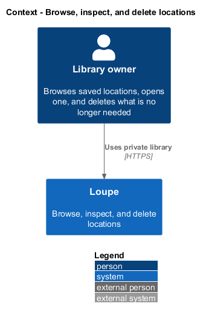
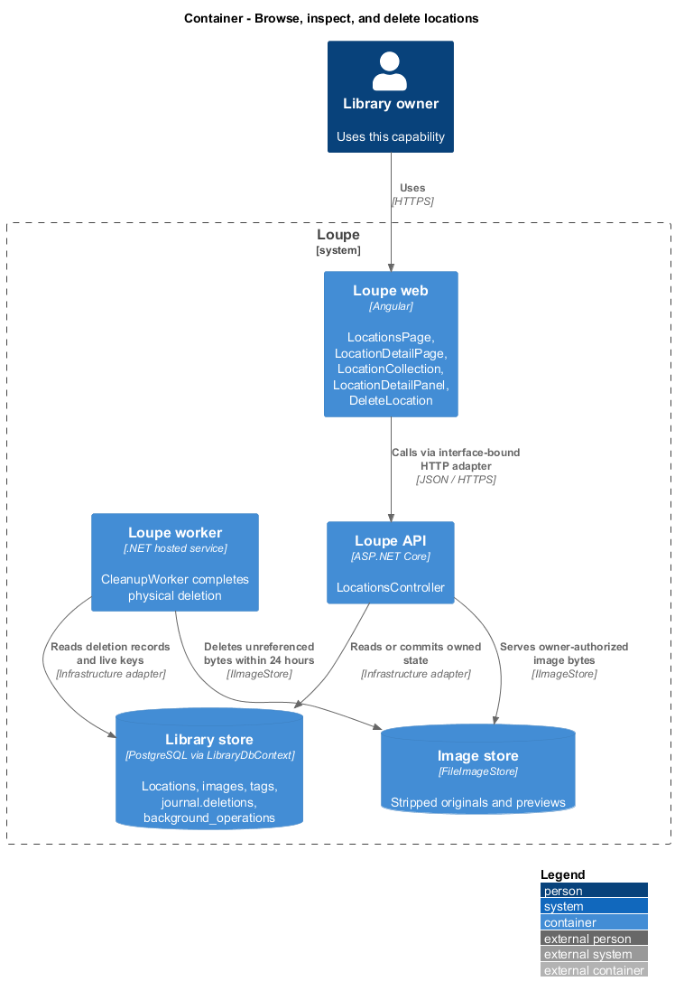
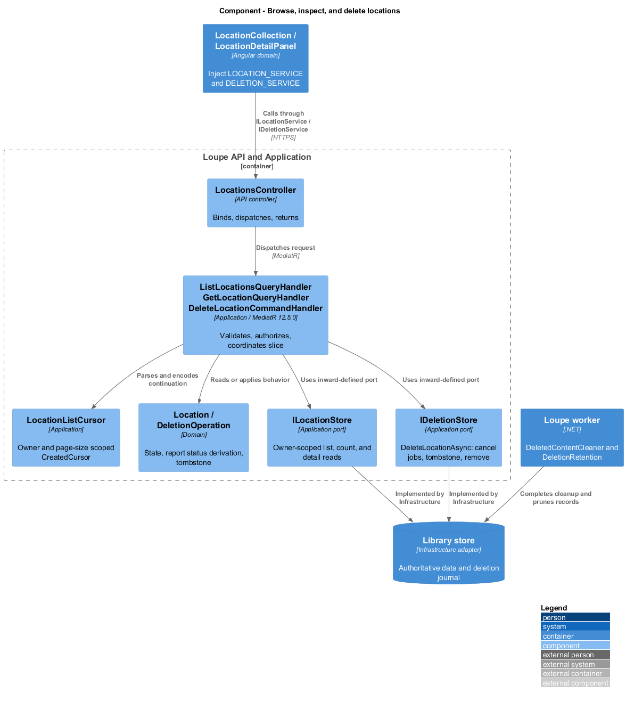
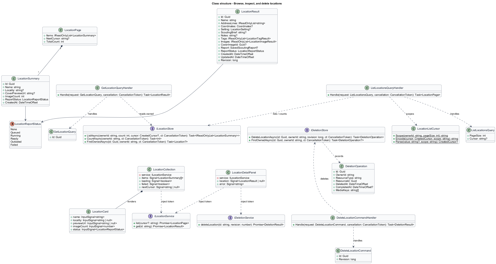
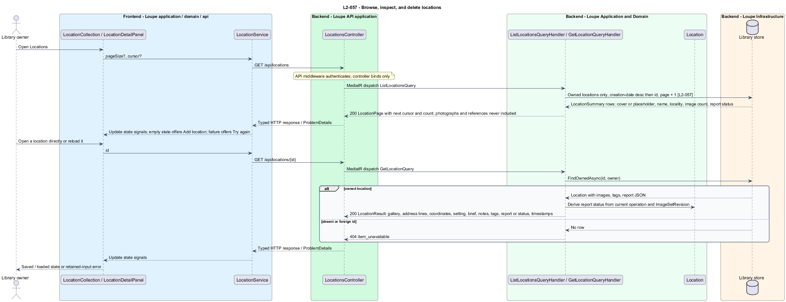
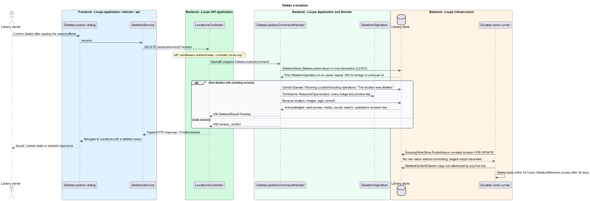

# Browse, inspect, and delete locations

## Overview

The **Locations area** — fifth main area of the private library, beside My Work, Inspiration, Photographers, and Search — is an image-first grid of the owner's saved locations, each opening a directly addressable detail. A **location card** — grid tile showing the cover image or a labelled placeholder, the name, the locality when present, the image count, and the report status — is the browsing unit. The **report status** — `LocationReportStatus`: None, Queued, Running, Ready, Outdated, or Failed — is derived on read from the location's current scouting operation and the image-set revision its report used.

This feature covers listing locations, opening one, and deleting one. Deleting follows the shared deletion rules: access is revoked at acknowledgment, physical cleanup follows within 24 hours, and a scouting job that finishes afterwards cannot commit. The details and images the detail screen shows are designed in [save-location](../save-location/README.md) and [manage-location-images](../manage-location-images/README.md); the report area is designed in [request-scouting-report](../../scouting/request-scouting-report/README.md).

This is a proposed design for the defined requirements. `docs/mocks/locations.html`, `docs/mocks/location.html`, and `docs/mocks/find-location.html` are the visual and interaction reference that `L2-055` names. The repository contains no Locations implementation. Components named below extend the implemented References, Critique, Search, and Deletion slices by their real names; proposed UI copy is design text, not a quotation.

## Description

`LocationsPage` and `LocationDetailPage` live in `frontend/projects/loupe` and own routing, page titles, and the `DeleteLocation` dialog. `LocationCollection` and `LocationDetailPanel` live in `frontend/projects/domain` and consume `ILocationService` through `LOCATION_SERVICE`; deletion goes through `IDeletionService` and `DELETION_SERVICE`. The contracts and tokens share `location.service.contract.ts` and `deletion.service.contract.ts` in `frontend/projects/api`. `LocationService` and `DeletionService` are the separate production HTTP adapters. Composition substitutes mock implementations under Playwright. State uses signals, and HTTP and observable conversion stay inside the adapters. `LocationCard` in `components` takes display inputs and emits selection and delete events. Component class, template, and styles occupy separate files.

`LocationsController` lives in `backend/src/Loupe.Api/Controllers` under `Loupe.Api.Controllers`. It binds requests, dispatches MediatR **12.5.0**, and returns results. Requests, handlers, and validators live in `Loupe.Application/Locations`; deletion lives in `Loupe.Application/Deletions`. `Location` and `DeletionOperation` live in `Loupe.Domain`; the domain references no other project. `ILocationStore` and `IDeletionStore` belong to Application. Infrastructure implements persistence and cleanup. Each type occupies its own named file.

`ListLocationsQueryHandler` pages only owned locations with the shared 24-item default and 100-item cap, in creation-date-descending then identifier-ascending order, through `ILocationStore.ListAsync` and `CountAsync`, and returns a `LocationPage` of `LocationSummary` items with the next cursor and the total count. `LocationListCursor` binds the owner and page size to a `CreatedCursor`, as `ReferenceListCursor` does, and a cursor from another view returns the shared 400. Each `LocationSummary` carries the cover preview URL or null, name, locality, image count, and report status. Photographs and references never appear: the query reads the locations table only.

`GetLocationQueryHandler` returns `LocationResult` through `ILocationStore.FindOwnedAsync`: every image in order with full-frame and preview URLs, the cover, the address lines in entered order with empty lines omitted, six-place coordinates, setting, brief, notes, active tags, the current report or its status, and created and updated timestamps. The detail gallery offers the complete oriented frame of every image; no thumbnail is the only available detail image. A location with no images returns an empty image list; the detail shows the labelled placeholder with Add images, and the report area explains that an image is needed instead of showing a failure. A foreign or deleted identifier raises `ResourceNotFoundException`, so absent and foreign locations are indistinguishable at 404.

`DeleteLocationCommandHandler` dispatches to `IDeletionStore.DeleteLocationAsync(id, ownerId, revision)`, a fourth per-entity method beside the photograph, reference, and photographer ones. Inside one transaction it returns the prior `DeletionOperation` on a repeat by the owner, cancels Queued or Running `LocationScouting` operations for the location with the message "The location was deleted.", locks the row `FOR UPDATE`, checks `Revision`, adds a `DeletionOperation` with `ResourceType` `location` and every image and preview key in `MediaKeys`, removes the location with its images and tags, and commits. Read access, media reads, counts, Find a location results, and operation reads exclude the location from acknowledgment. `DeletedContentCleaner` removes the keys within 24 hours under healthy storage, skipping any key still referenced by a live row, and `DeletionRetention` prunes the record after 35 days. A scouting job that publishes later re-reads the location `FOR UPDATE`, finds no row, and returns without committing, so deletion takes precedence. Every other location and the owner's photographs, references, and bookmarks are untouched. A foreign or unknown identifier returns the shared 404.

`LocationsPage` composes `LocationCollection`, which follows `ReferenceCollection`: eight skeleton tiles while loading, the empty state offering Add location, the retryable failure keeping already loaded cards, Load more while a cursor remains, and a request generation that discards obsolete responses. The header offers Add location and Find a location. `LocationCard` renders the cover or the labelled placeholder, the name, locality, image count, and status pill, and a delete action. `LocationDetailPage` composes `LocationDetailPanel`, which loads through `get(id)` with the `ReferenceDetailPanel` effect, distinguishes loading, unavailable, and retryable failure, marks Locations as the active area, and sets the page title. The gallery and details stack below 992 CSS pixels and sit alongside each other from 992; the gallery is operable by keyboard with the selected image announced. `DeleteLocation` names the location and states that its images and scouting report will be removed; cancellation sends no command, and confirmation navigates to Locations with a deleted notice. Routes are `locations`, `locations/find`, and `locations/:id`, declared in that order under `sessionGuard`; the fifth navigation item joins the area list in `app.ts`, the link in `app.html`, an `i-pin` symbol in `index.html`, and the compact tab bar grows to five columns.

`ILocationService.list(cursor?)` and `get(id)` and `IDeletionService.deleteLocation(id, revision)` are the contract methods this slice uses. The Playwright page objects `locations-page.js` and `location-page.js` own the selectors; `search-page.js` expects five navigation links.

The following contract surface names the proposed operations. Background commands run in the worker after a separate admission request; local evaluation commands run in the evaluation project.

| Application request | Entry point | Input |
| --- | --- | --- |
| `ListLocationsQuery` | `GET /api/locations` | `pageSize?, cursor?` |
| `GetLocationQuery` | `GET /api/locations/{id}` | `id` |
| `DeleteLocationCommand` | `DELETE /api/locations/{id}` | `revision` |

All operations inherit [shared contracts and open dependencies](../../README.md). Owner identity comes from authenticated server context, never from trusted client input. Mutations validate complete input before side effects and use conditional writes. API errors use the shared status mapping in [L2.md](../../../specs/L2.md#shared-acceptance-definitions). Visual implementation uses mirrored `--lp-` tokens and the specification's viewport matrix.

Implementation proceeds one behavior at a time using the linked Given-When-Then criteria. Each acceptance test first fails for its expected missing behavior. API integration tests cover persistence and failures. Playwright tests use one page object per screen and injected service mocks. Real-provider release checks supplement deterministic fixtures where applicable. Each acceptance file identifies L2 coverage and each test names its criterion. Regression checks pass before the next behavior starts; no architecture tests are introduced.

## Requirements

The table preserves source wording verbatim, including its use of "must". Quoted requirements are the sole exception to the design prose's shall/should/may convention. Each linked source section also supplies the acceptance criteria; deployment choices and unexecuted release evidence remain explicitly identified.

| L2 ID | Refines (L1) | Requirement |
| --- | --- | --- |
| `L2-057` | `L1-014` | Locations must provide an image-first grid and a detail screen with an image gallery, address, coordinates, setting, brief, notes, tags, scouting report or its status, and timestamps. Deletion must follow L2-031 and L2-032. |

Acceptance criteria: [L2-057](../../../specs/L2.md#l2-057-browse-inspect-and-delete-locations).

## Diagrams

The context view places this capability within the owner's private Loupe library. External services appear only where the slice uses provider or source content.

The container view separates Angular interaction, the .NET API, and authoritative persistence. Durable background work appears where cleanup continues after acknowledgment.

The component view shows dispatch into Application handlers and inward-defined ports. Infrastructure supplies the persistence and cleanup implementations.

The class view names the proposed state, requests, handlers, and interface-bound frontend services. Typed associations and dependencies show which element owns behavior.

The browse and inspect sequence traces `L2-057` through its enforcing operations, with the unavailable detail as an alternate. The accompanying Description defines state changes and significant recovery paths.

The deletion sequence shows revocation at acknowledgment, cancellation of active scouting work, cleanup, and the precedence a late job observes.

