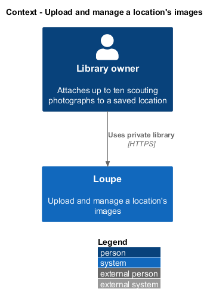
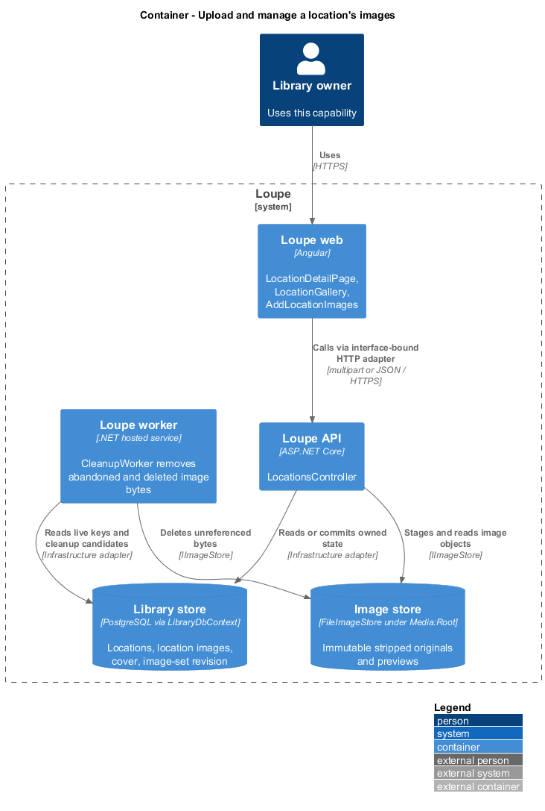
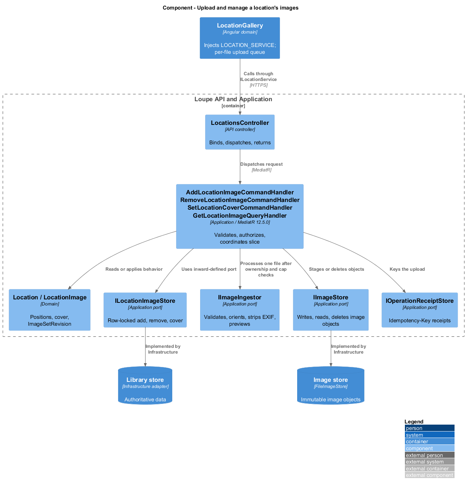
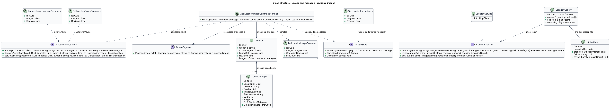
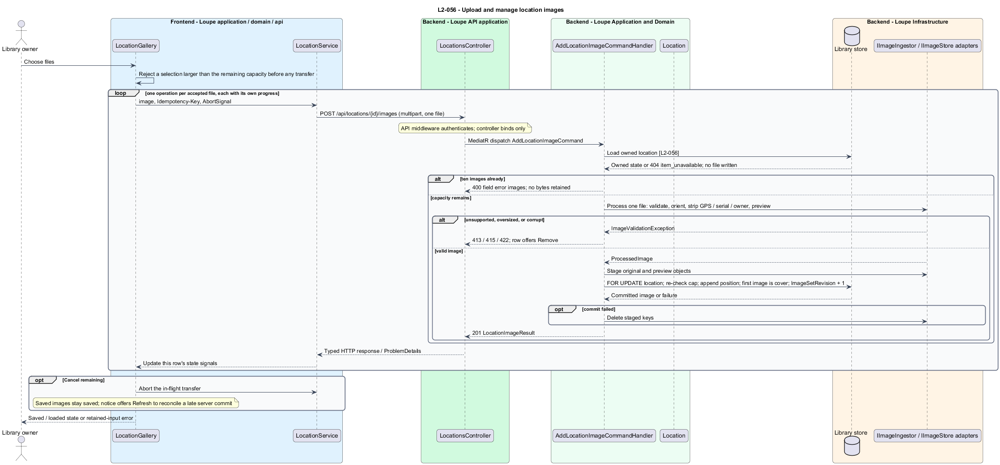
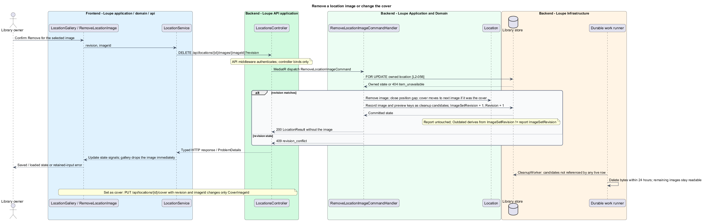

# Upload and manage a location's images

## Overview

A **location image** — one of up to ten photographs attached to a location, kept in upload order with a stripped original and a browser-compatible preview — is the evidence a scouting report reads and the picture a location shows in its grid and detail. The **cover** — the one image that represents the location on its grid card — is the first uploaded image until the owner chooses another. The **image-set revision** — counter on the location that increments whenever an image is added or removed — is what marks a scouting report Outdated and what a late scouting job checks before it commits.

This feature covers adding images one upload at a time, choosing the cover, and removing an image. It reuses the shared upload pipeline that photographs and references already use, so format, size, orientation, preview, and metadata stripping behave identically. The location's details are covered in [save-location](../save-location/README.md); the report's reaction to an image change is covered in [request-scouting-report](../../scouting/request-scouting-report/README.md).

This is a proposed design for the defined requirements. `docs/mocks/locations.html`, `docs/mocks/location.html`, and `docs/mocks/find-location.html` are the visual and interaction reference that `L2-055` names. The repository contains no Locations implementation. Components named below extend the implemented References, Critique, Search, and Deletion slices by their real names; proposed UI copy is design text, not a quotation.

## Description

`LocationDetailPage` lives in `frontend/projects/loupe` and owns routing and the `AddLocationImages` and `RemoveLocationImage` dialogs. `LocationGallery` lives in `frontend/projects/domain` and consumes `ILocationService` through `LOCATION_SERVICE`. The contract and token share `location.service.contract.ts` in `frontend/projects/api`. `LocationService` is the separate production HTTP adapter. Composition substitutes `MockLocationService` under Playwright. State uses signals, and HTTP and observable conversion stay inside the adapter. Presentational controls in `components` consume inputs and emit outputs. Component class, template, and styles occupy separate files.

`LocationsController` lives in `backend/src/Loupe.Api/Controllers` under `Loupe.Api.Controllers`. It binds requests, dispatches MediatR **12.5.0**, and returns results. Requests, handlers, and validators live in `Loupe.Application/Locations`. `LocationImage` lives in `Loupe.Domain/Locations`; the domain references no other project. `ILocationImageStore` and the shared image ports belong to Application. Infrastructure implements persistence and file storage. Each type occupies its own named file.

`LocationImage` carries `Id`, `LocationId`, `OwnerId`, `Position`, `ImageKey`, `PreviewKey`, `Width`, `Height`, the allowlisted `CaptureMetadata`, and `CreatedAt`. `Location.CoverImageId` names the cover and `Location.ImageSetRevision` changes with every add or remove. Image objects are the same immutable, server-keyed files that `FileImageStore` writes for photographs and references.

`AddLocationImageCommandHandler` accepts exactly one file per operation; `FileCount` other than one is rejected as `UploadReferenceCommandValidator.Key` rejects it. Selecting several files in the browser queues one operation per file, each with its own `Idempotency-Key`. The handler first resolves the owned location — a foreign or deleted identifier raises `ResourceNotFoundException` and no file is written — and checks that fewer than ten images exist, returning the field error `images` "A location holds up to 10 images." with no bytes retained. Only then does `IImageIngestor.Process` validate the declared format against decoded content, apply orientation, strip EXIF including GPS, serial number, and owner name from every retained copy, and produce the preview; `IImageStore.WriteAsync` stages both objects. `ILocationImageStore.AddAsync` locks the location row `FOR UPDATE`, re-checks the cap, appends at the next position, makes the first image the cover, increments `ImageSetRevision` and `Revision`, and commits. If the store rejects the add or the commit fails, the handler deletes the staged keys; an uncertain commit leaves them for `AbandonedMediaCleaner`, which treats `LocationImages` as live references. The location's coordinates are exactly what the owner typed, or absent, regardless of what the file contained.

`RemoveLocationImageCommandHandler` performs an owner-scoped conditional removal against `Revision`. `ILocationImageStore.RemoveAsync` deletes the row, closes the position gap so the remaining images keep their order, moves `CoverImageId` to the next image when the cover was removed, records the image and preview keys as cleanup candidates, and increments `ImageSetRevision`. The image disappears from the gallery immediately; the bytes are removed by `DeletedContentCleaner` within 24 hours under healthy storage, and the location's remaining images stay readable under `L2-032`. `SetLocationCoverCommandHandler` changes only `CoverImageId`, so the image order is unchanged and the grid card and detail show the chosen image after reload.

Every image or preview read authorizes the owning location before resolving its object key, through `GetLocationImageQueryHandler`; the response is the full oriented PNG or the JPEG preview. Adding or removing an image does not change the report; `Location.ImageSetRevision` now differs from `SavedScoutingReport.ImageSetRevision`, and the detail derives the Outdated label from that comparison. Removal never deletes the report.

`LocationGallery` owns a per-file queue. Choosing files first counts them against the remaining capacity and rejects an over-capacity selection before any transfer, stating how many more fit. Each accepted file becomes its own `addImage` call with its own `UploadProgress` of transferred and total bytes, or indeterminate progress when the total is unknown. A failed or invalid file affects only its own row, which offers Retry for a transfer failure and Remove for an invalid file; images already saved stay saved, and no file is skipped silently. Cancel aborts the remaining transfers through an `AbortSignal`, and the notice offers Refresh to reconcile a file the server finished first, as `PhotographUpload` does. At ten images the Add images control is disabled with its reason; below ten the remaining capacity is displayed. The thumbnails form a radio group, so keyboard arrows select an image, the selection is announced, and the stage shows the complete frame of the selected image without cropping. The cover carries a Cover label; the selected image offers Set as cover and Remove.

`ILocationService.addImage(id, image, operationKey, onProgress?, signal?)`, `removeImage(id, imageId, revision)`, and `setCover(id, imageId, revision)` are the contract methods this slice uses. `MockLocationService` forwards to `window.loupeLocations` and reports progress through a `loupe-location-upload-progress` window event, following the reference upload mock.

The following contract surface names the proposed operations. Background commands run in the worker after a separate admission request; local evaluation commands run in the evaluation project.

| Application request | Entry point | Input |
| --- | --- | --- |
| `AddLocationImageCommand` | `POST /api/locations/{id}/images` | `image (one multipart file); Idempotency-Key` |
| `RemoveLocationImageCommand` | `DELETE /api/locations/{id}/images/{imageId}` | `revision` |
| `SetLocationCoverCommand` | `PUT /api/locations/{id}/cover` | `revision, imageId` |
| `GetLocationImageQuery` | `GET /api/locations/{id}/images/{imageId}[/preview]` | `locationId, imageId, preview` |

All operations inherit [shared contracts and open dependencies](../../README.md). Owner identity comes from authenticated server context, never from trusted client input. Mutations validate complete input before side effects and use conditional writes. API errors use the shared status mapping in [L2.md](../../../specs/L2.md#shared-acceptance-definitions). Visual implementation uses mirrored `--lp-` tokens and the specification's viewport matrix.

Implementation proceeds one behavior at a time using the linked Given-When-Then criteria. Each acceptance test first fails for its expected missing behavior. API integration tests cover persistence and failures. Playwright tests use one page object per screen and injected service mocks. Real-provider release checks supplement deterministic fixtures where applicable. Each acceptance file identifies L2 coverage and each test names its criterion. Regression checks pass before the next behavior starts; no architecture tests are introduced.

## Requirements

The table preserves source wording verbatim, including its use of "must". Quoted requirements are the sole exception to the design prose's shall/should/may convention. Each linked source section also supplies the acceptance criteria; deployment choices and unexecuted release evidence remain explicitly identified.

| L2 ID | Refines (L1) | Requirement |
| --- | --- | --- |
| `L2-056` | `L1-014` | A location must hold zero to ten images. Each image is uploaded as its own operation under the shared Upload rules; selecting several files queues one operation per file. Images keep upload order, one image is the cover, and any image can be removed. Image metadata is stripped under L2-041; no coordinate is ever derived from an image. |

Acceptance criteria: [L2-056](../../../specs/L2.md#l2-056-upload-and-manage-location-images).

## Diagrams

The context view places this capability within the owner's private Loupe library. External services appear only where the slice uses provider or source content.

The container view separates Angular interaction, the .NET API, authoritative persistence, and the private image store. Durable background work appears where cleanup continues after acknowledgment.

The component view shows dispatch into Application handlers and the shared image ports. Infrastructure supplies the persistence and file-store implementations.

The class view names the proposed state, requests, handlers, and interface-bound frontend service. Typed associations and dependencies show which element owns behavior.

The upload sequence traces `L2-056` for one file of a queued selection, with the capacity and invalid-file alternates and the cancel path. The accompanying Description defines state changes and significant recovery paths.

The removal sequence shows the conditional removal, the cover move, the cleanup candidate, and the derived Outdated state; choosing a different cover follows the same shape without touching the image set.

