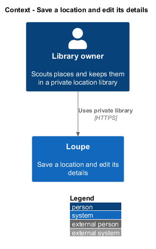
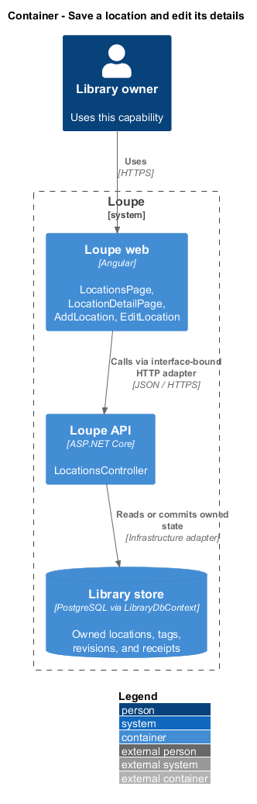
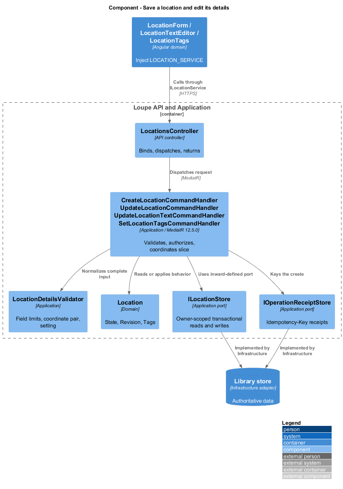
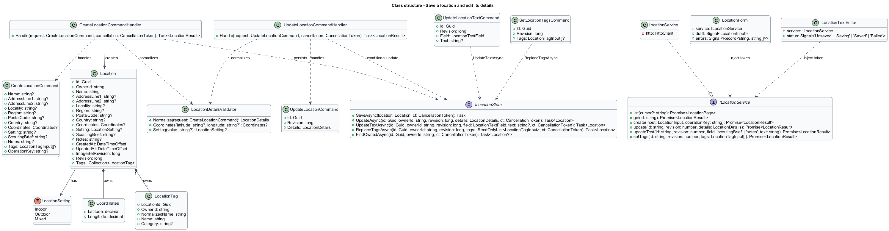
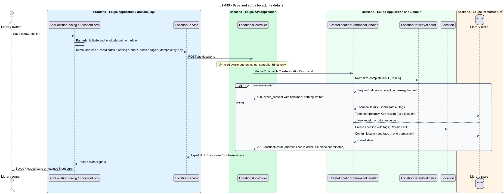
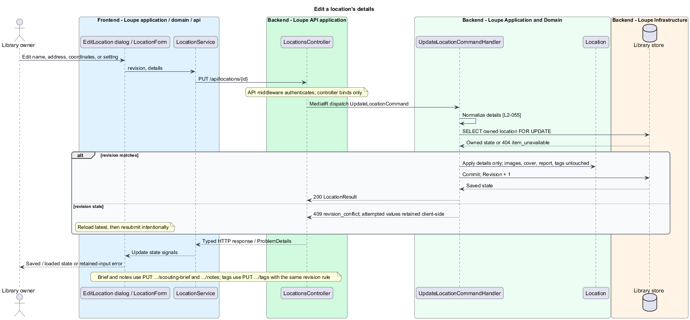

# Save a location and edit its details

## Overview

A **location** — owned record of a scouted place, holding a name, an optional address, optional coordinates, a setting, a scouting brief, personal notes, tags, and zero to ten images — is the unit of the Locations area, the fifth main area of the private library. A **scouting brief** — free text describing what the owner intends to shoot at the place — is the one text field that a scouting report reads; personal notes never leave the server. **Coordinates** — a latitude and longitude pair in decimal degrees, typed by the owner and shown to six decimal places — are optional, are entered as a pair, and are never read from a photograph.

This feature covers creating a location from its details and editing any of those details later. Images, the scouting report, and shoot-planning search are separate slices in the same subsystem group: [manage-location-images](../manage-location-images/README.md), [browse-locations](../browse-locations/README.md), [request-scouting-report](../../scouting/request-scouting-report/README.md), and [find-location](../../shoot-planning/find-location/README.md).

This is a proposed design for the defined requirements. `docs/mocks/locations.html`, `docs/mocks/location.html`, and `docs/mocks/find-location.html` are the visual and interaction reference that `L2-055` names. The repository contains no Locations implementation. Components named below extend the implemented References, Critique, Search, and Deletion slices by their real names; proposed UI copy is design text, not a quotation.

## Description

`LocationsPage` and `LocationDetailPage` live in `frontend/projects/loupe` and own routing and dialogs. `LocationForm`, `LocationTextEditor`, and `LocationTags` live in `frontend/projects/domain` and consume `ILocationService` through `LOCATION_SERVICE`. The contract and token share `location.service.contract.ts` in `frontend/projects/api`. `LocationService` is the separate production HTTP adapter. Composition substitutes `MockLocationService` under Playwright through the `e2e` file replacement of `app.providers.ts`. State uses signals, and HTTP and observable conversion stay inside the adapter. Presentational controls in `components` consume inputs and emit outputs. Component class, template, and styles occupy separate files.

`LocationsController` lives in `backend/src/Loupe.Api/Controllers` under `Loupe.Api.Controllers`. It binds requests, dispatches MediatR **12.5.0**, and returns results. Requests, handlers, and validators live in `Loupe.Application/Locations`. `Location` lives in `Loupe.Domain/Locations`; the domain references no other project. `ILocationStore` and the shared capability ports belong to Application. Infrastructure implements persistence through `LibraryDbContext`. Each type occupies its own named file.

`Location` follows the anemic entity style of `Reference`: `Id`, `OwnerId`, `Name`, `AddressLine1`, `AddressLine2`, `Locality`, `Region`, `PostalCode`, `Country`, an optional owned `Coordinates` value, an optional `LocationSetting` (`Indoor`, `Outdoor`, `Mixed`), `ScoutingBrief`, `Notes`, `CreatedAt`, `UpdatedAt`, `CoverImageId`, `CurrentScoutingOperationId`, `ScoutingReportJson`, `ImageSetRevision`, `Revision`, `Tags`, and `Images`. `Coordinates` is one record used by the entity, the commands, and the results. `LocationTag` mirrors `ReferenceTag` with the `(LocationId, NormalizedName)` key and the `(Id, OwnerId)` alternate-key foreign key. `Revision` is the concurrency token every aggregate carries.

`LocationDetailsValidator` applies the shared rules through `TextField.Normalize`: name 1–200 and required; address lines 0–200 each; locality, region, and country 0–100 each; postal code 0–20; scouting brief 0–2,000; notes 0–10,000; tags through `TagName` with the shared 50-tag cap. A latitude without a longitude, or the reverse, is a field error on the missing field. Latitude accepts −90 to 90 and longitude −180 to 180 in decimal degrees with at most six decimal places; a seventh place is a field error rather than a silent rounding, and the stored value is displayed with six places. A setting outside the enumeration is a field error. Optional emptiness becomes absence. Every field error names its field and leaves the saved values unchanged.

`CreateLocationCommandHandler` normalizes the complete input, then persists one `Location` with its tags in one transaction through `ILocationStore.SaveAsync`. `IOperationReceiptStore` keys the create on the `Idempotency-Key` header with receipt type `location`, so an accidental repeat returns the same record. A location with only a name reads back with the address, coordinates, images, and report absent; the detail labels those as Address not recorded, No images, and No scouting report. The record never appears in My Work, Inspiration, Photographers, or the inspiration Search.

`UpdateLocationCommandHandler` edits the structured details — name, address lines, locality, region, postal code, country, coordinates, and setting — with an owner-scoped conditional update against `Revision` through `ILocationStore.UpdateAsync`. Images, image order, cover, report, report status, and tags are untouched by that write. `UpdateLocationTextCommandHandler` saves the scouting brief or the notes through `ILocationStore.UpdateTextAsync` with a `LocationTextField` selector, so each inline editor sends only its own field. `SetLocationTagsCommandHandler` replaces the active tags through `ILocationStore.ReplaceTagsAsync` with the diff-merge of `ReferenceTagStore.ReplaceAsync`. A stale `Revision` raises `RevisionConflictException`; `ApiExceptionHandler` returns 409 `revision_conflict`, the editor retains its attempted values, and Reload latest re-reads before an intentional resubmission under `L2-030`. No partial field update is applied.

Editing the scouting brief leaves the current report current and readable. The report displays the brief snapshot it used, and the detail offers Regenerate through [request-scouting-report](../../scouting/request-scouting-report/README.md). Keyword search reflects every edit immediately; the semantic document refresh follows [find-location](../../shoot-planning/find-location/README.md). Address lines, locality, and name are stored and rendered as plain text; HTML, script, SQL metacharacters, and template expressions remain inert and match keyword tokens as text.

`LocationsPage` opens `AddLocation` and `LocationDetailPage` opens `EditLocation`; both are native `lp-dialog` elements that follow the upload dialog sizing rule — centred with the 560-pixel maximum, a bottom sheet bounded to 90dvh below 640 CSS pixels, body scrolling with footer actions reachable. Both wrap `LocationForm`, which owns the field signals, the pair rule for coordinates, and the field-error rendering next to each field. Add location also carries brief, notes, and tags so a location is complete on first save; images are added from the detail afterwards. `UnsavedChanges` applies to Close, Escape, backdrop, and route departure through `locationsUnsavedGuard` and `locationUnsavedGuard`: Keep editing preserves the draft and Discard clears it. `LocationTextEditor` mirrors `ReferenceTextEditor` with explicit Save and the Unsaved, Saving, Saved, and Couldn't save states; `LocationTags` mirrors `ReferenceTags`.

`ILocationService` declares `list`, `get`, `create`, `update`, `updateText`, `setTags`, `addImage`, `removeImage`, and `setCover`. Failures reach components as `ServiceError` codes — `invalid_request` with the field map, `revision_conflict`, `item_unavailable` — and each component maps the code to its copy. `MockLocationService` forwards to `window.loupeLocations`, which the `LocationLibrary` Playwright fixture exposes.

The following contract surface names the proposed operations. Background commands run in the worker after a separate admission request; local evaluation commands run in the evaluation project.

| Application request | Entry point | Input |
| --- | --- | --- |
| `CreateLocationCommand` | `POST /api/locations` | `name, addressLine1?, addressLine2?, locality?, region?, postalCode?, country?, coordinates?, setting?, scoutingBrief?, notes?, tags?; Idempotency-Key` |
| `UpdateLocationCommand` | `PUT /api/locations/{id}` | `revision, name, addressLine1?, addressLine2?, locality?, region?, postalCode?, country?, coordinates?, setting?` |
| `UpdateLocationTextCommand` | `PUT /api/locations/{id}/scouting-brief`; `PUT /api/locations/{id}/notes` | `revision, text?` |
| `SetLocationTagsCommand` | `PUT /api/locations/{id}/tags` | `revision, tags[]` |

All operations inherit [shared contracts and open dependencies](../../README.md). Owner identity comes from authenticated server context, never from trusted client input. Mutations validate complete input before side effects and use conditional writes. API errors use the shared status mapping in [L2.md](../../../specs/L2.md#shared-acceptance-definitions). Visual implementation uses mirrored `--lp-` tokens and the specification's viewport matrix.

Implementation proceeds one behavior at a time using the linked Given-When-Then criteria. Each acceptance test first fails for its expected missing behavior. API integration tests cover persistence and failures. Playwright tests use one page object per screen and injected service mocks. Real-provider release checks supplement deterministic fixtures where applicable. Each acceptance file identifies L2 coverage and each test names its criterion. Regression checks pass before the next behavior starts; no architecture tests are introduced.

## Requirements

The table preserves source wording verbatim, including its use of "must". Quoted requirements are the sole exception to the design prose's shall/should/may convention. Each linked source section also supplies the acceptance criteria; deployment choices and unexecuted release evidence remain explicitly identified.

| L2 ID | Refines (L1) | Requirement |
| --- | --- | --- |
| `L2-055` | `L1-014` | Users must be able to create a location with a required name and optional address lines, locality, region, postal code, country, coordinates, setting, scouting brief, personal notes, and tags, and edit any of those fields later. Locations use the shared field, tag, failure, and conflict rules. The Add location and Edit location forms open as dialogs that follow the upload dialog sizing rule in L2-044. The screens follow `docs/mocks/locations.html`, `docs/mocks/location.html`, and `docs/mocks/find-location.html`, which apply the Inspiration grid and detail structure and the design-system tokens under L2-052. (Updated 2026-09-12: mocks added.) |

Acceptance criteria: [L2-055](../../../specs/L2.md#l2-055-save-and-edit-a-locations-details).

## Diagrams

The context view places this capability within the owner's private Loupe library. External services appear only where the slice uses provider or source content.

The container view separates Angular interaction, the .NET API, and authoritative persistence. Durable background work appears where processing continues after admission.

The component view shows dispatch into Application handlers and inward-defined ports. Infrastructure supplies the persistence implementation.

The class view names the proposed state, requests, handlers, and interface-bound frontend service. Typed associations and dependencies show which element owns behavior.

The save a location sequence traces `L2-055` through its enforcing operations, with the field-error path as an alternate. The accompanying Description defines state changes and significant recovery paths.

The edit sequence shows the conditional details update and the 409 reload path. Brief, notes, and tag saves follow the same shape through their own commands.

