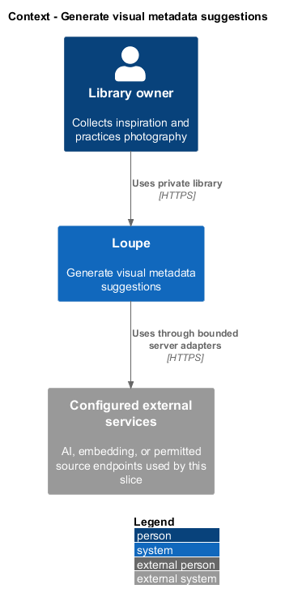
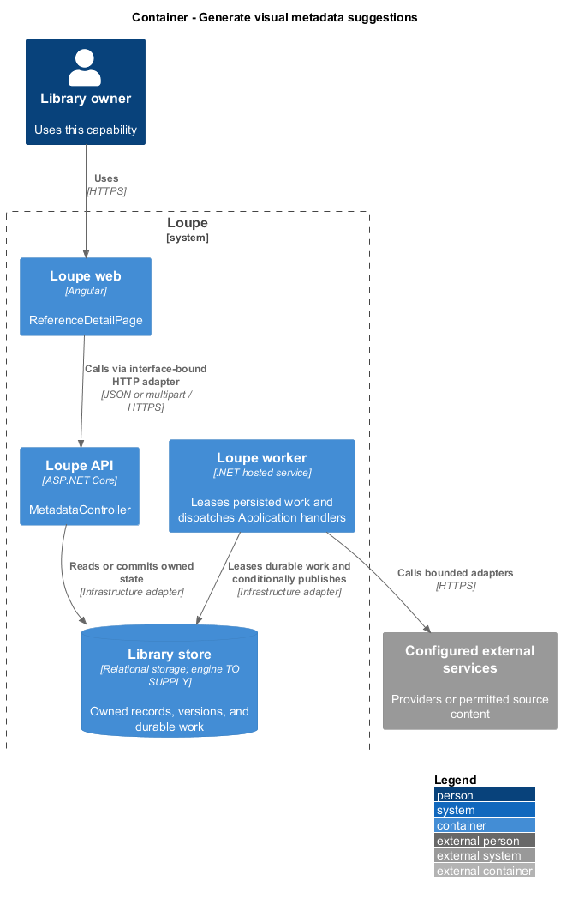
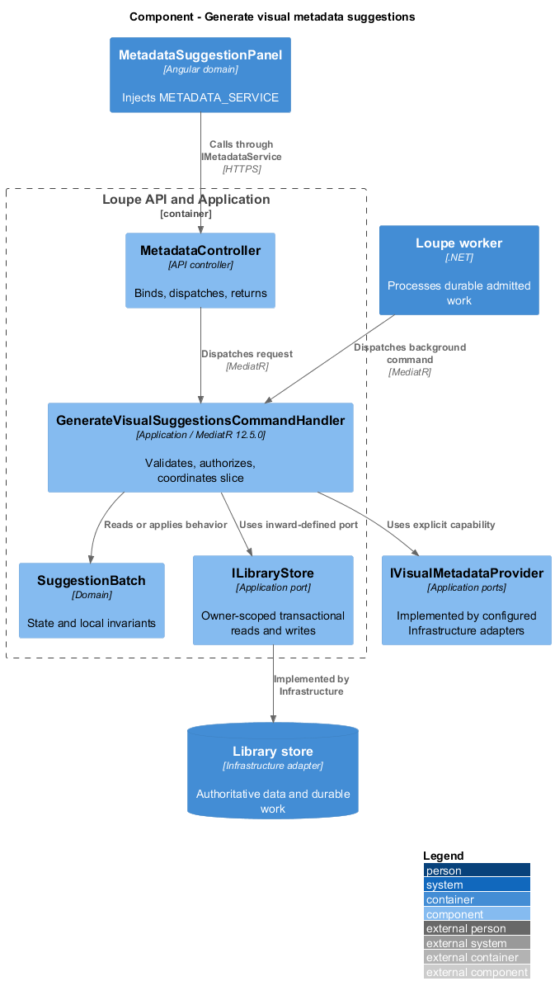
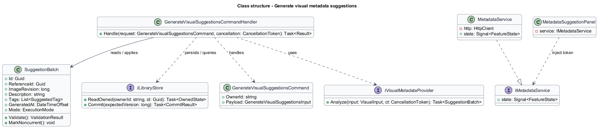
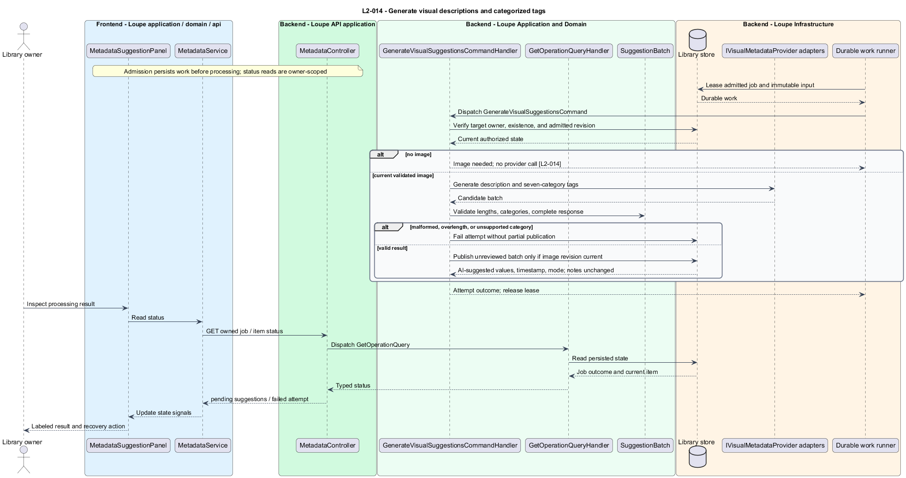

# Generate visual metadata suggestions

## Overview

A **suggestion batch** — generated description and categorized visual tags for one image revision — helps describe inspiration. Suggestions remain separate from active metadata and personal notes. An empty category means the image supplies no supported observation for that category.

This is a proposed design for the defined requirements. Existing files are illustrative HTML mockups; the repository contains no corresponding production implementation.

## Description

`ReferenceDetailPage` lives in `frontend/projects/loupe` and owns routing and dialogs. `MetadataSuggestionPanel` lives in `frontend/projects/domain` and consumes `IMetadataService` through `METADATA_SERVICE`. The contract and token share `metadata.service.contract.ts` in `frontend/projects/api`. `MetadataService` is the separate production HTTP adapter. Composition substitutes a mock implementation under Playwright. State uses signals, and HTTP and observable conversion stay inside the adapter. Presentational controls in `components` consume inputs and emit outputs. Component class, template, and styles occupy separate files.

`MetadataController` lives in `backend/src/Loupe.Api/Controllers` under `Loupe.Api.Controllers`. It binds requests, dispatches MediatR **12.5.0**, and returns results. Requests, handlers, and validators live in the matching feature namespace in `Loupe.Application`. `SuggestionBatch` lives in `Loupe.Domain`; the domain references no other project. `ILibraryStore` and capability ports belong to Application. Infrastructure implements persistence and external adapters. Each type occupies its own named file.

`RequestVisualSuggestionsCommandHandler` rejects image analysis for an owned link-only reference without calling a provider. An image-bearing reference creates durable work containing its immutable revision and execution mode. `VisualMetadataWorker` dispatches `GenerateVisualSuggestionsCommand` and calls `IVisualMetadataProvider` through an Application port.

`SuggestionBatchValidator` requires a nonempty description of at most 4,000 Unicode scalar values and tags of 1–50 Unicode scalar values under shared normalization. Categories are subject, genre, composition, lighting, palette, mood, and visible technique. Each category supports zero or more suggestions. An unknown category, overlength value, or malformed result rejects the entire attempt; no silent truncation or partial publication occurs. Active-tag capacity is enforced on acceptance, not by treating pending tags as already active.

Publication checks `ImageRevision` and stores unreviewed suggestions with timestamp and execution mode. A separate machine visual description can feed semantic search before review. Pending suggestions do not enter keyword fields or active-tag filters. Neither generation nor regeneration writes personal notes or active metadata.

`MetadataSuggestionPanel` labels output AI suggested and shows empty categories as absent or No suggestions. Deterministic malformed-output cases prove structural rejection. Licensed/synthetic content-evaluation fixtures check that photographer identities and camera settings have supplied evidence. Unsupported factual claims fail the release gate; automated shape validation alone cannot establish that guarantee. Provider identity, fixture corpus, and evaluator configuration are `<TO SUPPLY>`.

The following contract surface names the proposed operations. Background commands run in the worker after a separate admission request; local evaluation commands run in the evaluation project.

| Application request | Entry point | Input |
| --- | --- | --- |
| `GenerateVisualSuggestionsCommand` | `POST /api/references/{id}/suggestion-jobs` | `referenceId; admitted image revision` |

All operations inherit [shared contracts and open dependencies](../../README.md). Owner identity comes from authenticated server context, never from trusted client input. Mutations validate complete input before side effects and use conditional writes. API errors use the shared status mapping in [L2.md](../../../specs/L2.md#shared-acceptance-definitions). Visual implementation uses mirrored `--lp-` tokens and the specification's viewport matrix.

Implementation proceeds one behavior at a time using the linked Given-When-Then criteria. Each acceptance test first fails for its expected missing behavior. API integration tests cover persistence and failures. Playwright tests use one page object per screen and injected service mocks. Real-provider release checks supplement deterministic fixtures where applicable. Each acceptance file identifies L2 coverage and each test names its criterion. Regression checks pass before the next behavior starts; no architecture tests are introduced.

## Requirements

The table preserves source wording verbatim, including its use of “must”. Quoted requirements are the sole exception to the design prose's shall/should/may convention. Each linked source section also supplies the acceptance criteria; deployment choices and unexecuted release evidence remain explicitly identified.

| L2 ID | Refines (L1) | Requirement |
| --- | --- | --- |
| `L2-014` | `L1-004` | Image references must support AI suggestions for a description and tags in the categories subject, genre, composition, lighting, palette, mood, and visible technique. Generated content must be labeled AI suggested, include its timestamp and execution mode, and remain separate from personal notes. A category with no supported observation must remain empty rather than receiving a fabricated tag. |

Acceptance criteria: [L2-014](../../../specs/L2.md#l2-014-generate-visual-descriptions-and-categorized-tags).

## Diagrams

The context view places this capability within the owner's private Loupe library. External services appear only where the slice uses provider or source content.

The container view separates Angular interaction, the .NET API, and authoritative persistence. Durable background work appears where processing continues after admission.

The component view shows dispatch into Application handlers and inward-defined ports. Infrastructure supplies the persistence and provider implementations.

The class view names the proposed state, requests, handlers, and interface-bound frontend service. Typed associations and dependencies show which element owns behavior.

The generate visual descriptions and categorized tags sequence traces `L2-014` through its enforcing operations. The accompanying Description defines state changes and significant recovery paths.

