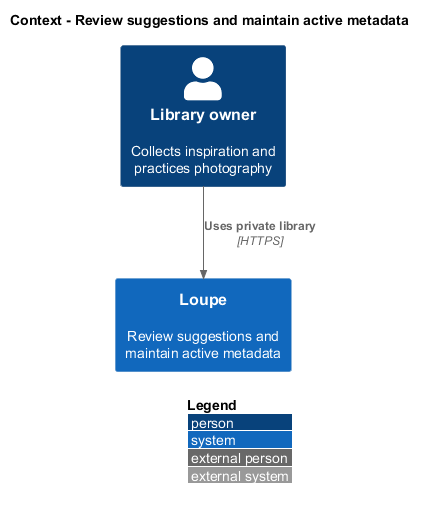
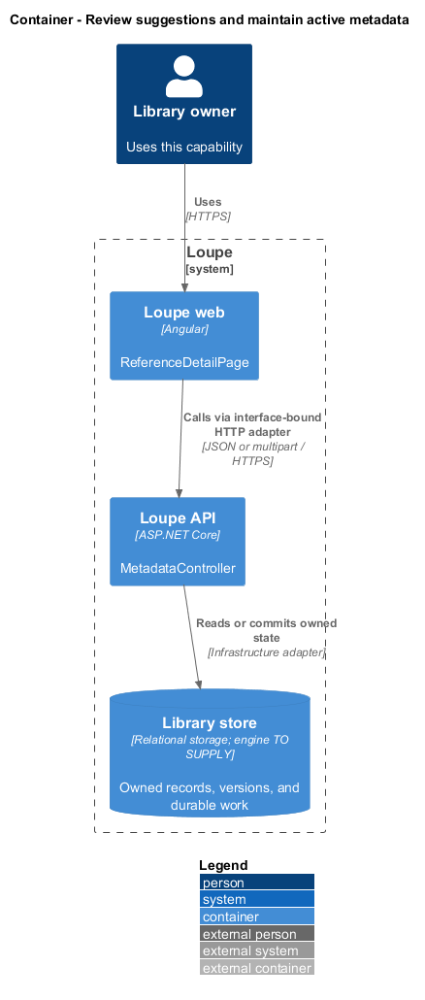
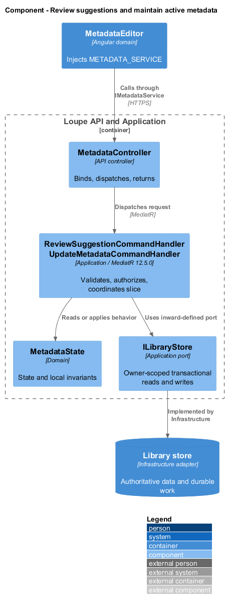
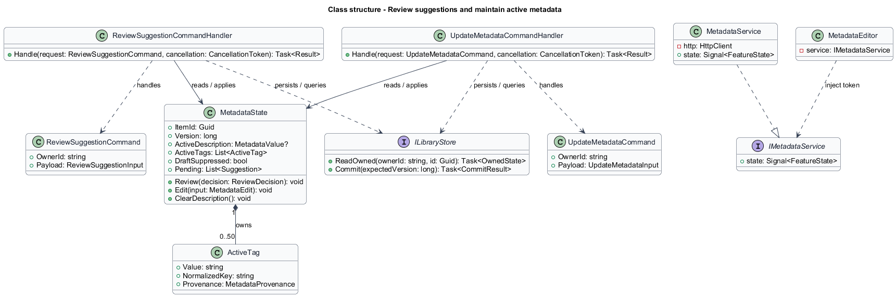
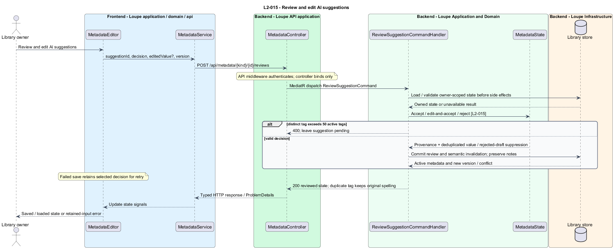
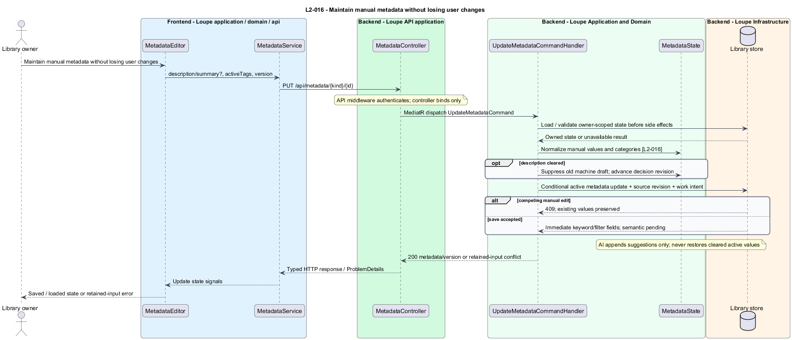

# Review suggestions and maintain active metadata

## Overview

**Active metadata** — description, summary, and tags accepted for normal display and search — differs from pending AI suggestions. **Provenance** — record of manual entry, AI acceptance, or editing of an AI suggestion — explains the origin of each active value. The review workflow applies to references and photographer bookmarks.

This is a proposed design for the defined requirements. Existing files are illustrative HTML mockups; the repository contains no corresponding production implementation.

## Description

`ReferenceDetailPage` lives in `frontend/projects/loupe` and owns routing and dialogs. `MetadataEditor` lives in `frontend/projects/domain` and consumes `IMetadataService` through `METADATA_SERVICE`. The contract and token share `metadata.service.contract.ts` in `frontend/projects/api`. `MetadataService` is the separate production HTTP adapter. Composition substitutes a mock implementation under Playwright. State uses signals, and HTTP and observable conversion stay inside the adapter. Presentational controls in `components` consume inputs and emit outputs. Component class, template, and styles occupy separate files.

`MetadataController` lives in `backend/src/Loupe.Api/Controllers` under `Loupe.Api.Controllers`. It binds requests, dispatches MediatR **12.5.0**, and returns results. Requests, handlers, and validators live in the matching feature namespace in `Loupe.Application`. `MetadataState` lives in `Loupe.Domain`; the domain references no other project. `ILibraryStore` and capability ports belong to Application. Infrastructure implements persistence and external adapters. Each type occupies its own named file.

`MetadataEditor` injects `METADATA_SERVICE` and appears within reference and photographer detail domain components. `ReviewSuggestionCommand` carries item kind, item identifier, suggestion identifier, expected metadata version, decision, and optional edited text. `ReviewSuggestionCommandHandler` validates ownership, current suggestion revision, and normalized value before an atomic metadata update.

Accept moves a pending suggestion into active metadata with AI-accepted provenance. Edit-and-accept uses only the edited value and edited-AI provenance. Reject removes the review item without making it active. Each decision persists before the UI reports success; failed saves retain the selected decision for retry. Rejection of a description also sets `DraftSuppressed`, excluding that machine draft from semantic input.

`ActiveTag` retains display spelling and a normalized uniqueness key using Unicode NFC and invariant case-insensitive comparison. Accepting a duplicate consumes no slot and preserves existing spelling. A distinct 51st active tag returns a field error and leaves its suggestion pending. Manual categories are optional; supplied categories use the visual-category enumeration.

`UpdateMetadataCommandHandler` adds, renames, removes, and categorizes active tags and edits or clears description/summary with manual provenance. Notes remain outside all suggestion and metadata write sets. Conditional updates detect concurrent manual edits with 409. An AI completion appends suggestions under its image/source revision and cannot overwrite active values.

Clearing a description sets `DraftSuppressed` even when an old draft exists. Explicit new generation resets suppression only for a successfully published new generation; an in-flight older batch cannot undo a later clear or rejection. This uses a metadata decision revision captured with the job. Supplying a manual description immediately takes precedence over machine drafts. Removed/rejected tags are excluded from all semantic inputs.

Every successful review or manual edit changes authoritative keyword/filter state immediately and bumps the semantic source revision in the same transaction. [Refresh-search](../../search/refresh-search/README.md) processes the durable indexing intent. Conflicts offer Reload latest while retaining attempted input, followed by explicit intentional resubmission under `L2-030`.

The following contract surface names the proposed operations. Background commands run in the worker after a separate admission request; local evaluation commands run in the evaluation project.

| Application request | Entry point | Input |
| --- | --- | --- |
| `ReviewSuggestionCommand` | `POST /api/metadata/{kind}/{id}/reviews` | `suggestionId, decision, editedValue?, version` |
| `UpdateMetadataCommand` | `PUT /api/metadata/{kind}/{id}` | `description/summary?, activeTags, version` |

All operations inherit [shared contracts and open dependencies](../../README.md). Owner identity comes from authenticated server context, never from trusted client input. Mutations validate complete input before side effects and use conditional writes. API errors use the shared status mapping in [L2.md](../../../specs/L2.md#shared-acceptance-definitions). Visual implementation uses mirrored `--lp-` tokens and the specification's viewport matrix.

Implementation proceeds one behavior at a time using the linked Given-When-Then criteria. Each acceptance test first fails for its expected missing behavior. API integration tests cover persistence and failures. Playwright tests use one page object per screen and injected service mocks. Real-provider release checks supplement deterministic fixtures where applicable. Each acceptance file identifies L2 coverage and each test names its criterion. Regression checks pass before the next behavior starts; no architecture tests are introduced.

## Requirements

The table preserves source wording verbatim, including its use of “must”. Quoted requirements are the sole exception to the design prose's shall/should/may convention. Each linked source section also supplies the acceptance criteria; deployment choices and unexecuted release evidence remain explicitly identified.

| L2 ID | Refines (L1) | Requirement |
| --- | --- | --- |
| `L2-015` | `L1-004` | Users must be able to accept, edit-and-accept, or reject each suggested description and tag. Active metadata must record whether it was entered manually, accepted from AI, or edited from an AI suggestion. Notes must always remain user-authored. |
| `L2-016` | `L1-004` | Users must be able to add, rename, remove, and categorize active tags and edit or clear the active description. AI regeneration must offer new suggestions without overwriting reviewed or manual values. Semantic input must prefer an active description to its machine-generated draft and exclude rejected/deleted tag values. |

Acceptance criteria: [L2-015](../../../specs/L2.md#l2-015-review-and-edit-ai-suggestions), [L2-016](../../../specs/L2.md#l2-016-maintain-manual-metadata-without-losing-user-changes).

## Diagrams

The context view places this capability within the owner's private Loupe library. External services appear only where the slice uses provider or source content.

The container view separates Angular interaction, the .NET API, and authoritative persistence. Durable background work appears where processing continues after admission.

The component view shows dispatch into Application handlers and inward-defined ports. Infrastructure supplies the persistence and provider implementations.

The class view names the proposed state, requests, handlers, and interface-bound frontend service. Typed associations and dependencies show which element owns behavior.

The review and edit ai suggestions sequence traces `L2-015` through its enforcing operations. The accompanying Description defines state changes and significant recovery paths.

The maintain manual metadata without losing user changes sequence traces `L2-016` through its enforcing operations. The accompanying Description defines state changes and significant recovery paths.

