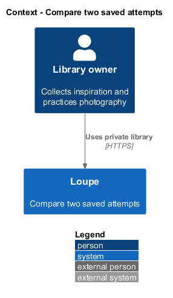
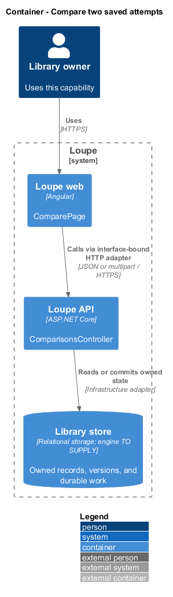
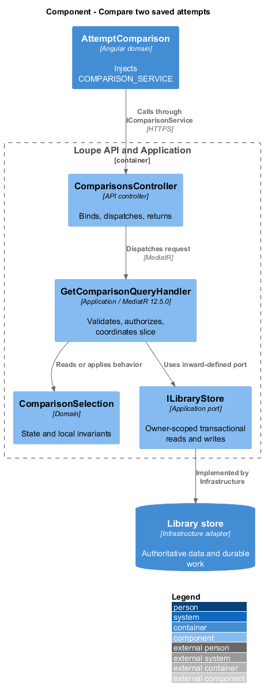
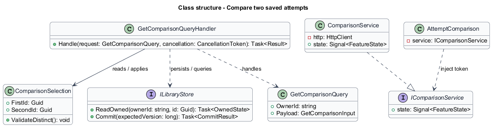
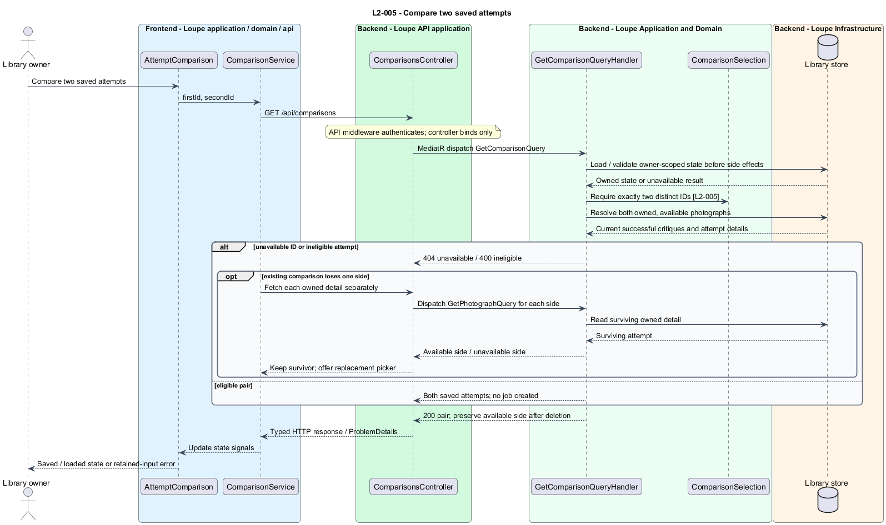

# Compare two saved attempts

## Overview

An **attempt** — saved personal photograph together with its current successful critique — provides evidence of a practice outcome. Comparison displays exactly two distinct owned attempts together. It reads existing feedback and performs no AI comparison.

This is a proposed design for the defined requirements. Existing files are illustrative HTML mockups; the repository contains no corresponding production implementation.

## Description

`ComparePage` lives in `frontend/projects/loupe` and owns routing and dialogs. `AttemptComparison` lives in `frontend/projects/domain` and consumes `IComparisonService` through `COMPARISON_SERVICE`. The contract and token share `comparison.service.contract.ts` in `frontend/projects/api`. `ComparisonService` is the separate production HTTP adapter. Composition substitutes a mock implementation under Playwright. State uses signals, and HTTP and observable conversion stay inside the adapter. Presentational controls in `components` consume inputs and emit outputs. Component class, template, and styles occupy separate files.

`ComparisonsController` lives in `backend/src/Loupe.Api/Controllers` under `Loupe.Api.Controllers`. It binds requests, dispatches MediatR **12.5.0**, and returns results. Requests, handlers, and validators live in the matching feature namespace in `Loupe.Application`. `ComparisonSelection` lives in `Loupe.Domain`; the domain references no other project. `ILibraryStore` and capability ports belong to Application. Infrastructure implements persistence and external adapters. Each type occupies its own named file.

`ComparePage` owns the route containing two identifiers and the dialog for selecting another attempt. `AttemptComparison` injects `COMPARISON_SERVICE`. `IComparisonService` exposes `eligible()` and `load(firstId, secondId)`. `GetComparisonQueryHandler` validates distinct identifiers and owner visibility before checking critique eligibility. A foreign or missing identifier returns 404; repeated identifiers or owned photographs without a successful critique return 400.

The initial selection action requires two eligible photographs. Fewer eligible records produce an explanation and no empty comparison. The comparison result includes both images, titles, localized dates, submitted briefs, current critiques, and notes. There is no job-dispatch dependency in this slice.

`IComparisonService` retains each successfully loaded side in signals. If a previously selected photograph disappears, a failed comparison refresh is followed by independent owned-detail reads. The surviving side remains visible; the unavailable side offers a replacement picker without identifying foreign content. This preserves the shared 404 contract while supporting partial recovery in an already open comparison.

Attempts stack below 768 CSS pixels and form two labeled columns from 768 pixels. Images use full-frame fit. The application mirrors the `--lp-` tokens from the independent design system. The specified 768-pixel breakpoint takes precedence over the illustrative mockup's different breakpoints.

The following contract surface names the proposed operations. Background commands run in the worker after a separate admission request; local evaluation commands run in the evaluation project.

| Application request | Entry point | Input |
| --- | --- | --- |
| `GetComparisonQuery` | `GET /api/comparisons` | `firstId, secondId` |

All operations inherit [shared contracts and open dependencies](../../README.md). Owner identity comes from authenticated server context, never from trusted client input. Mutations validate complete input before side effects and use conditional writes. API errors use the shared status mapping in [L2.md](../../../specs/L2.md#shared-acceptance-definitions). Visual implementation uses mirrored `--lp-` tokens and the specification's viewport matrix.

Implementation proceeds one behavior at a time using the linked Given-When-Then criteria. Each acceptance test first fails for its expected missing behavior. API integration tests cover persistence and failures. Playwright tests use one page object per screen and injected service mocks. Real-provider release checks supplement deterministic fixtures where applicable. Each acceptance file identifies L2 coverage and each test names its criterion. Regression checks pass before the next behavior starts; no architecture tests are introduced.

## Requirements

The table preserves source wording verbatim, including its use of “must”. Quoted requirements are the sole exception to the design prose's shall/should/may convention. Each linked source section also supplies the acceptance criteria; deployment choices and unexecuted release evidence remain explicitly identified.

| L2 ID | Refines (L1) | Requirement |
| --- | --- | --- |
| `L2-005` | `L1-001` | Users must be able to select exactly two distinct owned photographs with successful critiques and inspect each image, title, date, brief, critique, and notes together. |

Acceptance criteria: [L2-005](../../../specs/L2.md#l2-005-compare-two-saved-attempts).

## Diagrams

The context view places this capability within the owner's private Loupe library. External services appear only where the slice uses provider or source content.

The container view separates Angular interaction, the .NET API, and authoritative persistence. Durable background work appears where processing continues after admission.

The component view shows dispatch into Application handlers and inward-defined ports. Infrastructure supplies the persistence and provider implementations.

The class view names the proposed state, requests, handlers, and interface-bound frontend service. Typed associations and dependencies show which element owns behavior.

The compare two saved attempts sequence traces `L2-005` through its enforcing operations. The accompanying Description defines state changes and significant recovery paths.

