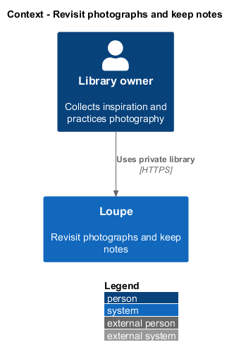
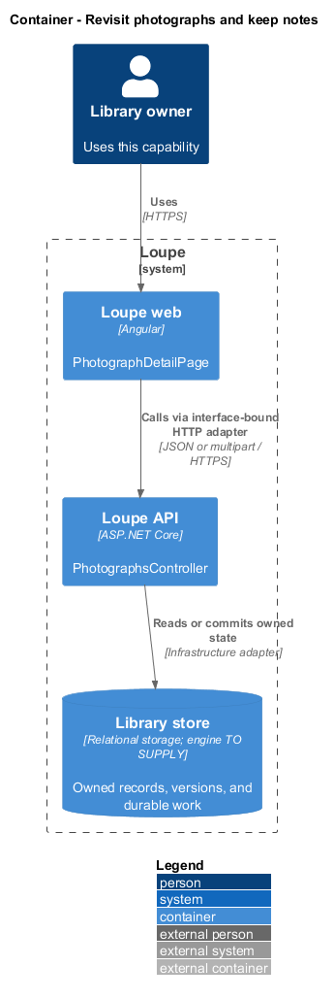
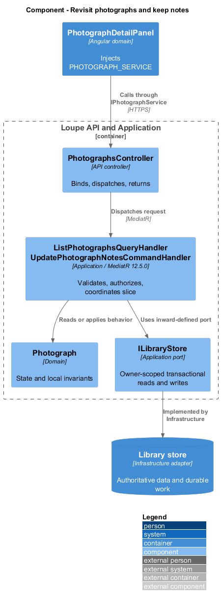
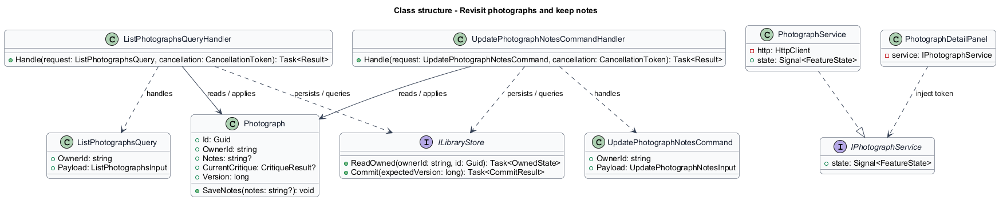
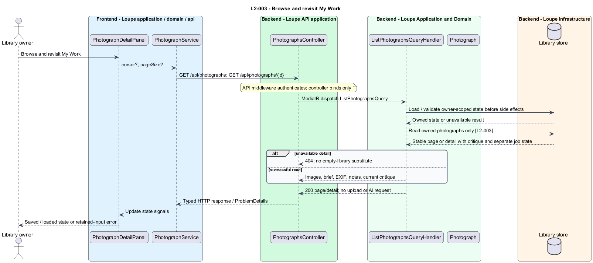
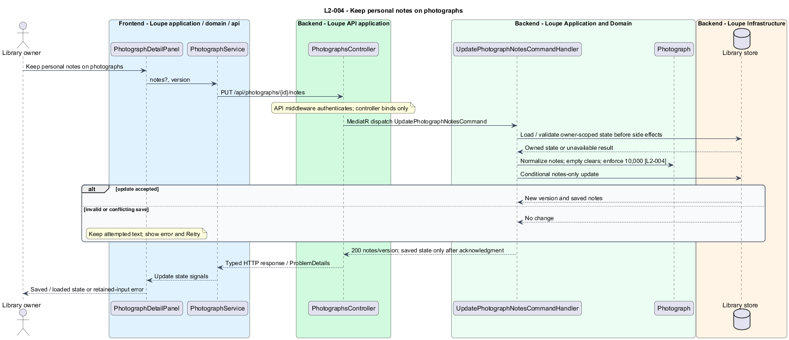

# Revisit photographs and keep notes

## Overview

My Work provides a persistent collection of personal photographs. A **current critique** — most recent validated successful critique for a photograph — remains available during replacement processing. Personal notes record the owner's observations independently of generated feedback.

This is a proposed design for the defined requirements. Existing files are illustrative HTML mockups; the repository contains no corresponding production implementation.

## Description

`PhotographDetailPage` lives in `frontend/projects/loupe` and owns routing and dialogs. `PhotographDetailPanel` lives in `frontend/projects/domain` and consumes `IPhotographService` through `PHOTOGRAPH_SERVICE`. The contract and token share `photograph.service.contract.ts` in `frontend/projects/api`. `PhotographService` is the separate production HTTP adapter. Composition substitutes a mock implementation under Playwright. State uses signals, and HTTP and observable conversion stay inside the adapter. Presentational controls in `components` consume inputs and emit outputs. Component class, template, and styles occupy separate files.

`PhotographsController` lives in `backend/src/Loupe.Api/Controllers` under `Loupe.Api.Controllers`. It binds requests, dispatches MediatR **12.5.0**, and returns results. Requests, handlers, and validators live in the matching feature namespace in `Loupe.Application`. `Photograph` lives in `Loupe.Domain`; the domain references no other project. `ILibraryStore` and capability ports belong to Application. Infrastructure implements persistence and external adapters. Each type occupies its own named file.

`MyWorkPage` composes a `PhotographCollection` domain component. `PhotographDetailPage` composes `PhotographDetailPanel`, which reads `IPhotographService` through its token. `ListPhotographsQueryHandler` returns owner-scoped photographs only. Its cursor contains creation time and identifier, with descending creation time and ascending identifier order. Page size defaults to 24 and is capped at 100.

`GetPhotographQueryHandler` returns the complete oriented image, available EXIF, normalized brief, notes, current critique, and separate job status. Opening a saved URL performs reads only. The response distinguishes no critique, queued, running, successful, and failed replacement states; failure never erases the current successful critique.

`UpdatePhotographNotesCommandHandler` saves normalized plain text up to 10,000 Unicode scalar values using the record version. Empty text clears notes. Its update targets notes alone, so critique publication never owns or changes this field. The editor exposes explicit Save and unsaved, saving, saved, and error states. A failed save retains the attempted text until navigation, cancellation, or sign-out.

The collection distinguishes empty success from request failure and offers retry for the latter. Missing, deleted, or foreign detail returns indistinguishable 404 and an unavailable-detail screen. Saved UTC dates render in the viewer's locale. Recovery follows `L2-043`, including retained content, Retry, and same-tab draft handling.

The following contract surface names the proposed operations. Background commands run in the worker after a separate admission request; local evaluation commands run in the evaluation project.

| Application request | Entry point | Input |
| --- | --- | --- |
| `ListPhotographsQuery` | `GET /api/photographs; GET /api/photographs/{id}` | `cursor?, pageSize?` |
| `UpdatePhotographNotesCommand` | `PUT /api/photographs/{id}/notes` | `notes?, version` |

All operations inherit [shared contracts and open dependencies](../../README.md). Owner identity comes from authenticated server context, never from trusted client input. Mutations validate complete input before side effects and use conditional writes. API errors use the shared status mapping in [L2.md](../../../specs/L2.md#shared-acceptance-definitions). Visual implementation uses mirrored `--lp-` tokens and the specification's viewport matrix.

Implementation proceeds one behavior at a time using the linked Given-When-Then criteria. Each acceptance test first fails for its expected missing behavior. API integration tests cover persistence and failures. Playwright tests use one page object per screen and injected service mocks. Real-provider release checks supplement deterministic fixtures where applicable. Each acceptance file identifies L2 coverage and each test names its criterion. Regression checks pass before the next behavior starts; no architecture tests are introduced.

## Requirements

The table preserves source wording verbatim, including its use of “must”. Quoted requirements are the sole exception to the design prose's shall/should/may convention. Each linked source section also supplies the acceptance criteria; deployment choices and unexecuted release evidence remain explicitly identified.

| L2 ID | Refines (L1) | Requirement |
| --- | --- | --- |
| `L2-003` | `L1-001` | My Work must show saved photographs, titles, creation dates, and critique status, and open a detail screen containing the image, brief, available EXIF, critique, and notes. |
| `L2-004` | `L1-001` | Users must be able to save, revise, and clear personal notes independently of AI content. Note editors must provide explicit Save and unsaved/saving/saved/error feedback. |

Acceptance criteria: [L2-003](../../../specs/L2.md#l2-003-browse-and-revisit-my-work), [L2-004](../../../specs/L2.md#l2-004-keep-personal-notes-on-photographs).

## Diagrams

The context view places this capability within the owner's private Loupe library. External services appear only where the slice uses provider or source content.

The container view separates Angular interaction, the .NET API, and authoritative persistence. Durable background work appears where processing continues after admission.

The component view shows dispatch into Application handlers and inward-defined ports. Infrastructure supplies the persistence and provider implementations.

The class view names the proposed state, requests, handlers, and interface-bound frontend service. Typed associations and dependencies show which element owns behavior.

The browse and revisit my work sequence traces `L2-003` through its enforcing operations. The accompanying Description defines state changes and significant recovery paths.

The keep personal notes on photographs sequence traces `L2-004` through its enforcing operations. The accompanying Description defines state changes and significant recovery paths.

