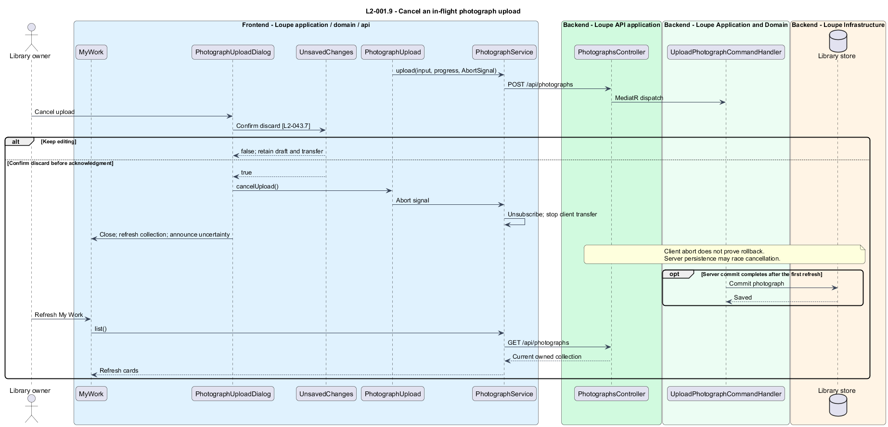

# Save a photograph and its brief

## Overview

Loupe separates personal photographs from inspiration references. A **photograph** — private image record submitted for practice and critique — belongs to My Work. A **brief** — optional statement of intent, genre, experience, and requested feedback — supplies context for a later critique. Saving a photograph does not itself request analysis.

The upload interaction is implemented in the Angular client. The HTML mockups remain the visual reference; the description below records the dialog behavior and its service boundaries.

## Description

`MyWork` lives in `frontend/projects/loupe` and owns `PhotographUploadDialog`. The header and empty-state buttons open a native modal using `showModal()`. Each activation explicitly focuses its button before opening, giving the native dialog a restoration target even when a browser does not focus mouse-clicked buttons. My Work remains mounted and its URL does not change. The former `/my-work/upload` route redirects to `/my-work`.

`PhotographUpload` lives in `frontend/projects/domain` and consumes `IPhotographService` through `PHOTOGRAPH_SERVICE`. The contract and token share `photograph.service.contract.ts` in `frontend/projects/api`. `PhotographService` is the separate production HTTP adapter. Composition substitutes a mock implementation under Playwright. Signals hold state; HTTP and observable conversion stay inside the adapter. Component class, template, and styles occupy separate files.

The dialog follows the form, progress and invalid-file states in `docs/mocks/my-work.html`. Optional details retain title and custom feedback entry. Genre and experience start absent. Feedback chips serialize their selected labels in display order, followed by custom feedback on a new line. The combined value retains the existing requested-feedback limit. Browse and drop accept one file per operation.

The native modal makes the background inert and locks its scrolling. Focus enters the dialog, stays within its visible controls, and returns to the trigger after closing. `UnsavedChanges` handles Close, Escape, backdrop dismissal and route departure. Keep editing preserves the draft; Discard clears it. Below 640 CSS pixels the dialog becomes a bottom sheet bounded to 90dvh. The body scrolls while footer actions remain reachable.

`PhotographsController` lives in `backend/src/Loupe.Api/Controllers` under `Loupe.Api.Controllers`. It binds requests, dispatches MediatR **12.5.0**, and returns results. Requests, handlers, and validators live in the matching feature namespace in `Loupe.Application`. `Photograph` lives in `Loupe.Domain`; the domain references no other project. `ILibraryStore` and capability ports belong to Application. Infrastructure implements persistence and external adapters. Each type occupies its own named file.

`PhotographUpload` owns form and transfer signals. `IPhotographService.upload()` reports transferred and total bytes when available; otherwise the panel shows indeterminate progress. A failed attempt retains non-file fields and indicates whether file reselection is necessary.

`UploadPhotographCommandHandler` validates normalized fields before accepting the image. `IImageIngestor` stages bytes, validates the declared format against decoded content, applies EXIF orientation, and produces a browser-compatible preview. Accepted input contains exactly one still JPEG, PNG, HEIC, or WebP image. Limits are 25,000,000 bytes, 100,000,000 decoded pixels, and 20,000 pixels on either edge, inclusive. Multi-image containers, animation, RAW, TIFF, SVG, and GIF receive the shared failure response.

The handler writes immutable image objects before committing the photograph and file references in one database transaction. Staged objects remain inaccessible without an owned record. Failed persistence deletes staged objects where possible and records abandoned work for cleanup. Cleanup removes abandoned bytes within 24 hours under healthy storage, with overdue alerts and durable retries under `L2-032`. A saved record never points to an incomplete preview.

An absent title defaults to the filename without extension, capped at 200 Unicode scalar values; an empty result becomes Untitled photograph. `CritiqueBrief` contains nullable intent, genre, experience, and requested feedback. `ExperienceLevel` permits Beginner, Intermediate, Advanced, and Professional. Clearing optional values stores absence. `UpdatePhotographBriefCommandHandler` performs an owner-scoped conditional update against `Version`. Already queued critiques retain immutable brief snapshots.

`IPhotographService.upload` accepts an optional `AbortSignal` after its progress callback. The HTTP adapter unsubscribes when the signal aborts, stopping the client transfer. Each attempt removes its abort listener when settled. The domain component ignores progress and completion after cancellation or destruction.

Cancel upload opens the existing discard confirmation. Keep editing leaves the transfer active. Confirmed cancellation closes the modal and refreshes My Work. Its notice explains that a server commit may have raced cancellation. Refresh My Work permits another read after a late commit. Cancellation does not delete an acknowledged photograph or promise rollback. The injected mock records abort separately and permits a late server acknowledgment to exercise this race.

Upload-and-critique performs job admission after saving the photograph, through [request-critique](../../critique/request-critique/README.md). An admission failure preserves the photograph and retains Request critique recovery within the modal. The client distinguishes saved content from an unconfirmed critique. Retry retains the original admission identity and never uploads again.

Upload-only success and acknowledged critique admission close the modal on My Work. A persistent, dismissible notification offers View. `PhotographCollection.refresh()` replaces the first page and resets its continuation cursor. A request generation rejects obsolete list responses. Refresh failure preserves loaded cards and retries the refresh. Acknowledgment during discard confirmation closes the confirmation and completes the saved operation.

The following contract surface names the operations. Background commands run in the worker after a separate admission request; local evaluation commands run in the evaluation project.

| Application request | Entry point | Input |
| --- | --- | --- |
| `UploadPhotographCommand` | `POST /api/photographs` | `image, title?, brief?` |
| `UpdatePhotographBriefCommand` | `PUT /api/photographs/{id}/brief` | `intent?, genre?, experience?, requestedFeedback?, version` |

All operations inherit [shared contracts and open dependencies](../../README.md). Owner identity comes from authenticated server context, never from trusted client input. Mutations validate complete input before side effects and use conditional writes. API errors use the shared status mapping in [L2.md](../../../specs/L2.md#shared-acceptance-definitions). Visual implementation uses mirrored `--lp-` tokens and the specification's viewport matrix.

Implementation proceeds one behavior at a time using the linked Given-When-Then criteria. Each acceptance test first fails for its expected missing behavior. API integration tests cover persistence and failures. Playwright tests use one page object per screen and injected service mocks. Real-provider release checks supplement deterministic fixtures where applicable. Each acceptance file identifies L2 coverage and each test names its criterion. Regression checks pass before the next behavior starts; no architecture tests are introduced.

## Requirements

The table preserves source wording verbatim, including its use of “must”. Quoted requirements are the sole exception to the design prose's shall/should/may convention. Each linked source section also supplies the acceptance criteria; deployment choices and unexecuted release evidence remain explicitly identified.

| L2 ID | Refines (L1) | Requirement |
| --- | --- | --- |
| `L2-001` | `L1-001` | Users must be able to save a valid image to My Work with an optional title and brief, independently of requesting a critique. |
| `L2-002` | `L1-001` | A photograph's brief must support optional intent, genre, experience level, and requested feedback. Experience is absent or one of Beginner, Intermediate, Advanced, or Professional. |

Acceptance criteria: [L2-001](../../../specs/L2.md#l2-001-upload-and-save-personal-photographs), [L2-002](../../../specs/L2.md#l2-002-record-and-edit-the-critique-brief).

## Diagrams

The context view places this capability within the owner's private Loupe library. External services appear only where the slice uses provider or source content.

The container view separates Angular interaction, the .NET API, and authoritative persistence. Durable background work appears where processing continues after admission.

The component view shows dispatch into Application handlers and inward-defined ports. Infrastructure supplies the persistence and provider implementations.

The class view names the state, requests, handlers, and interface-bound frontend service. Typed associations and dependencies show which element owns behavior.

The upload and save personal photographs sequence traces `L2-001` through its enforcing operations. The accompanying Description defines state changes and significant recovery paths.

Cancellation stops the client transfer while acknowledging the possibility of a concurrent server commit. The notice's Refresh My Work action reconciles a commit that appears after the first refresh.

The record and edit the critique brief sequence traces `L2-002` through its enforcing operations. The accompanying Description defines state changes and significant recovery paths.

