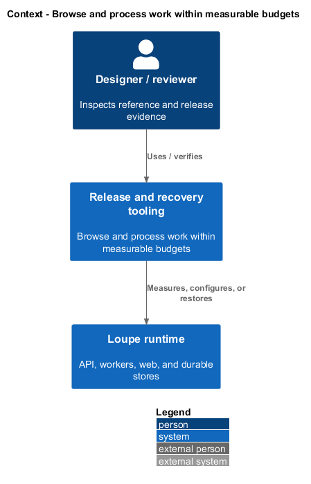
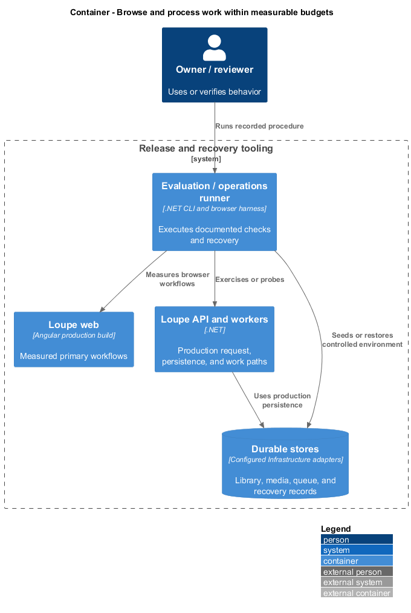
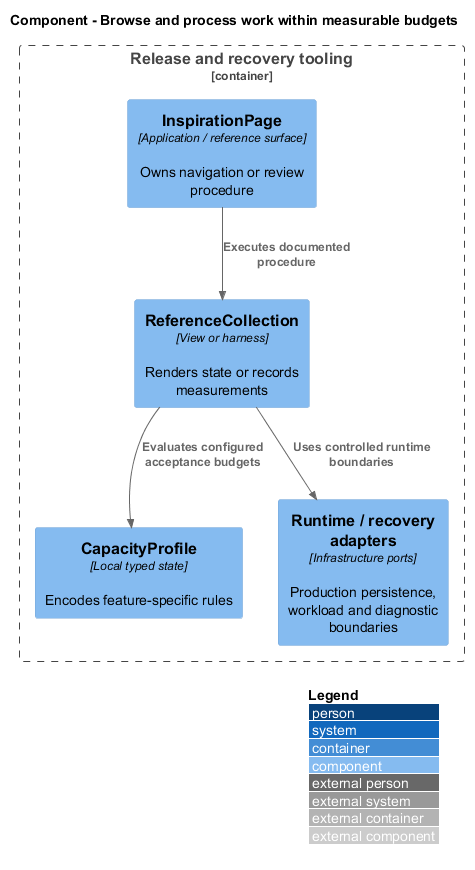
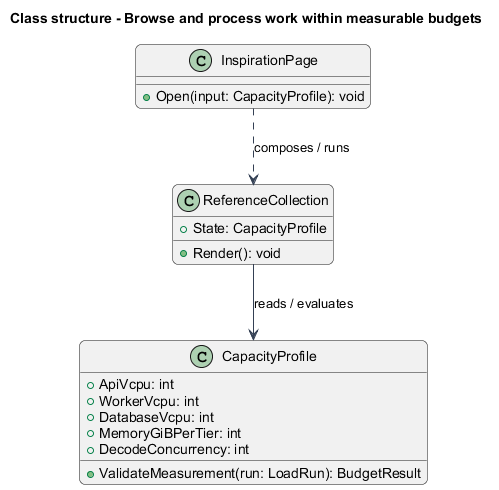
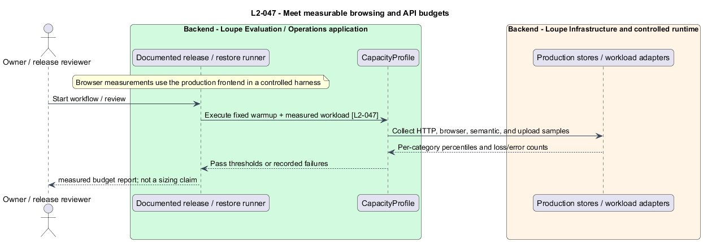
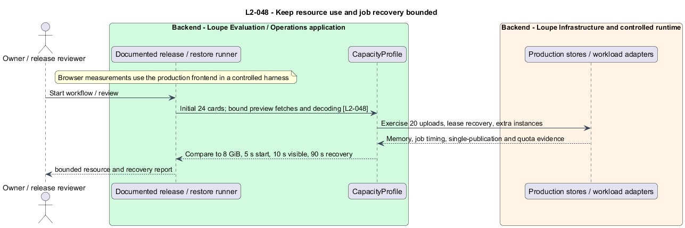

# Browse and process work within measurable budgets

## Overview

A **capacity profile** — fixed dataset, compute allocation, and request mix — makes responsiveness measurable. A **bounded preview** — small sanitized image used for collection browsing — limits network and decode cost while full images remain available in detail.

This is a proposed design for the defined requirements. Existing files are illustrative HTML mockups; the repository contains no corresponding production implementation.

## Description

This slice supplies operator and release behavior through documented CLI/browser procedures, runtime probes, and Infrastructure ports. The application exposes only the health/capability contracts described here; no setup or performance business API is introduced.

`ReferenceCollection` fetches cursor pages on explicit pagination or approaching the next page. Initial 24-card browsing fetches no originals and at most 48 grid previews. `PreviewEncoder` caps longest edge at 640 pixels and encoded bytes at 200,000, with private EXIF stripped. It adjusts encoding within those bounds without changing the full-detail asset. Page sizes above 100 return field errors. `ImageDecodeScheduler` allows at most two simultaneous image operations per baseline worker and applies bounded admission rather than unbounded buffered uploads.

`CapacityEvaluationRunner` records a repeatable seed and environment: API, workers, and database/search each receive four vCPU and 8 GiB; durable storage is in-region. Fifty users each hold 1,000 My Work records, 10,000 references, 1,000 photographers, and 50 boards, with at least 80% of references indexed. This is an acceptance target, not a sizing claim. Each user also holds 200 locations with four images each, at least 80% carrying a scouting report and a current vector, and each load category draws proportionally from the Locations endpoints.

The API run warms for two minutes, then executes 50 authenticated users at one request/second each for ten minutes. Mix is 40% lists, 25% detail, 20% filtered keywords, 10% metadata/membership writes, and 5% admission. Each read category and admission has p95 at most 500 ms; writes at most 750 ms. Unexpected 5xx/timeouts stay below 0.1%, with no lost acknowledged write. Healthy stubs retain production persistence paths.

Meaning load uses ten concurrent users, one query every two seconds for ten minutes, controlled 100-ms query embedding, and production search storage; p95 is at most 1,000 ms. Each main area has 20 cold-cache production-build runs at 10 Mbps down, 1 Mbps up, 100-ms RTT, and fourfold CPU slowdown. Successful-load p75 LCP is at most 2.5 seconds, CLS at most 0.1, and input acknowledgment at most 200 ms. Failed network/AI-processing states do not count as successful loads.

Each supported 25-MB format has 20 uploads on an idle baseline; p95 acknowledgment after bytes arrive is at most five seconds, excluding AI. Twenty concurrent maximum-supported uploads keep workers below 8 GiB, without memory termination or lost acknowledged content; capacity failure is a defined retryable result. No-backlog jobs start within five seconds, and a two-second fixture provider yields a durable visible result within ten seconds. Two-worker races commit once; recovery starts within 90 seconds of last renewal. Extra instances preserve ownership, quotas, deduplication, and shared provider caps. Measured outputs remain `<TO SUPPLY>` until implementation runs.

The following table names local workflows or release procedures. These names identify behavior and do not imply additional network endpoints.

| Workflow | Entry point | Input |
| --- | --- | --- |
| `MeasureCapacity` | `release load/browser runner` | `baseline seed and load profile` |
| `ExerciseBoundedResources` | `release concurrency runner` | `large library, uploads, worker races` |

The slice follows [shared architecture and acceptance rules](../../README.md). Where a workflow calls the private application, that feature retains its authorization and failure contracts. The static design-system site uses synthetic local content only.

Implementation proceeds one behavior at a time using the linked Given-When-Then criteria. Each acceptance test first fails for its expected missing behavior. API integration tests cover persistence and failures. Playwright tests use one page object per screen and injected service mocks. Real-provider release checks supplement deterministic fixtures where applicable. Each acceptance file identifies L2 coverage and each test names its criterion. Regression checks pass before the next behavior starts; no architecture tests are introduced.

## Requirements

The table preserves source wording verbatim, including its use of “must”. Quoted requirements are the sole exception to the design prose's shall/should/may convention. Each linked source section also supplies the acceptance criteria; deployment choices and unexecuted release evidence remain explicitly identified.

| L2 ID | Refines (L1) | Requirement |
| --- | --- | --- |
| `L2-047` | `L1-012` | The baseline load environment must allocate 4 vCPU and 8 GiB RAM to the API, 4 vCPU and 8 GiB to workers, 4 vCPU and 8 GiB to the database/search service, and durable SSD/object storage in the same region. Each of 50 users has 1,000 My Work records, 10,000 references, 1,000 photographers, 50 boards, and 200 locations with four images each, with at least 80% of references indexed and at least 80% of locations holding a scouting report and a current vector. A repeatable seed and environment configuration must be recorded. This baseline is a capacity target, not a production sizing claim. (Updated 2026-09-12: locations seeded.) The API load profile runs 50 authenticated virtual users at one request per second each for 10 minutes after a two-minute warmup: 40% list, 25% detail, 20% keyword search with filters, 10% metadata/membership writes, and 5% job admission. Each category draws proportionally from the Locations endpoints as well as the existing areas, under the same budgets. Uploads, image bytes, live AI calls, and semantic queries have separate budgets. Timing is end-to-end HTTP latency within the load-test network. Healthy dependency stubs must preserve the production persistence paths. |
| `L2-048` | `L1-012` | Lists must not load whole libraries or original-resolution images for thumbnail browsing. Grid previews must be at most 640 pixels on the longest edge and 200,000 encoded bytes, stripping private EXIF. Decoding can use at most two image operations concurrently per baseline worker. Queue recovery and scaling must preserve single committed results and configured concurrency caps. |

Acceptance criteria: [L2-047](../../../specs/L2.md#l2-047-meet-measurable-browsing-and-api-budgets), [L2-048](../../../specs/L2.md#l2-048-keep-resource-use-and-job-recovery-bounded).

## Diagrams

The context view places this capability within the owner's private Loupe library. External services appear only where the slice uses provider or source content.

The container view separates Angular interaction, the .NET API, and authoritative persistence. Durable background work appears where processing continues after admission.

The component view shows the local UI or evaluation components and their real dependencies. The slice does not introduce a network call for behavior performed locally.

The class view names proposed local state and the components that render or evaluate it. Relationships distinguish state ownership from a dependency on an existing surface.

The meet measurable browsing and api budgets sequence traces `L2-047` through its enforcing operations. The accompanying Description defines state changes and significant recovery paths.

The keep resource use and job recovery bounded sequence traces `L2-048` through its enforcing operations. The accompanying Description defines state changes and significant recovery paths.

