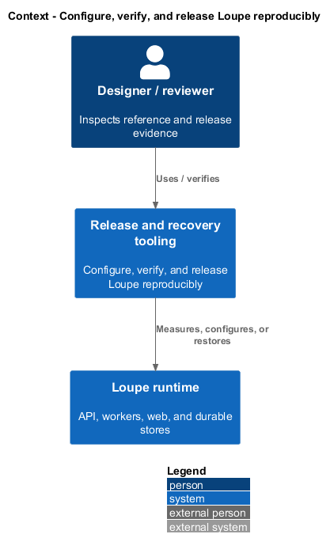
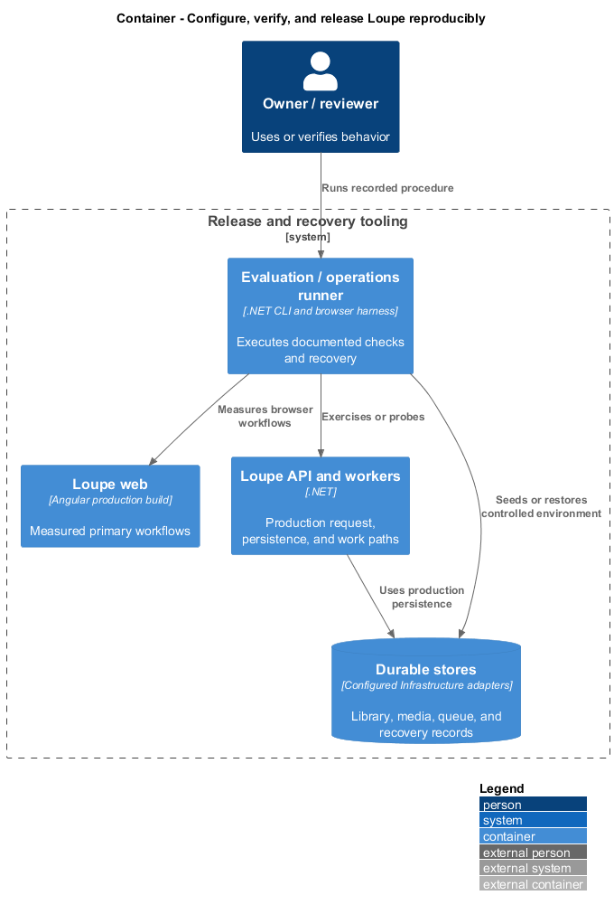
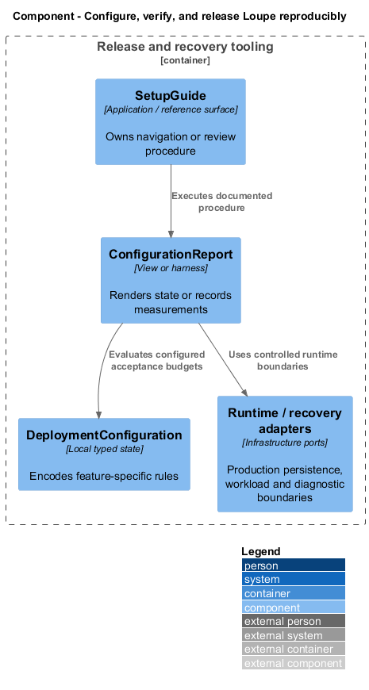
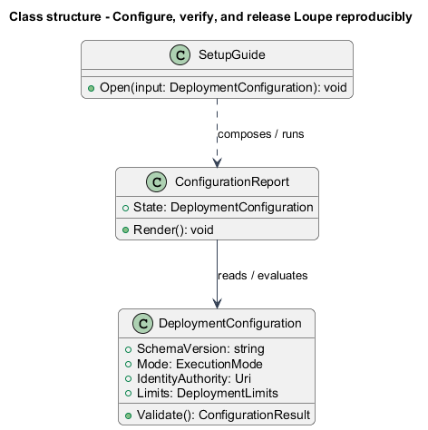
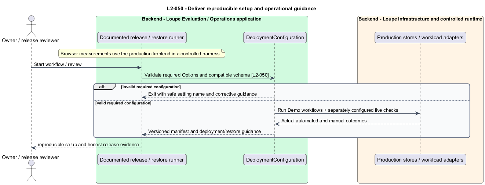

# Configure, verify, and release Loupe reproducibly

## Overview

A **release manifest** — recorded versions, configuration assumptions, commands, and actual validation outcomes — makes deployment repeatable. Setup guidance covers the API, worker, Angular application, and independent static design system with configured Live providers and honest unavailable states.

This is a proposed design for the defined requirements. Existing files are illustrative HTML mockups; the repository contains no corresponding production implementation.

## Description

This slice supplies operator and release behavior through documented CLI/browser procedures, runtime probes, and Infrastructure ports. The application exposes only the health/capability contracts described here; no setup or performance business API is introduced.

`ConfigurationValidator` binds Microsoft.Extensions Options at startup and rejects missing required settings or incompatible schema with setting names and safe corrective guidance. Optional absent Live AI credentials degrade the affected capability without stopping manual library startup. Example configuration contains no secrets. Deployment limits are displayed and enforced consistently; lower operational quotas do not rewrite the baseline specification.

`SetupGuide` specifies exact supported tool versions, restore/install/build commands, identity provisioning, database/media/queue setup and migration, and launch commands for all four deliverables. `ReleaseManifest` records demo completion of the five product-brief workflows from a clean environment. Live connection checks verify critique, visual metadata, summaries, and embeddings using actual configured services, reporting safe configuration failures accurately.

The guide includes API integration acceptance, Playwright POM acceptance with injected mocks, regression/build commands, design-system behavioral checks, accessibility and performance procedures, and real AI evaluations. It separates automated evidence from named manual review. Every acceptance file identifies L2 coverage and each test's criterion in comments as specified; review checks traceability without adding specification-parsing tests.

Deployment/rollback procedures coordinate schema compatibility and code versions. Backup/restore instructions include deletion replay before readiness. Delivery notes state tested versions, assumptions, results, provider data handling and retention, uncertain external-charge limitations, and any unverified integration. Unexecuted checks remain unexecuted. Exact commands, runtime/package versions beyond the mandated MediatR 12.5.0 pin, provider choices, and hosting configuration are `<TO SUPPLY>` until implementation decisions are made. This design defines the deliverable without claiming runnable setup already exists.

The following table names local workflows or release procedures. These names identify behavior and do not imply additional network endpoints.

| Workflow | Entry point | Input |
| --- | --- | --- |
| `VerifyReleaseSetup` | `documented setup/release commands` | `clean environment and example configuration` |

The slice follows [shared architecture and acceptance rules](../../README.md). Where a workflow calls the private application, that feature retains its authorization and failure contracts. The static design-system site uses synthetic local content only.

Implementation proceeds one behavior at a time using the linked Given-When-Then criteria. Each acceptance test first fails for its expected missing behavior. API integration tests cover persistence and failures. Playwright tests use one page object per screen and injected service mocks. Real-provider release checks supplement deterministic fixtures where applicable. Each acceptance file identifies L2 coverage and each test names its criterion. Regression checks pass before the next behavior starts; no architecture tests are introduced.

## Requirements

The table preserves source wording verbatim, including its use of “must”. Quoted requirements are the sole exception to the design prose's shall/should/may convention. Each linked source section also supplies the acceptance criteria; deployment choices and unexecuted release evidence remain explicitly identified.

| L2 ID | Refines (L1) | Requirement |
| --- | --- | --- |
| `L2-050` | `L1-012` | Delivery must include setup, required tool versions, configuration examples without secrets, database/storage provisioning and migration, identity-provider setup, demo/live operation, provider data handling, tests, backup/restore, deployment, and known limitations. The runtime/build must obey AGENTS.md, including .NET, Angular, MediatR pinned to 12.5.0, interface/token service consumption, independent design-system ownership, and incremental ATDD. These code organization constraints are reviewed using compiler, formatter, dependency tools, and human review, never architecture tests. |

Acceptance criteria: [L2-050](../../../specs/L2.md#l2-050-deliver-reproducible-setup-and-operational-guidance).

## Diagrams

The context view places this capability within the owner's private Loupe library. External services appear only where the slice uses provider or source content.

The container view separates Angular interaction, the .NET API, and authoritative persistence. Durable background work appears where processing continues after admission.

The component view shows the local UI or evaluation components and their real dependencies. The slice does not introduce a network call for behavior performed locally.

The class view names proposed local state and the components that render or evaluate it. Relationships distinguish state ownership from a dependency on an existing surface.

The deliver reproducible setup and operational guidance sequence traces `L2-050` through its enforcing operations. The accompanying Description defines state changes and significant recovery paths.

