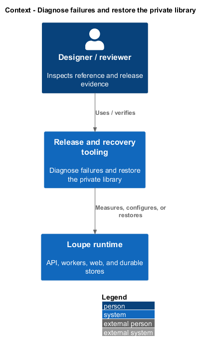
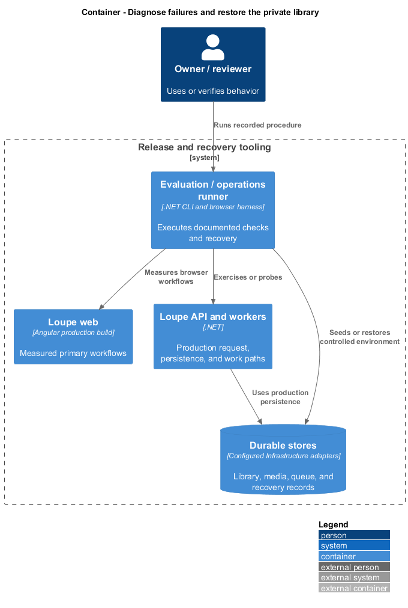
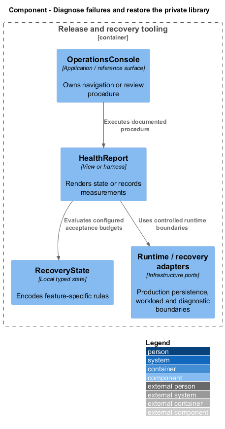
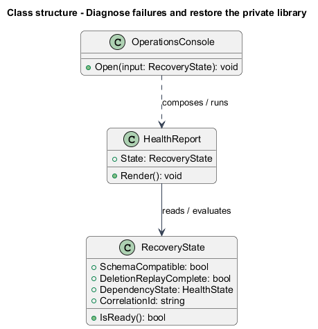
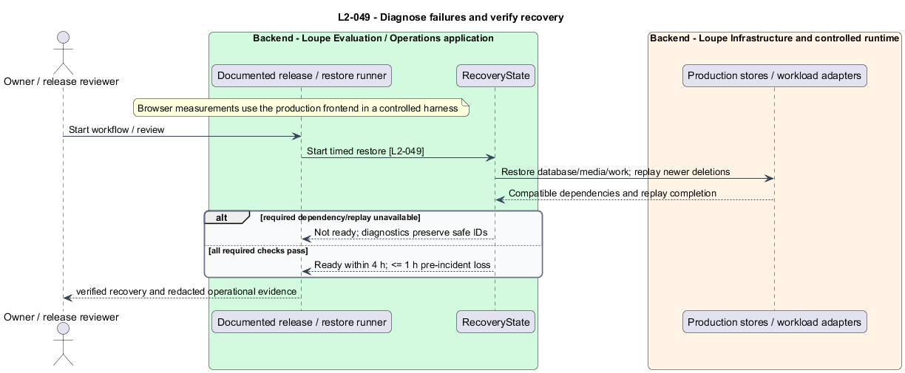

# Diagnose failures and restore the private library

## Overview

**Readiness** — ability to serve library traffic against compatible durable dependencies — differs from process liveness. A **restore run** — recovery of encrypted backups followed by deletion replay and integrity checks — restores availability without reviving deleted private content.

This is a proposed design for the defined requirements. Existing files are illustrative HTML mockups; the repository contains no corresponding production implementation.

## Description

This slice supplies operator and release behavior through documented CLI/browser procedures, runtime probes, and Infrastructure ports. The application exposes only the health/capability contracts described here; no setup or performance business API is introduced.

`RequestDiagnosticsBehavior` and worker instrumentation emit redacted structured latency, error, queue-depth/age, job-outcome/duration/retry, indexing-lag, and cleanup-backlog signals. Correlation/operation identifiers link UI errors to request and background stages. Logs include safe failure class, attempts, and durations; images, briefs, notes, source bodies, secrets, and complete private URLs are excluded.

`LivenessHealthCheck` reports responsive process state. `ReadinessHealthCheck` requires compatible schema, database, media, and durable queue, plus completed deletion replay after restore. Unavailable required dependencies return 503 while a responsive process remains live. Optional AI outages mark capabilities degraded and allow manual library readiness.

`OperationalAlertEvaluator` emits safe capability-specific diagnostic links when queue age or indexing lag exceeds five minutes, cleanup exceeds 24 hours, or unexpected 5xx exceeds 1% in five minutes with at least 100 requests. Restored dependencies recover readiness and resume persisted jobs through normal retries without manual database edits or duplicate publication.

`BackupCoordinator` creates encrypted backups at least hourly and expires them by day 30. `RestoreCoordinator` restores a selected consistent backup, replays the independently retained 35-day deletion ledger before readiness, verifies relationships and storage, and resumes durable work. Baseline restore reaches library availability within four hours of start, with at most one hour of acknowledged pre-incident loss. Restored deleted bytes are inaccessible immediately and removed within 24 hours. The run records stage timings and actual results. Backup service, alert sink, operator identity, and infrastructure procedures are `<TO SUPPLY>` deployment choices.

The following table names local workflows or release procedures. These names identify behavior and do not imply additional network endpoints.

| Workflow | Entry point | Input |
| --- | --- | --- |
| `RestoreLibrary` | `operator recovery runner` | `encrypted backup and retained deletion ledger` |

The slice follows [shared architecture and acceptance rules](../../README.md). Where a workflow calls the private application, that feature retains its authorization and failure contracts. The static design-system site uses synthetic local content only.

Implementation proceeds one behavior at a time using the linked Given-When-Then criteria. Each acceptance test first fails for its expected missing behavior. API integration tests cover persistence and failures. Playwright tests use one page object per screen and injected service mocks. Real-provider release checks supplement deterministic fixtures where applicable. Each acceptance file identifies L2 coverage and each test names its criterion. Regression checks pass before the next behavior starts; no architecture tests are introduced.

## Requirements

The table preserves source wording verbatim, including its use of “must”. Quoted requirements are the sole exception to the design prose's shall/should/may convention. Each linked source section also supplies the acceptance criteria; deployment choices and unexecuted release evidence remain explicitly identified.

| L2 ID | Refines (L1) | Requirement |
| --- | --- | --- |
| `L2-049` | `L1-012` | Operations must emit structured, redacted logs and metrics for request latency, error rates, queue depth/age, job outcome/duration/retry count, indexing lag, and cleanup backlog. Correlation must connect a user-visible error to its request and background operation. Liveness must report process responsiveness; readiness must require database, media storage, durable queue, and schema compatibility. Optional AI outages must degrade capability rather than make manual library use unready. |

Acceptance criteria: [L2-049](../../../specs/L2.md#l2-049-diagnose-failures-and-verify-recovery).

## Diagrams

The context view places this capability within the owner's private Loupe library. External services appear only where the slice uses provider or source content.

The container view separates Angular interaction, the .NET API, and authoritative persistence. Durable background work appears where processing continues after admission.

The component view shows the local UI or evaluation components and their real dependencies. The slice does not introduce a network call for behavior performed locally.

The class view names proposed local state and the components that render or evaluate it. Relationships distinguish state ownership from a dependency on an existing surface.

The diagnose failures and verify recovery sequence traces `L2-049` through its enforcing operations. The accompanying Description defines state changes and significant recovery paths.

