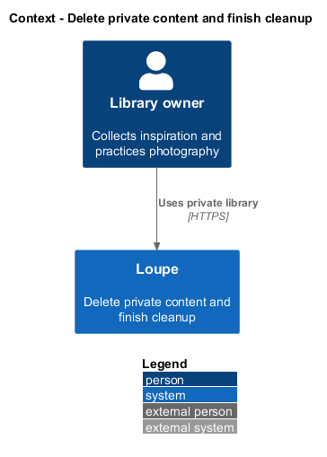
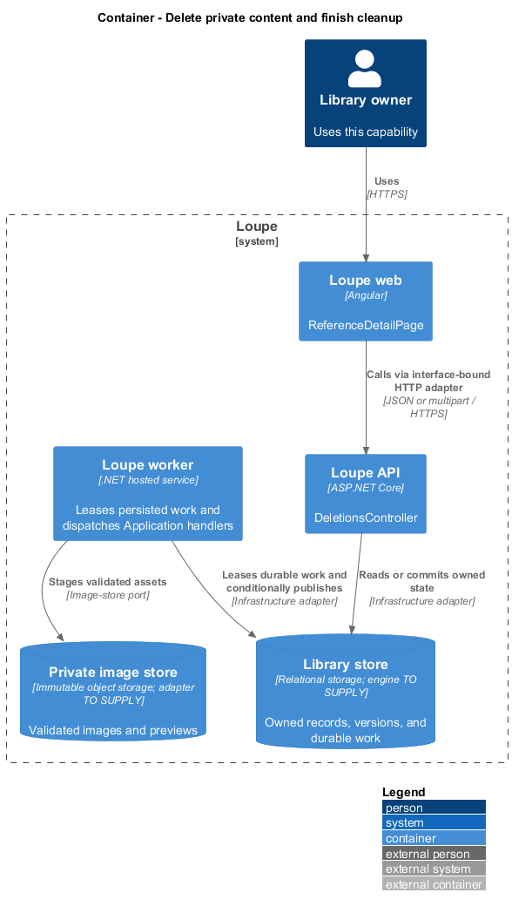
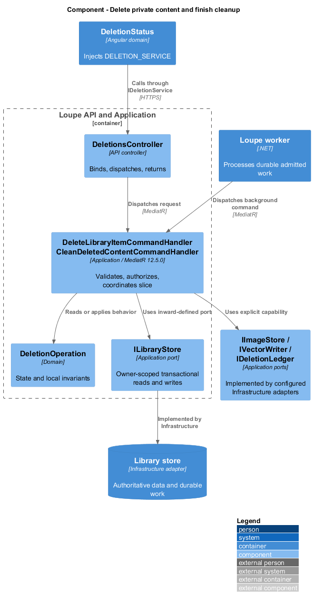
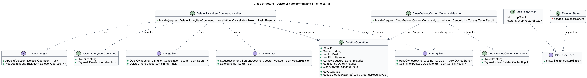
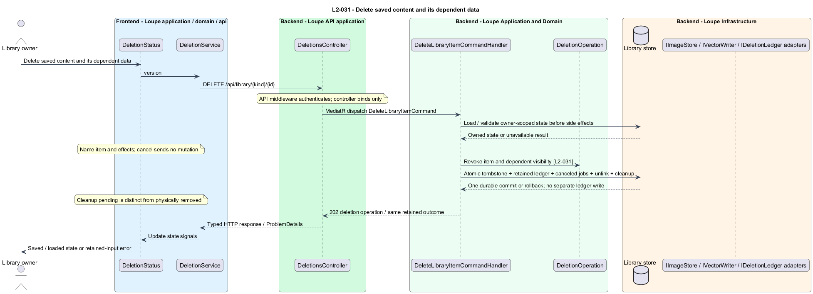
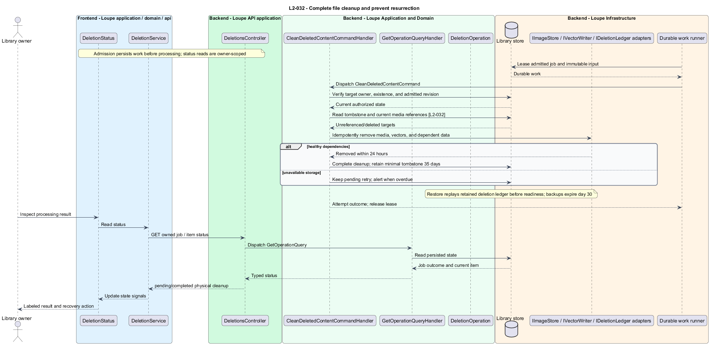

# Delete private content and finish cleanup

## Overview

A **deletion operation** — durable record that revokes an item and tracks removal of dependent data — separates immediate privacy from physical cleanup. A **deletion tombstone** — minimal retained identity and deletion time — prevents replay or backup restoration from resurrecting content.

This is a proposed design for the defined requirements. Existing files are illustrative HTML mockups; the repository contains no corresponding production implementation.

## Description

`ReferenceDetailPage` lives in `frontend/projects/loupe` and owns routing and dialogs. `DeletionStatus` lives in `frontend/projects/domain` and consumes `IDeletionService` through `DELETION_SERVICE`. The contract and token share `deletion.service.contract.ts` in `frontend/projects/api`. `DeletionService` is the separate production HTTP adapter. Composition substitutes a mock implementation under Playwright. State uses signals, and HTTP and observable conversion stay inside the adapter. Presentational controls in `components` consume inputs and emit outputs. Component class, template, and styles occupy separate files.

`DeletionsController` lives in `backend/src/Loupe.Api/Controllers` under `Loupe.Api.Controllers`. It binds requests, dispatches MediatR **12.5.0**, and returns results. Requests, handlers, and validators live in the matching feature namespace in `Loupe.Application`. `DeletionOperation` lives in `Loupe.Domain`; the domain references no other project. `ILibraryStore` and capability ports belong to Application. Infrastructure implements persistence and external adapters. Each type occupies its own named file.

Application-owned delete dialogs name the photograph, reference, or photographer and describe effects. Cancellation sends no command. `DeleteLibraryItemCommandHandler` authorizes the owner, marks the item deleted, cancels active work, invalidates search, and records cleanup plus the tombstone atomically. Read access, media, counts, pickers, and comparison revoke at acknowledgment. Repeated owner deletion resolves to the same pending/completed operation while its tombstone remains; unknown and foreign IDs return 404.

Photograph deletion removes its critique, notes, EXIF, original/derived media, and jobs. Reference deletion removes memberships, suggestions, vectors, and media but preserves boards and photographer. Photographer deletion clears reference links and invalidates affected search input while preserving textual attribution, images, sources, notes, and boards. Its fetched preview, suggestions, and vectors become cleanup targets.

`CleanupWorker` dispatches `CleanDeletedContentCommand` and `CleanAbandonedMediaCommand`. Cleanup reads a durable manifest, rechecks current file references, deletes active-store content idempotently, and records each completed step. Late job publication checks deletion before commit and retires staged output. Unreferenced uploads/replacements and deleted content disappear within 24 hours with healthy dependencies. A failed store call leaves access revoked, cleanup pending, and retryable work; the UI never equates acknowledgment with completed physical deletion.

Minimal tombstones persist 35 days; redacted security audit expires after 30 days. Backups expire by day 30. `RestoreDeletionReplay` reads a deletion ledger retained independently of the restored backup, reapplies tombstones before readiness, and queues removal of restored deleted bytes within 24 hours. The ledger and tombstone share the deletion transaction's atomic durability boundary; there is no post-commit external ledger write. Restore replaces content state while preserving the independently retained journal. Disaster recovery uses its synchronously durable copy so acknowledged deletions survive a content-backup rollback. The storage adapter is `<TO SUPPLY>` and its acceptance includes fault injection before and after the atomic commit. Overdue cleanup produces an alert and resumes until successful after recovery.

The following contract surface names the proposed operations. Background commands run in the worker after a separate admission request; local evaluation commands run in the evaluation project.

| Application request | Entry point | Input |
| --- | --- | --- |
| `DeleteLibraryItemCommand` | `DELETE /api/library/{kind}/{id}` | `version` |
| `CleanDeletedContentCommand` | `GET /api/deletions/{id}` | `deletionId; worker cleanup manifest` |

All operations inherit [shared contracts and open dependencies](../../README.md). Owner identity comes from authenticated server context, never from trusted client input. Mutations validate complete input before side effects and use conditional writes. API errors use the shared status mapping in [L2.md](../../../specs/L2.md#shared-acceptance-definitions). Visual implementation uses mirrored `--lp-` tokens and the specification's viewport matrix.

Implementation proceeds one behavior at a time using the linked Given-When-Then criteria. Each acceptance test first fails for its expected missing behavior. API integration tests cover persistence and failures. Playwright tests use one page object per screen and injected service mocks. Real-provider release checks supplement deterministic fixtures where applicable. Each acceptance file identifies L2 coverage and each test names its criterion. Regression checks pass before the next behavior starts; no architecture tests are introduced.

## Requirements

The table preserves source wording verbatim, including its use of “must”. Quoted requirements are the sole exception to the design prose's shall/should/may convention. Each linked source section also supplies the acceptance criteria; deployment choices and unexecuted release evidence remain explicitly identified.

| L2 ID | Refines (L1) | Requirement |
| --- | --- | --- |
| `L2-031` | `L1-008` | Users must be able to delete a photograph, reference, or photographer bookmark. The UI must name the item and explain its deletion effects before confirmation. Deletion must revoke read access at acknowledgment and schedule complete cleanup. |
| `L2-032` | `L1-008` | Unreferenced upload/replacement files and deleted content must be physically removed from active storage within 24 hours under healthy storage dependencies. Deletion records must persist for 35 days. Backups retain data for at most 30 days; restoration must reapply retained deletion records before user access is enabled. |

Acceptance criteria: [L2-031](../../../specs/L2.md#l2-031-delete-saved-content-and-its-dependent-data), [L2-032](../../../specs/L2.md#l2-032-complete-file-cleanup-and-prevent-resurrection).

## Diagrams

The context view places this capability within the owner's private Loupe library. External services appear only where the slice uses provider or source content.

The container view separates Angular interaction, the .NET API, and authoritative persistence. Durable background work appears where processing continues after admission.

The component view shows dispatch into Application handlers and inward-defined ports. Infrastructure supplies the persistence and provider implementations.

The class view names the proposed state, requests, handlers, and interface-bound frontend service. Typed associations and dependencies show which element owns behavior.

The delete saved content and its dependent data sequence traces `L2-031` through its enforcing operations. The accompanying Description defines state changes and significant recovery paths.

The complete file cleanup and prevent resurrection sequence traces `L2-032` through its enforcing operations. The accompanying Description defines state changes and significant recovery paths.

