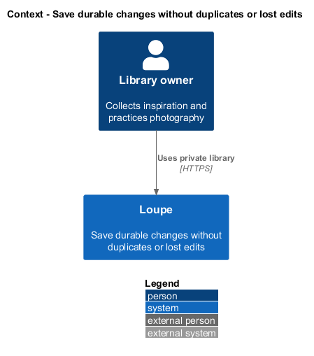
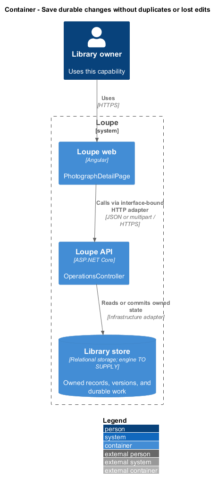
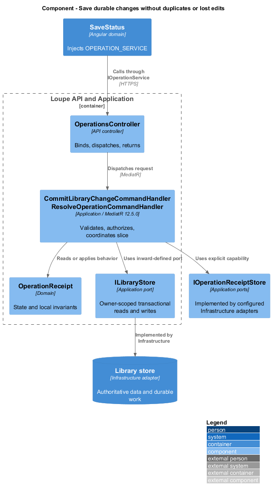
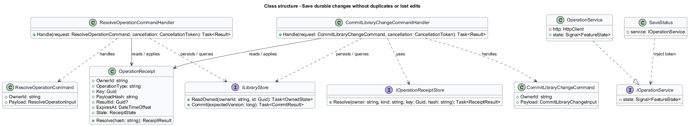
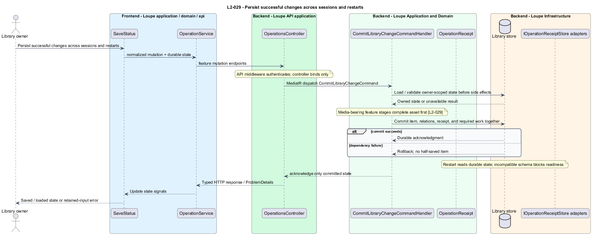
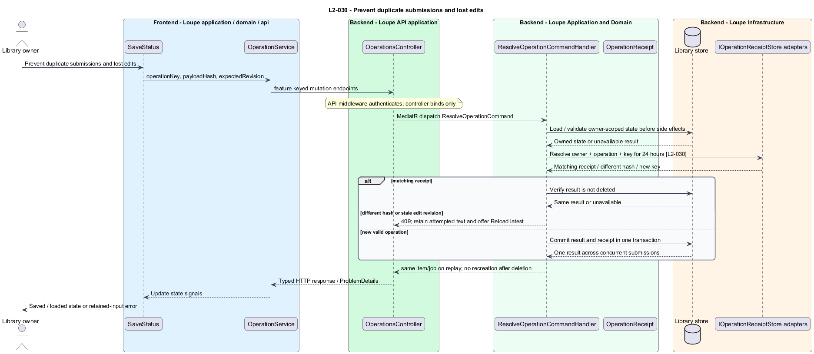

# Save durable changes without duplicates or lost edits

## Overview

A **save receipt** — durable result associated with an owner-scoped operation key — makes retry after a lost response safe. A **record revision** — incrementing version returned with editable state — detects a competing edit. Acknowledged changes survive browser, API, and worker restarts.

This is a proposed design for the defined requirements. Existing files are illustrative HTML mockups; the repository contains no corresponding production implementation.

## Description

`PhotographDetailPage` lives in `frontend/projects/loupe` and owns routing and dialogs. `SaveStatus` lives in `frontend/projects/domain` and consumes `IOperationService` through `OPERATION_SERVICE`. The contract and token share `operation.service.contract.ts` in `frontend/projects/api`. `OperationService` is the separate production HTTP adapter. Composition substitutes a mock implementation under Playwright. State uses signals, and HTTP and observable conversion stay inside the adapter. Presentational controls in `components` consume inputs and emit outputs. Component class, template, and styles occupy separate files.

`OperationsController` lives in `backend/src/Loupe.Api/Controllers` under `Loupe.Api.Controllers`. It binds requests, dispatches MediatR **12.5.0**, and returns results. Requests, handlers, and validators live in the matching feature namespace in `Loupe.Application`. `OperationReceipt` lives in `Loupe.Domain`; the domain references no other project. `ILibraryStore` and capability ports belong to Application. Infrastructure implements persistence and external adapters. Each type occupies its own named file.

`OperationKeyBehavior<TRequest,TResponse>` wraps create/upload, critique/regeneration, import, and retry handlers in Application. `IOperationReceiptStore` arbitrates `(OwnerId, OperationType, Key)` through a unique database constraint. The payload fingerprint includes normalized fields and a streamed byte digest for uploads. Receipt resolution precedes quota admission for equivalent operations, so resolving known work does not admit hidden duplicate work.

Keys persist for 24 hours. Same-key concurrent requests either observe the committed result or await/retry the in-progress receipt; no request receives success before commit. Different payloads under an unexpired key return 409. The receipt and entity/job mutations commit together. Pre-commit failures roll back the transaction and do not retain a successful receipt. Extra staged upload objects from racing requests are retired; replay returns the original image and never leaves a second AI job.

`RecordRevisionBehavior` requires the displayed revision on editable writes and performs a conditional database update. Two writers at revision N yield one accepted change and one 409. `SaveStatus` retains attempted text and offers Reload latest before an intentional new submission. Reload does not auto-resubmit or overwrite the user's draft. A create receipt pointing at a deleted item resolves as unavailable, not recreation. After key expiry a fresh operation is intentional and still observes URL uniqueness.

`ILibraryStore` commits all authoritative content and required durable work before acknowledging. Media staging completes before pointers commit. Restart reconstruction reads database, media, and operation state without browser memory. `SchemaCompatibilityCheck` blocks readiness on unsupported schema. A documented migration runs against a populated acceptance copy and preserves all relationships; failure prevents serving an incompatible schema. Storage engine and migration tooling remain `<TO SUPPLY>` as deployment choices.

The following contract surface names the proposed operations. Background commands run in the worker after a separate admission request; local evaluation commands run in the evaluation project.

| Application request | Entry point | Input |
| --- | --- | --- |
| `CommitLibraryChangeCommand` | `feature mutation endpoints` | `normalized mutation + durable state` |
| `ResolveOperationCommand` | `feature keyed mutation endpoints` | `operationKey, payloadHash, expectedRevision` |

All operations inherit [shared contracts and open dependencies](../../README.md). Owner identity comes from authenticated server context, never from trusted client input. Mutations validate complete input before side effects and use conditional writes. API errors use the shared status mapping in [L2.md](../../../specs/L2.md#shared-acceptance-definitions). Visual implementation uses mirrored `--lp-` tokens and the specification's viewport matrix.

Implementation proceeds one behavior at a time using the linked Given-When-Then criteria. Each acceptance test first fails for its expected missing behavior. API integration tests cover persistence and failures. Playwright tests use one page object per screen and injected service mocks. Real-provider release checks supplement deterministic fixtures where applicable. Each acceptance file identifies L2 coverage and each test names its criterion. Regression checks pass before the next behavior starts; no architecture tests are introduced.

## Requirements

The table preserves source wording verbatim, including its use of “must”. Quoted requirements are the sole exception to the design prose's shall/should/may convention. Each linked source section also supplies the acceptance criteria; deployment choices and unexecuted release evidence remain explicitly identified.

| L2 ID | Refines (L1) | Requirement |
| --- | --- | --- |
| `L2-029` | `L1-008` | A successful save acknowledgment must mean the record and all required durable state are committed. Database, media, and job persistence must survive application and worker restarts without reliance on browser memory. |
| `L2-030` | `L1-008` | Create/upload, critique/regeneration, import, and retry requests must accept a client-generated operation key retained for 24 hours and scoped to user and operation. Editable records must expose a revision used on updates. Retrying a request must not duplicate content, jobs, or memberships. |

Acceptance criteria: [L2-029](../../../specs/L2.md#l2-029-persist-successful-changes-across-sessions-and-restarts), [L2-030](../../../specs/L2.md#l2-030-prevent-duplicate-submissions-and-lost-edits).

## Diagrams

The context view places this capability within the owner's private Loupe library. External services appear only where the slice uses provider or source content.

The container view separates Angular interaction, the .NET API, and authoritative persistence. Durable background work appears where processing continues after admission.

The component view shows dispatch into Application handlers and inward-defined ports. Infrastructure supplies the persistence and provider implementations.

The class view names the proposed state, requests, handlers, and interface-bound frontend service. Typed associations and dependencies show which element owns behavior.

The persist successful changes across sessions and restarts sequence traces `L2-029` through its enforcing operations. The accompanying Description defines state changes and significant recovery paths.

The prevent duplicate submissions and lost edits sequence traces `L2-030` through its enforcing operations. The accompanying Description defines state changes and significant recovery paths.

