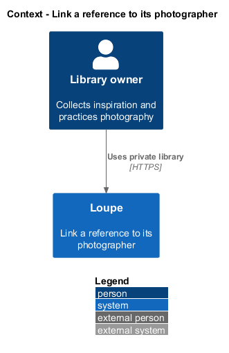
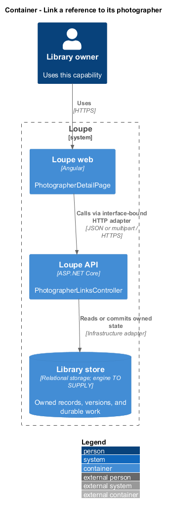
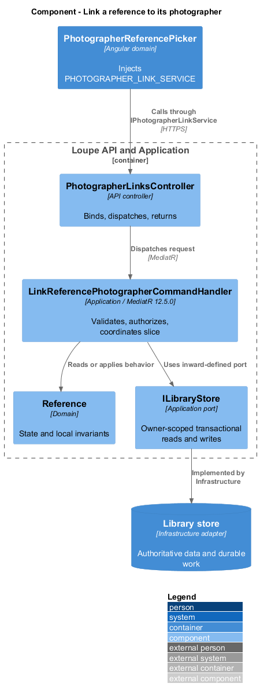
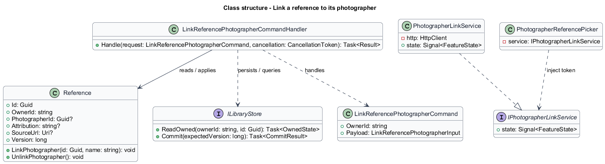
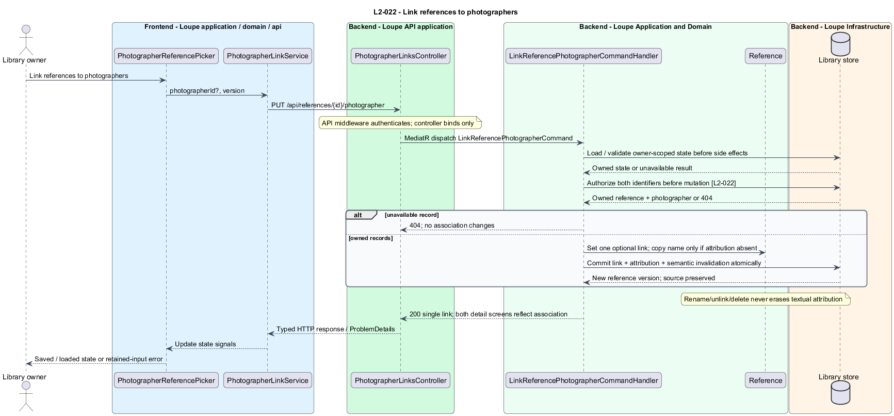

# Link a reference to its photographer

## Overview

A **photographer link** — optional association from one reference to one photographer bookmark — connects an image to a collected portfolio. **Textual attribution** — saved credit text independent of that association — preserves source context after a rename, unlink, or bookmark deletion.

This is a proposed design for the defined requirements. Existing files are illustrative HTML mockups; the repository contains no corresponding production implementation.

## Description

`PhotographerDetailPage` lives in `frontend/projects/loupe` and owns routing and dialogs. `PhotographerReferencePicker` lives in `frontend/projects/domain` and consumes `IPhotographerLinkService` through `PHOTOGRAPHER_LINK_SERVICE`. The contract and token share `photographer-link.service.contract.ts` in `frontend/projects/api`. `PhotographerLinkService` is the separate production HTTP adapter. Composition substitutes a mock implementation under Playwright. State uses signals, and HTTP and observable conversion stay inside the adapter. Presentational controls in `components` consume inputs and emit outputs. Component class, template, and styles occupy separate files.

`PhotographerLinksController` lives in `backend/src/Loupe.Api/Controllers` under `Loupe.Api.Controllers`. It binds requests, dispatches MediatR **12.5.0**, and returns results. Requests, handlers, and validators live in the matching feature namespace in `Loupe.Application`. `Reference` lives in `Loupe.Domain`; the domain references no other project. `ILibraryStore` and capability ports belong to Application. Infrastructure implements persistence and external adapters. Each type occupies its own named file.

`PhotographerReferencePicker` is a domain component reused from reference and photographer detail. It injects `PHOTOGRAPHER_LINK_SERVICE`. Application-owned dialogs explain association replacement before confirmation. `LinkReferencePhotographerCommandHandler` accepts reference identifier, nullable photographer identifier, and expected reference version.

The handler resolves the reference and target photographer within the current owner's transaction before any mutation. Missing or foreign endpoints return indistinguishable 404 with no relationship changes. A nullable foreign key enforces at most one photographer per reference. Replacement changes that key atomically rather than adding a second association.

When attribution is absent, linking copies the current photographer name into the attribution field. Existing attribution remains unchanged, even when it differs from the linked name. Unlink sets only the association to absent. Reference views obtain the live photographer name through a join and display independent textual credit separately.

`ListPhotographerReferencesQueryHandler` pages current owned references linked by identifier, without duplication. Rename changes the displayed linked name but not saved attribution. Bookmark deletion clears links while preserving reference images, source URLs, and attribution. The complete lifecycle follows [delete-content](../../persistence/delete-content/README.md), including immediate revocation, 24-hour cleanup, and 35-day tombstones. Keyword joins reflect association changes immediately, and semantic source revisions change with affected text.

The following contract surface names the proposed operations. Background commands run in the worker after a separate admission request; local evaluation commands run in the evaluation project.

| Application request | Entry point | Input |
| --- | --- | --- |
| `LinkReferencePhotographerCommand` | `PUT /api/references/{id}/photographer` | `photographerId?, version` |

All operations inherit [shared contracts and open dependencies](../../README.md). Owner identity comes from authenticated server context, never from trusted client input. Mutations validate complete input before side effects and use conditional writes. API errors use the shared status mapping in [L2.md](../../../specs/L2.md#shared-acceptance-definitions). Visual implementation uses mirrored `--lp-` tokens and the specification's viewport matrix.

Implementation proceeds one behavior at a time using the linked Given-When-Then criteria. Each acceptance test first fails for its expected missing behavior. API integration tests cover persistence and failures. Playwright tests use one page object per screen and injected service mocks. Real-provider release checks supplement deterministic fixtures where applicable. Each acceptance file identifies L2 coverage and each test names its criterion. Regression checks pass before the next behavior starts; no architecture tests are introduced.

## Requirements

The table preserves source wording verbatim, including its use of “must”. Quoted requirements are the sole exception to the design prose's shall/should/may convention. Each linked source section also supplies the acceptance criteria; deployment choices and unexecuted release evidence remain explicitly identified.

| L2 ID | Refines (L1) | Requirement |
| --- | --- | --- |
| `L2-022` | `L1-006` | A reference must support one optional photographer link, with a photographer detail listing its linked references. Textual source attribution must survive unlinking or deletion of the bookmark. |

Acceptance criteria: [L2-022](../../../specs/L2.md#l2-022-link-references-to-photographers).

## Diagrams

The context view places this capability within the owner's private Loupe library. External services appear only where the slice uses provider or source content.

The container view separates Angular interaction, the .NET API, and authoritative persistence. Durable background work appears where processing continues after admission.

The component view shows dispatch into Application handlers and inward-defined ports. Infrastructure supplies the persistence and provider implementations.

The class view names the proposed state, requests, handlers, and interface-bound frontend service. Typed associations and dependencies show which element owns behavior.

The link references to photographers sequence traces `L2-022` through its enforcing operations. The accompanying Description defines state changes and significant recovery paths.

