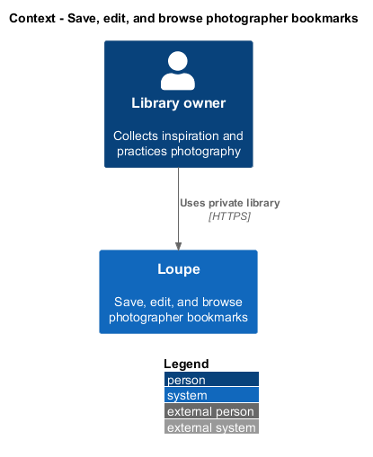
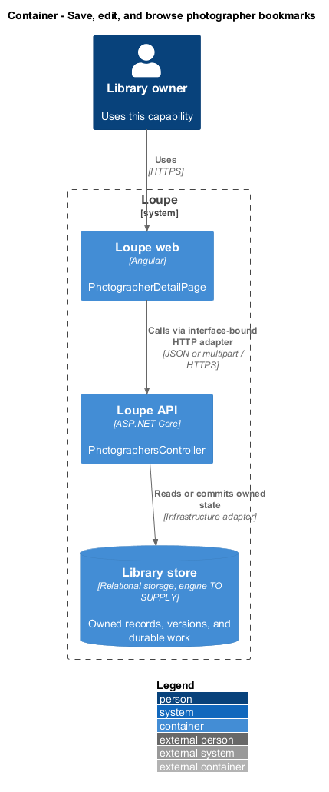
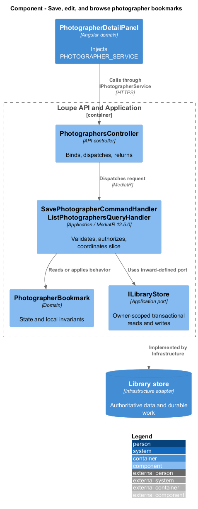
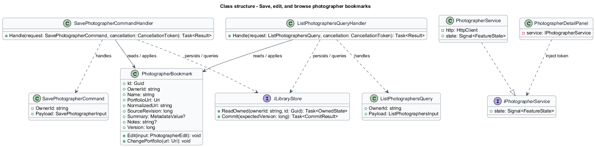
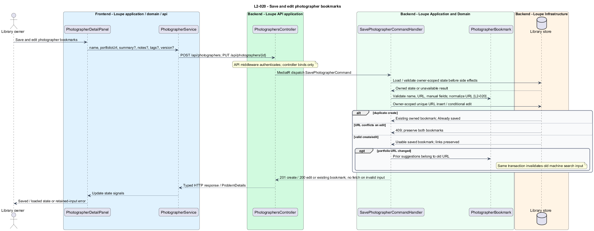
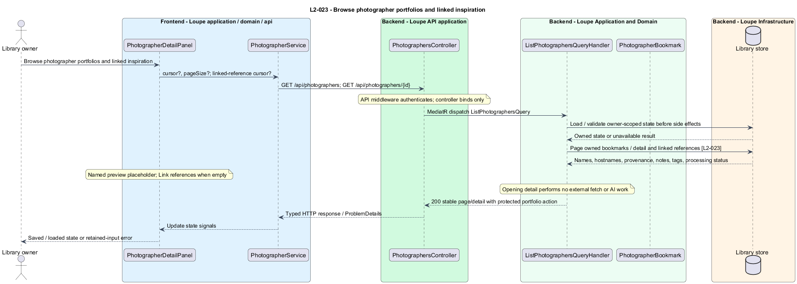

# Save, edit, and browse photographer bookmarks

## Overview

A **photographer bookmark** — private record containing a name and portfolio URL — collects a photographer's work as inspiration. It supports manual summary, notes, and tags without requiring an image or a successful AI fetch. Linked references remain separate records.

This is a proposed design for the defined requirements. Existing files are illustrative HTML mockups; the repository contains no corresponding production implementation.

## Description

`PhotographerDetailPage` lives in `frontend/projects/loupe` and owns routing and dialogs. `PhotographerDetailPanel` lives in `frontend/projects/domain` and consumes `IPhotographerService` through `PHOTOGRAPHER_SERVICE`. The contract and token share `photographer.service.contract.ts` in `frontend/projects/api`. `PhotographerService` is the separate production HTTP adapter. Composition substitutes a mock implementation under Playwright. State uses signals, and HTTP and observable conversion stay inside the adapter. Presentational controls in `components` consume inputs and emit outputs. Component class, template, and styles occupy separate files.

`PhotographersController` lives in `backend/src/Loupe.Api/Controllers` under `Loupe.Api.Controllers`. It binds requests, dispatches MediatR **12.5.0**, and returns results. Requests, handlers, and validators live in the matching feature namespace in `Loupe.Application`. `PhotographerBookmark` lives in `Loupe.Domain`; the domain references no other project. `ILibraryStore` and capability ports belong to Application. Infrastructure implements persistence and external adapters. Each type occupies its own named file.

`PhotographersPage` composes `PhotographerCollection`; `PhotographerDetailPage` composes `PhotographerDetailPanel`. Both inject `PHOTOGRAPHER_SERVICE` through their domain components. `SavePhotographerCommandHandler` validates required manual name and HTTP(S) URL plus optional summary, notes, and active tags. An imported name becomes input only through explicit acceptance.

A unique `(OwnerId, NormalizedUrl)` constraint uses the normalization from reference import. Duplicate create returns the existing owned bookmark with Already saved. Editing a different bookmark to an occupied URL returns 409 and preserves both. Forbidden or malformed URLs produce a field error before outbound fetch; the full public-address and connection validation follows `L2-040`.

`UpdatePhotographerCommandHandler` preserves the bookmark identifier and linked references. A portfolio change increments `SourceRevision`, labels existing fetched suggestions as belonging to the previous URL, and excludes old machine-derived content from current semantic input. New fetch results remain suggestions and never overwrite manual values. A name change is immediately visible through linked-reference queries and invalidates affected semantic source revisions transactionally.

`ListPhotographersQueryHandler` uses shared pagination and includes name and source hostname even without preview or summary. `GetPhotographerQueryHandler` returns optional preview or named placeholder, summary with provenance, notes, active tags, processing status, and paginated linked references. No links produce a Link references action. Opening collection or detail performs no fetch or AI work. Portfolio actions use the saved URL with `noopener noreferrer` and no-referrer protection.

The following contract surface names the proposed operations. Background commands run in the worker after a separate admission request; local evaluation commands run in the evaluation project.

| Application request | Entry point | Input |
| --- | --- | --- |
| `SavePhotographerCommand` | `POST /api/photographers; PUT /api/photographers/{id}` | `name, portfolioUrl, summary?, notes?, tags?, version?` |
| `ListPhotographersQuery` | `GET /api/photographers; GET /api/photographers/{id}` | `cursor?, pageSize?; linked-reference cursor?` |

All operations inherit [shared contracts and open dependencies](../../README.md). Owner identity comes from authenticated server context, never from trusted client input. Mutations validate complete input before side effects and use conditional writes. API errors use the shared status mapping in [L2.md](../../../specs/L2.md#shared-acceptance-definitions). Visual implementation uses mirrored `--lp-` tokens and the specification's viewport matrix.

Implementation proceeds one behavior at a time using the linked Given-When-Then criteria. Each acceptance test first fails for its expected missing behavior. API integration tests cover persistence and failures. Playwright tests use one page object per screen and injected service mocks. Real-provider release checks supplement deterministic fixtures where applicable. Each acceptance file identifies L2 coverage and each test names its criterion. Regression checks pass before the next behavior starts; no architecture tests are introduced.

## Requirements

The table preserves source wording verbatim, including its use of “must”. Quoted requirements are the sole exception to the design prose's shall/should/may convention. Each linked source section also supplies the acceptance criteria; deployment choices and unexecuted release evidence remain explicitly identified.

| L2 ID | Refines (L1) | Requirement |
| --- | --- | --- |
| `L2-020` | `L1-006` | A photographer bookmark must contain a required name and HTTP(S) portfolio URL and optional summary, notes, and active tags. One normalized portfolio URL is allowed per user; normalization follows L2-010. |
| `L2-023` | `L1-006` | Photographers must provide a browsable collection and detail view with name, portfolio link, optional preview, summary/provenance, notes, tags, processing status, and linked references. |

Acceptance criteria: [L2-020](../../../specs/L2.md#l2-020-save-and-edit-photographer-bookmarks), [L2-023](../../../specs/L2.md#l2-023-browse-photographer-portfolios-and-linked-inspiration).

## Diagrams

The context view places this capability within the owner's private Loupe library. External services appear only where the slice uses provider or source content.

The container view separates Angular interaction, the .NET API, and authoritative persistence. Durable background work appears where processing continues after admission.

The component view shows dispatch into Application handlers and inward-defined ports. Infrastructure supplies the persistence and provider implementations.

The class view names the proposed state, requests, handlers, and interface-bound frontend service. Typed associations and dependencies show which element owns behavior.

The save and edit photographer bookmarks sequence traces `L2-020` through its enforcing operations. The accompanying Description defines state changes and significant recovery paths.

The browse photographer portfolios and linked inspiration sequence traces `L2-023` through its enforcing operations. The accompanying Description defines state changes and significant recovery paths.

