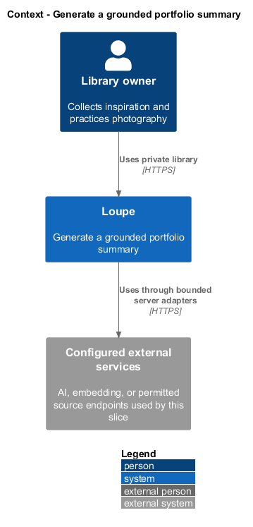
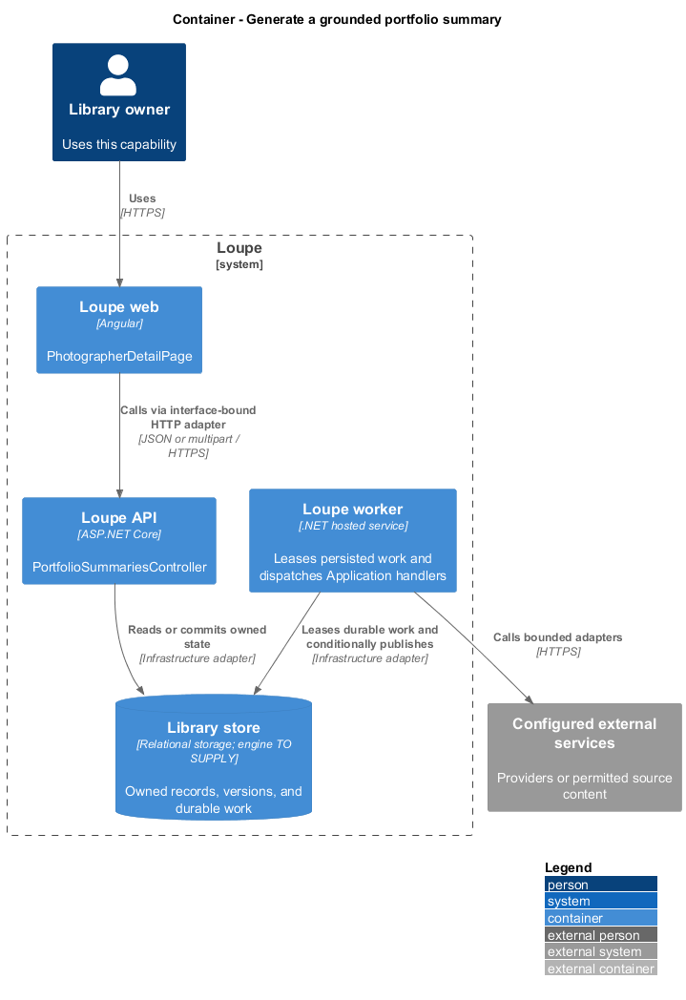
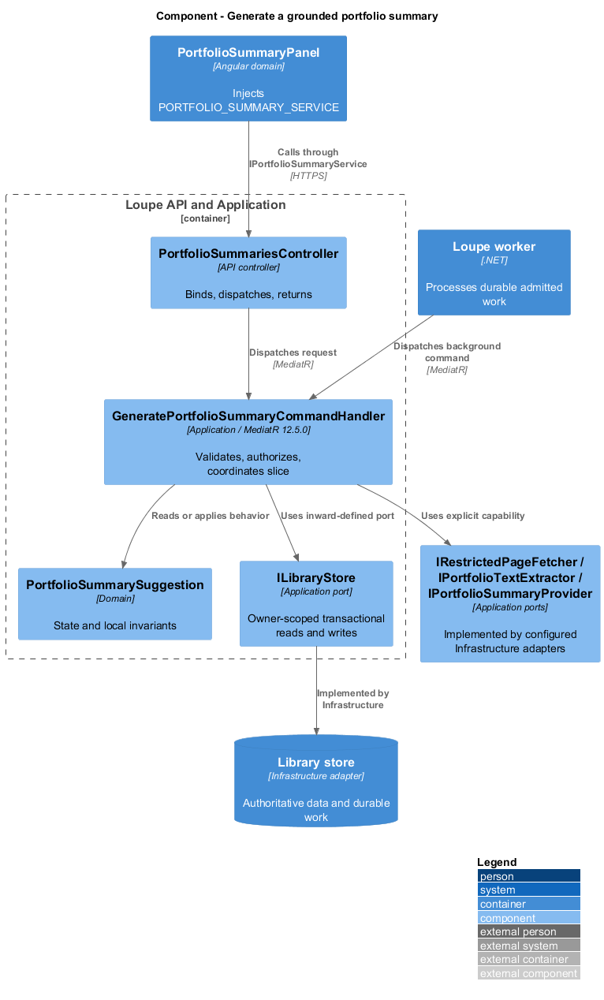
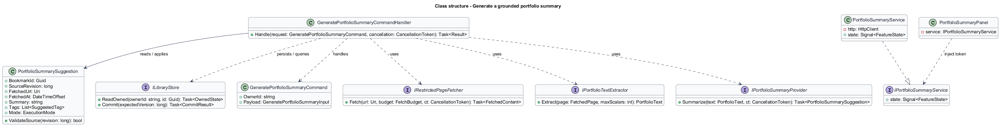
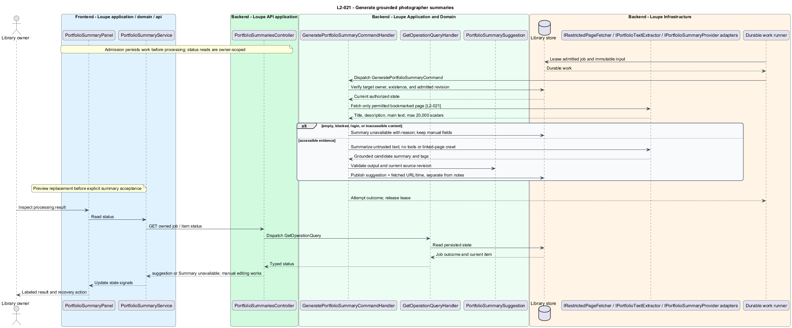

# Generate a grounded portfolio summary

## Overview

A **portfolio summary suggestion** — AI description derived from accessible content on one bookmarked page — helps catalog a photographer. It carries fetched URL and timestamp so the owner can inspect its basis. The process does not infer inaccessible galleries or crawl linked pages.

This is a proposed design for the defined requirements. Existing files are illustrative HTML mockups; the repository contains no corresponding production implementation.

## Description

`PhotographerDetailPage` lives in `frontend/projects/loupe` and owns routing and dialogs. `PortfolioSummaryPanel` lives in `frontend/projects/domain` and consumes `IPortfolioSummaryService` through `PORTFOLIO_SUMMARY_SERVICE`. The contract and token share `portfolio-summary.service.contract.ts` in `frontend/projects/api`. `PortfolioSummaryService` is the separate production HTTP adapter. Composition substitutes a mock implementation under Playwright. State uses signals, and HTTP and observable conversion stay inside the adapter. Presentational controls in `components` consume inputs and emit outputs. Component class, template, and styles occupy separate files.

`PortfolioSummariesController` lives in `backend/src/Loupe.Api/Controllers` under `Loupe.Api.Controllers`. It binds requests, dispatches MediatR **12.5.0**, and returns results. Requests, handlers, and validators live in the matching feature namespace in `Loupe.Application`. `PortfolioSummarySuggestion` lives in `Loupe.Domain`; the domain references no other project. `ILibraryStore` and capability ports belong to Application. Infrastructure implements persistence and external adapters. Each type occupies its own named file.

`RequestPortfolioSummaryCommandHandler` captures the owned bookmark's portfolio URL and source revision in durable work. `PortfolioSummaryWorker` dispatches `GeneratePortfolioSummaryCommand`. `IRestrictedPageFetcher` applies the same robots and access restrictions as reference import. `IPortfolioTextExtractor` captures accessible title, description metadata, and main text in document order, bounded to 20,000 Unicode scalar values.

`IPortfolioSummaryProvider` receives that captured content as untrusted source text. It has no tools, secrets, unrelated library records, or permission to mutate items. Embedded instructions do not change the task. Empty, inaccessible, blocked, or login content returns Summary unavailable with a reason and leaves manual editing available. A hostname alone never becomes evidence for a summary.

Only the bookmarked page is fetched for text. Linked galleries and navigation targets are ignored. An optional preview follows reference-import candidate and bounded-fetch rules. `PortfolioSummarySuggestion` stores summary and suggested tags plus fetched URL, timestamp, execution mode, and source revision. Publication of a late prior-URL job cannot become current.

The panel routes review through [review-metadata](../../metadata/review-metadata/README.md). Accepting a summary over an existing manual value first displays the replacement in the application-owned dialog. Explicit acceptance updates summary alone, preserving notes and tags. Provider and main-text extraction implementation are `<TO SUPPLY>` choices. `L2-041` restricts provider inputs and treats generated output as inert data.

The following contract surface names the proposed operations. Background commands run in the worker after a separate admission request; local evaluation commands run in the evaluation project.

| Application request | Entry point | Input |
| --- | --- | --- |
| `GeneratePortfolioSummaryCommand` | `POST /api/photographers/{id}/summary-jobs` | `bookmarkId; admitted source revision` |

All operations inherit [shared contracts and open dependencies](../../README.md). Owner identity comes from authenticated server context, never from trusted client input. Mutations validate complete input before side effects and use conditional writes. API errors use the shared status mapping in [L2.md](../../../specs/L2.md#shared-acceptance-definitions). Visual implementation uses mirrored `--lp-` tokens and the specification's viewport matrix.

Implementation proceeds one behavior at a time using the linked Given-When-Then criteria. Each acceptance test first fails for its expected missing behavior. API integration tests cover persistence and failures. Playwright tests use one page object per screen and injected service mocks. Real-provider release checks supplement deterministic fixtures where applicable. Each acceptance file identifies L2 coverage and each test names its criterion. Regression checks pass before the next behavior starts; no architecture tests are introduced.

## Requirements

The table preserves source wording verbatim, including its use of “must”. Quoted requirements are the sole exception to the design prose's shall/should/may convention. Each linked source section also supplies the acceptance criteria; deployment choices and unexecuted release evidence remain explicitly identified.

| L2 ID | Refines (L1) | Requirement |
| --- | --- | --- |
| `L2-021` | `L1-006` | Summary generation must use only the bookmarked page's accessible title, description metadata, and extracted main text, bounded to 20,000 Unicode scalar values in document order. It must not crawl linked pages or infer inaccessible portfolio content. Suggestions use the review workflow in L2-015 and L2-016. |

Acceptance criteria: [L2-021](../../../specs/L2.md#l2-021-generate-grounded-photographer-summaries).

## Diagrams

The context view places this capability within the owner's private Loupe library. External services appear only where the slice uses provider or source content.

The container view separates Angular interaction, the .NET API, and authoritative persistence. Durable background work appears where processing continues after admission.

The component view shows dispatch into Application handlers and inward-defined ports. Infrastructure supplies the persistence and provider implementations.

The class view names the proposed state, requests, handlers, and interface-bound frontend service. Typed associations and dependencies show which element owns behavior.

The generate grounded photographer summaries sequence traces `L2-021` through its enforcing operations. The accompanying Description defines state changes and significant recovery paths.

