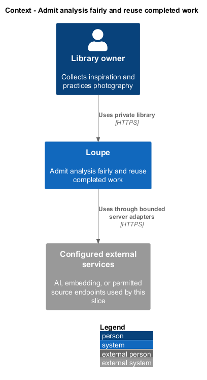
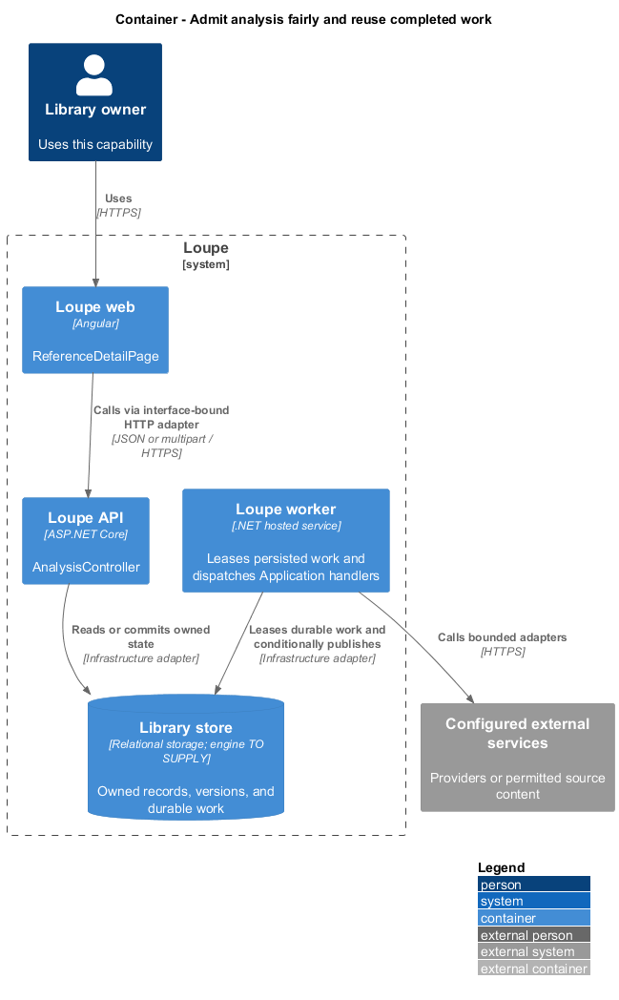
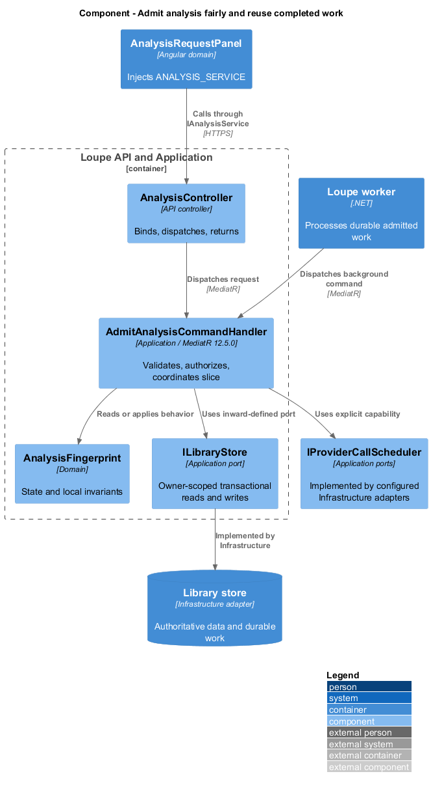
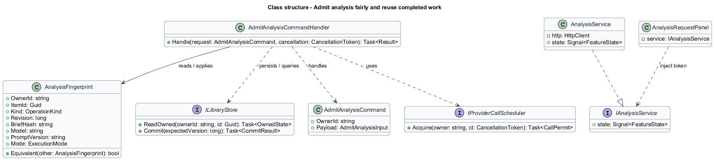
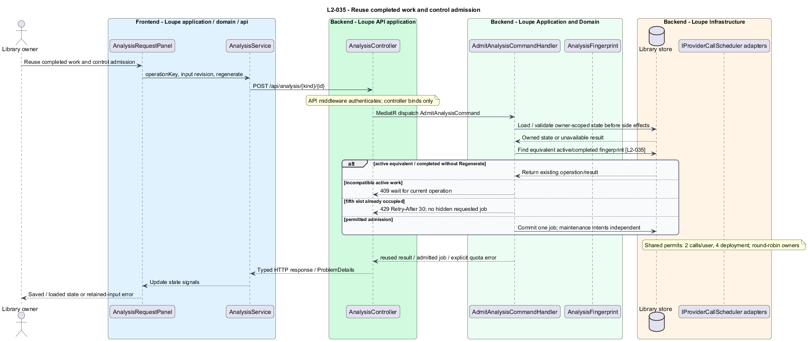

# Admit analysis fairly and reuse completed work

## Overview

An **analysis fingerprint** — identity of the inputs and configuration that determine one AI operation — supports reuse within an owner's item. **Admission** — decision to persist a new requested job — enforces capacity before work enters the queue. Index maintenance remains durable independently of user-requested admission quotas.

This is a proposed design for the defined requirements. Existing files are illustrative HTML mockups; the repository contains no corresponding production implementation.

## Description

`ReferenceDetailPage` lives in `frontend/projects/loupe` and owns routing and dialogs. `AnalysisRequestPanel` lives in `frontend/projects/domain` and consumes `IAnalysisService` through `ANALYSIS_SERVICE`. The contract and token share `analysis.service.contract.ts` in `frontend/projects/api`. `AnalysisService` is the separate production HTTP adapter. Composition substitutes a mock implementation under Playwright. State uses signals, and HTTP and observable conversion stay inside the adapter. Presentational controls in `components` consume inputs and emit outputs. Component class, template, and styles occupy separate files.

`AnalysisController` lives in `backend/src/Loupe.Api/Controllers` under `Loupe.Api.Controllers`. It binds requests, dispatches MediatR **12.5.0**, and returns results. Requests, handlers, and validators live in the matching feature namespace in `Loupe.Application`. `AnalysisFingerprint` lives in `Loupe.Domain`; the domain references no other project. `ILibraryStore` and capability ports belong to Application. Infrastructure implements persistence and external adapters. Each type occupies its own named file.

`AdmitAnalysisCommandHandler` resolves operation keys first, then finds equivalent active work and completed results. Equivalent queued/running requests return their existing identifier. Completed work is reused unless Regenerate is explicit. Regenerate still returns an equivalent active job. Different inputs while the same item/type is active return 409 explaining that it can finish first.

An owner/item/type active-job constraint prevents simultaneous competing work. A transactional owner admission lock enforces at most five active user-requested analyses/imports across API instances. The sixth returns 429 with Retry-After 30 seconds and creates no hidden job. Saving manual content remains successful with Analysis not queued and a later action. Automatic semantic intents use a separate maintenance queue and do not consume this five-job cap.

`ProviderCallScheduler` maintains leased concurrency permits in shared durable state: at most two provider calls per user and four deployment-wide by default. It rotates owners with queued work in round-robin order. Both automatic maintenance and requested work acquire these permits. Provider timeouts and permit expiry prevent crash-created capacity leaks; recovered work observes the same global limits.

Fingerprint fields include owner, target, type, image/content revision, brief, model, prompt version, and mode. No result crosses an incompatible field. Provider idempotency keys survive recovery where supported. Without that support, at most one recovery call fits within the original total attempt budget. One current committed result is guaranteed; duplicate external charges after uncertain provider completion cannot be ruled out.

The following contract surface names the proposed operations. Background commands run in the worker after a separate admission request; local evaluation commands run in the evaluation project.

| Application request | Entry point | Input |
| --- | --- | --- |
| `AdmitAnalysisCommand` | `POST /api/analysis/{kind}/{id}` | `operationKey, input revision, regenerate` |

All operations inherit [shared contracts and open dependencies](../../README.md). Owner identity comes from authenticated server context, never from trusted client input. Mutations validate complete input before side effects and use conditional writes. API errors use the shared status mapping in [L2.md](../../../specs/L2.md#shared-acceptance-definitions). Visual implementation uses mirrored `--lp-` tokens and the specification's viewport matrix.

Implementation proceeds one behavior at a time using the linked Given-When-Then criteria. Each acceptance test first fails for its expected missing behavior. API integration tests cover persistence and failures. Playwright tests use one page object per screen and injected service mocks. Real-provider release checks supplement deterministic fixtures where applicable. Each acceptance file identifies L2 coverage and each test names its criterion. Regression checks pass before the next behavior starts; no architecture tests are introduced.

## Requirements

The table preserves source wording verbatim, including its use of “must”. Quoted requirements are the sole exception to the design prose's shall/should/may convention. Each linked source section also supplies the acceptance criteria; deployment choices and unexecuted release evidence remain explicitly identified.

| L2 ID | Refines (L1) | Requirement |
| --- | --- | --- |
| `L2-035` | `L1-009` | Equivalent AI work must be deduplicated per user, target item, operation type, image/content revision, brief, model, prompt version, and execution mode. At most one active job of the same type is allowed per item, five active jobs per user, and two simultaneous provider calls per user. The five-job admission cap applies to user-requested analysis and imports, including analysis selected during save. Automatic semantic-index maintenance must be durably queued independently of that admission cap and still obey provider concurrency limits. A deployment defaults to four simultaneous provider calls total. Explicit regeneration bypasses completed-result reuse, but never duplicates an already-active equivalent job. |

Acceptance criteria: [L2-035](../../../specs/L2.md#l2-035-reuse-completed-work-and-control-admission).

## Diagrams

The context view places this capability within the owner's private Loupe library. External services appear only where the slice uses provider or source content.

The container view separates Angular interaction, the .NET API, and authoritative persistence. Durable background work appears where processing continues after admission.

The component view shows dispatch into Application handlers and inward-defined ports. Infrastructure supplies the persistence and provider implementations.

The class view names the proposed state, requests, handlers, and interface-bound frontend service. Typed associations and dependencies show which element owns behavior.

The reuse completed work and control admission sequence traces `L2-035` through its enforcing operations. The accompanying Description defines state changes and significant recovery paths.

