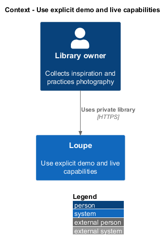
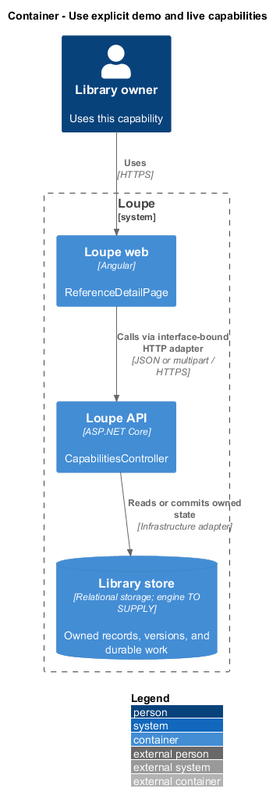
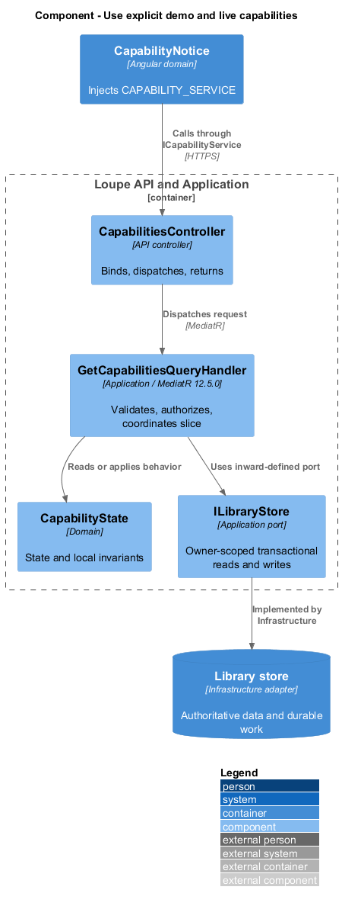
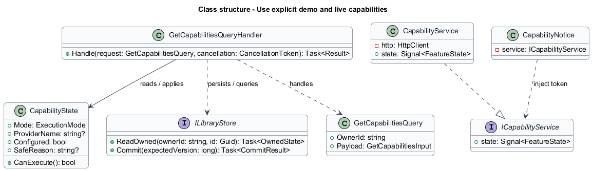
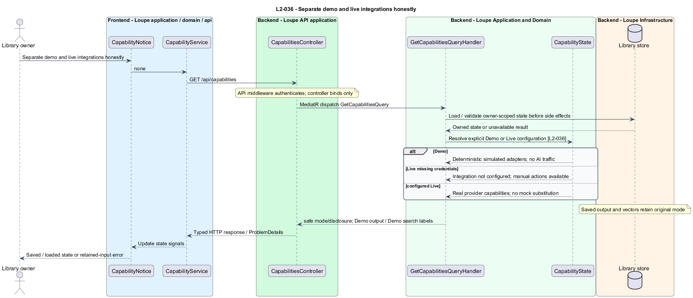

# Use explicit demo and live capabilities

## Overview

**Execution mode** — configured Demo or Live identity attached to an operation and its output — distinguishes simulation from connected analysis. Capability state explains whether a configured provider is usable. Manual library work remains available when optional AI configuration is absent.

This is a proposed design for the defined requirements. Existing files are illustrative HTML mockups; the repository contains no corresponding production implementation.

## Description

`ReferenceDetailPage` lives in `frontend/projects/loupe` and owns routing and dialogs. `CapabilityNotice` lives in `frontend/projects/domain` and consumes `ICapabilityService` through `CAPABILITY_SERVICE`. The contract and token share `capability.service.contract.ts` in `frontend/projects/api`. `CapabilityService` is the separate production HTTP adapter. Composition substitutes a mock implementation under Playwright. State uses signals, and HTTP and observable conversion stay inside the adapter. Presentational controls in `components` consume inputs and emit outputs. Component class, template, and styles occupy separate files.

`CapabilitiesController` lives in `backend/src/Loupe.Api/Controllers` under `Loupe.Api.Controllers`. It binds requests, dispatches MediatR **12.5.0**, and returns results. Requests, handlers, and validators live in the matching feature namespace in `Loupe.Application`. `CapabilityState` lives in `Loupe.Domain`; the domain references no other project. `ILibraryStore` and capability ports belong to Application. Infrastructure implements persistence and external adapters. Each type occupies its own named file.

`ExecutionOptions` binds through Microsoft.Extensions Options and validates an explicit Demo or Live value. Composition selects deterministic `DemoCritiqueProvider`, `DemoVisualMetadataProvider`, `DemoSummaryProvider`, and `DemoEmbeddingProvider` in Demo. These adapters make no third-party AI calls, including for real uploaded images. URL import remains an independent external fetch and retains its disclosure and safety rules.

Live composition selects configured provider adapters. Missing credentials mark only the affected capability Integration not configured and return a safe capability error without a mock result. Manual saving, browsing, and keyword search continue. The capability endpoint exposes provider display names, configured limits, and necessary data disclosure, never secrets. `CapabilityNotice` displays setup guidance beside unavailable actions.

Every saved critique, description, summary, tag suggestion, and semantic generation retains original mode. Demo output and Demo search labels explain simulation wherever shown. Switching deployment mode neither relabels prior outputs nor silently reuses incompatible vectors. Live Meaning selects only live generations; replacing demo vectors requires live indexing.

Release connection checks exercise critique, metadata, summary, and embeddings against configured real services and verify persisted non-demo outputs. Their recorded requests redact private inputs and secrets. Demo acceptance is separate evidence and never claims those checks passed. Production providers and their retention settings are `<TO SUPPLY>` deployment configuration.

The following contract surface names the proposed operations. Background commands run in the worker after a separate admission request; local evaluation commands run in the evaluation project.

| Application request | Entry point | Input |
| --- | --- | --- |
| `GetCapabilitiesQuery` | `GET /api/capabilities` | `none` |

All operations inherit [shared contracts and open dependencies](../../README.md). Owner identity comes from authenticated server context, never from trusted client input. Mutations validate complete input before side effects and use conditional writes. API errors use the shared status mapping in [L2.md](../../../specs/L2.md#shared-acceptance-definitions). Visual implementation uses mirrored `--lp-` tokens and the specification's viewport matrix.

Implementation proceeds one behavior at a time using the linked Given-When-Then criteria. Each acceptance test first fails for its expected missing behavior. API integration tests cover persistence and failures. Playwright tests use one page object per screen and injected service mocks. Real-provider release checks supplement deterministic fixtures where applicable. Each acceptance file identifies L2 coverage and each test names its criterion. Regression checks pass before the next behavior starts; no architecture tests are introduced.

## Requirements

The table preserves source wording verbatim, including its use of “must”. Quoted requirements are the sole exception to the design prose's shall/should/may convention. Each linked source section also supplies the acceptance criteria; deployment choices and unexecuted release evidence remain explicitly identified.

| L2 ID | Refines (L1) | Requirement |
| --- | --- | --- |
| `L2-036` | `L1-009` | AI execution mode must be explicitly configured as Demo or Live. Missing live credentials must disable affected AI capabilities with setup guidance, never silently select demo. Demo must support the end-to-end workflows with deterministic fixtures and no AI-provider calls, while labeling simulated analysis and meaning search. Saved outputs must retain their original mode after configuration changes. |

Acceptance criteria: [L2-036](../../../specs/L2.md#l2-036-separate-demo-and-live-integrations-honestly).

## Diagrams

The context view places this capability within the owner's private Loupe library. External services appear only where the slice uses provider or source content.

The container view separates Angular interaction, the .NET API, and authoritative persistence. Durable background work appears where processing continues after admission.

The component view shows dispatch into Application handlers and inward-defined ports. Infrastructure supplies the persistence and provider implementations.

The class view names the proposed state, requests, handlers, and interface-bound frontend service. Typed associations and dependencies show which element owns behavior.

The separate demo and live integrations honestly sequence traces `L2-036` through its enforcing operations. The accompanying Description defines state changes and significant recovery paths.

