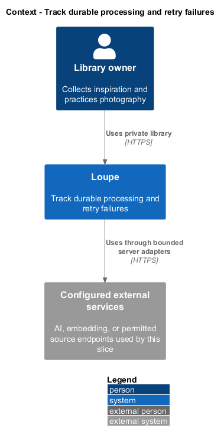
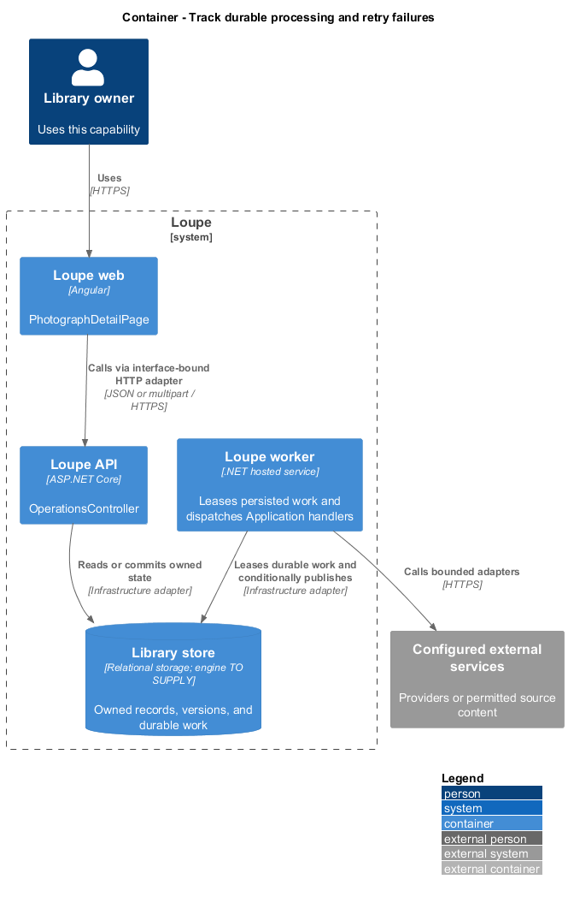
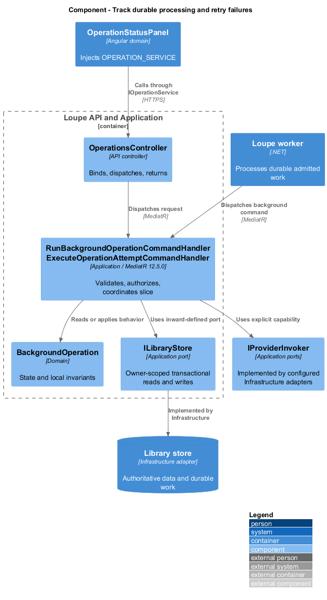
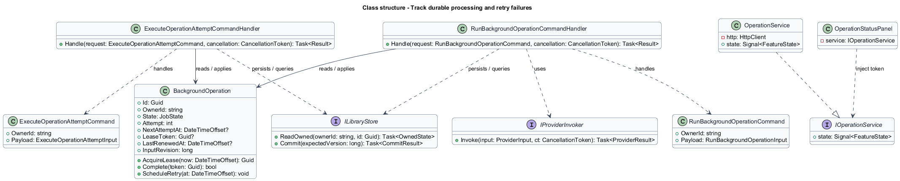
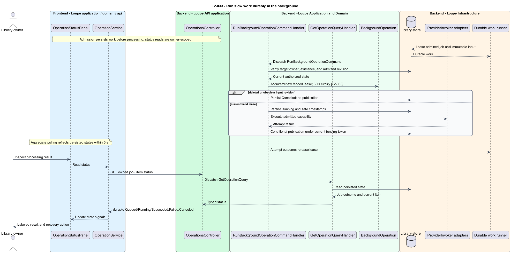
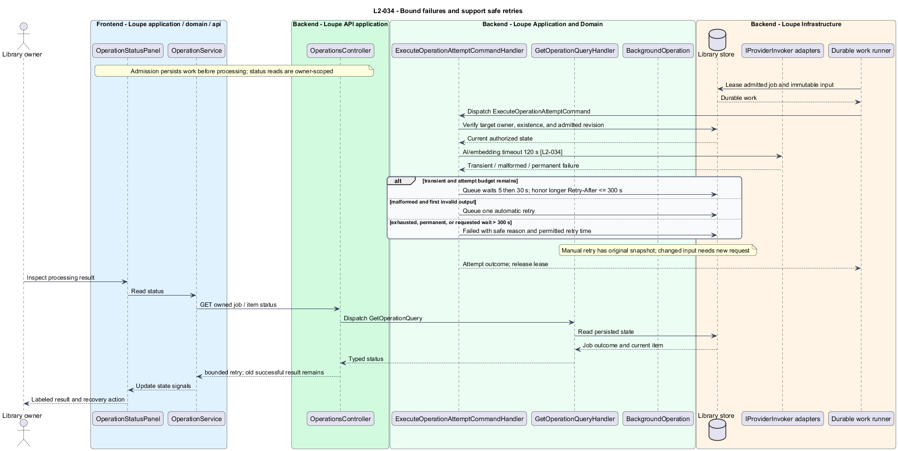
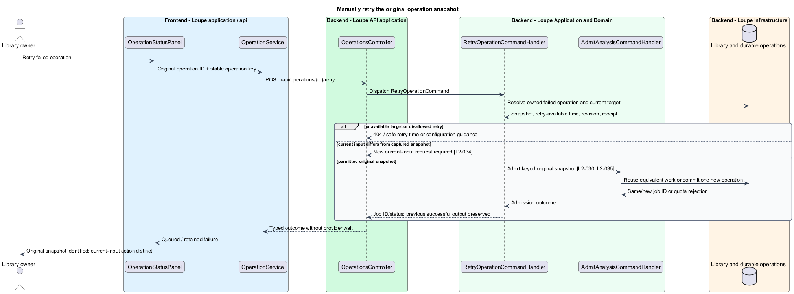

# Track durable processing and retry failures

## Overview

A **background operation** — durable lifecycle for critique, metadata, import, summary, or indexing — keeps slow work visible. A **lease** — time-bounded ownership token held by a worker — prevents an obsolete worker from committing after recovery. Retries reuse a captured input snapshot.

This is a proposed design for the defined requirements. Existing files are illustrative HTML mockups; the repository contains no corresponding production implementation.

## Description

`PhotographDetailPage` lives in `frontend/projects/loupe` and owns routing and dialogs. `OperationStatusPanel` lives in `frontend/projects/domain` and consumes `IOperationService` through `OPERATION_SERVICE`. The contract and token share `operation.service.contract.ts` in `frontend/projects/api`. `OperationService` is the separate production HTTP adapter. Composition substitutes a mock implementation under Playwright. State uses signals, and HTTP and observable conversion stay inside the adapter. Presentational controls in `components` consume inputs and emit outputs. Component class, template, and styles occupy separate files.

`OperationsController` lives in `backend/src/Loupe.Api/Controllers` under `Loupe.Api.Controllers`. It binds requests, dispatches MediatR **12.5.0**, and returns results. Requests, handlers, and validators live in the matching feature namespace in `Loupe.Application`. `BackgroundOperation` lives in `Loupe.Domain`; the domain references no other project. `ILibraryStore` and capability ports belong to Application. Infrastructure implements persistence and external adapters. Each type occupies its own named file.

`GetOperationQueryHandler` returns Queued, Running, Succeeded, Failed, or Canceled with timestamps and a safe message. Retry delay is Queued plus next-attempt time. `OperationService` performs an aggregate visible-operation status read at most every two seconds, respecting Retry-After and the shared read quota. The normal healthy path reflects persisted transitions within five seconds; navigation reconstructs status from durable records. Other edits and browsing stay enabled. `OperationType.LocationScouting` follows the same lifecycle, timestamps, and safe messages ([request-scouting-report](../../scouting/request-scouting-report/README.md)).

`DurableWorkRunner` selects due work, atomically leases it, and renews ownership while executing. Ownership becomes recoverable after 60 seconds without renewal. A fencing token accompanies every publication; only its current holder can commit. The runner checks deletion and input revision at start and commit. Deleted or obsolete image/URL work becomes Canceled. Recovery begins within 90 seconds of the last renewal under L2-048. Normal lease-renewal cadence is a configurable engineering value below the 60-second boundary.

`ProviderRetryPolicy` applies a 120-second timeout to each AI/embedding call. Transient network timeout, 429, and provider 5xx receive at most three total automatic attempts, waiting five then 30 seconds. A valid longer Retry-After replaces the wait up to 300 seconds. A requested wait beyond 300 seconds fails the operation with retry-available time. Malformed structured AI output receives one automatic retry. Permanent unsupported input, access denial, and credential failure receive none. Mixed failure classes share the total attempt budget rather than resetting it.

`RetryOperationCommandHandler` creates one keyed new operation from the original snapshot when retry is permitted. Changed current input requires a new clearly labeled analysis request. Repeated retry activation resolves to one operation under the 24-hour key policy. Prior successful output remains readable throughout replacement retry. Robots denial or disabled-provider failure offers configuration/access guidance and manual fallback, not a misleading immediate Retry. URL fetching follows its separate 30-second policy. All failure payloads are redacted; operation reads never return private snapshots or raw provider output.

The following contract surface names the proposed operations. Background commands run in the worker after a separate admission request; local evaluation commands run in the evaluation project.

| Application request | Entry point | Input |
| --- | --- | --- |
| `RunBackgroundOperationCommand` | `GET /api/operations; GET /api/operations/{id}` | `operationIds` |
| `ExecuteOperationAttemptCommand` | `worker admitted attempt; POST retry admits a new job` | `operationId; original snapshot` |

All operations inherit [shared contracts and open dependencies](../../README.md). Owner identity comes from authenticated server context, never from trusted client input. Mutations validate complete input before side effects and use conditional writes. API errors use the shared status mapping in [L2.md](../../../specs/L2.md#shared-acceptance-definitions). Visual implementation uses mirrored `--lp-` tokens and the specification's viewport matrix.

Implementation proceeds one behavior at a time using the linked Given-When-Then criteria. Each acceptance test first fails for its expected missing behavior. API integration tests cover persistence and failures. Playwright tests use one page object per screen and injected service mocks. Real-provider release checks supplement deterministic fixtures where applicable. Each acceptance file identifies L2 coverage and each test names its criterion. Regression checks pass before the next behavior starts; no architecture tests are introduced.

## Requirements

The table preserves source wording verbatim, including its use of “must”. Quoted requirements are the sole exception to the design prose's shall/should/may convention. Each linked source section also supplies the acceptance criteria; deployment choices and unexecuted release evidence remain explicitly identified.

| L2 ID | Refines (L1) | Requirement |
| --- | --- | --- |
| `L2-033` | `L1-009` | Critique, visual metadata, source import, photographer summary, location scouting, and semantic indexing must expose operation states Queued, Running, Succeeded, Failed, and Canceled. Each state must include timestamps and a safe status message. Automated retry wait is Queued with a next-attempt time. Browsing and editing must remain available while jobs run. (Updated 2026-09-12: location scouting.) |
| `L2-034` | `L1-009` | Each AI or embedding provider call must time out after 120 seconds. URL import limits are in L2-040. Network timeouts, 429, and provider 5xx responses must receive at most three total automatic attempts, with waits of 5 then 30 seconds; a valid Retry-After replaces the wait if longer, up to 300 seconds. Longer requested waits must result in a failed operation with a retry-available time. Invalid structured AI output gets one automatic retry. Other permanent errors get no automatic retry. |

Acceptance criteria: [L2-033](../../../specs/L2.md#l2-033-run-slow-work-durably-in-the-background), [L2-034](../../../specs/L2.md#l2-034-bound-failures-and-support-safe-retries).

## Diagrams

The context view places this capability within the owner's private Loupe library. External services appear only where the slice uses provider or source content.

The container view separates Angular interaction, the .NET API, and authoritative persistence. Durable background work appears where processing continues after admission.

The component view shows dispatch into Application handlers and inward-defined ports. Infrastructure supplies the persistence and provider implementations.

The class view names the proposed state, requests, handlers, and interface-bound frontend service. Typed associations and dependencies show which element owns behavior.

The run slow work durably in the background sequence traces `L2-033` through its enforcing operations. The accompanying Description defines state changes and significant recovery paths.

The bound failures and support safe retries sequence traces `L2-034` through its enforcing operations. The accompanying Description defines state changes and significant recovery paths.

`RetryOperationCommandHandler` admits a keyed replacement operation. `ExecuteOperationAttemptCommandHandler` performs the provider attempt shown in L2-034; the retry request does not itself call the provider.

