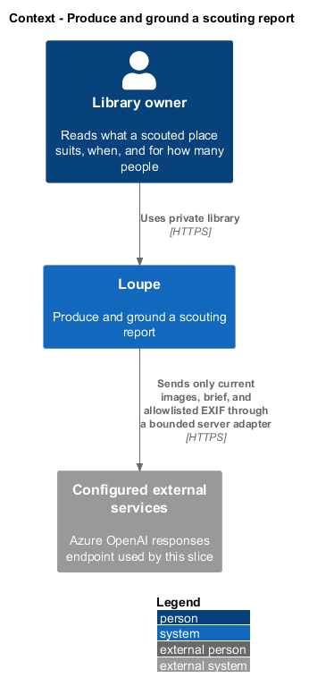
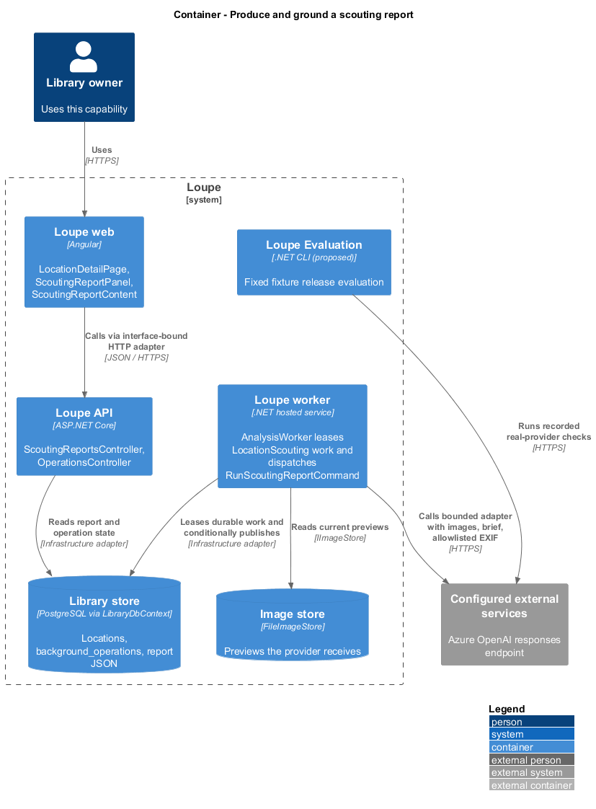
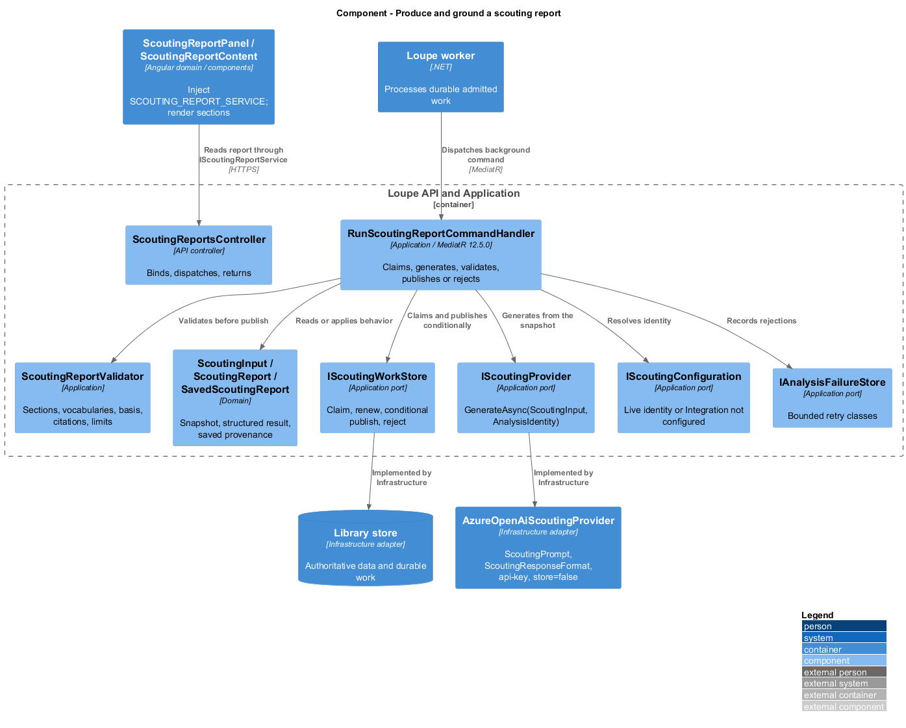
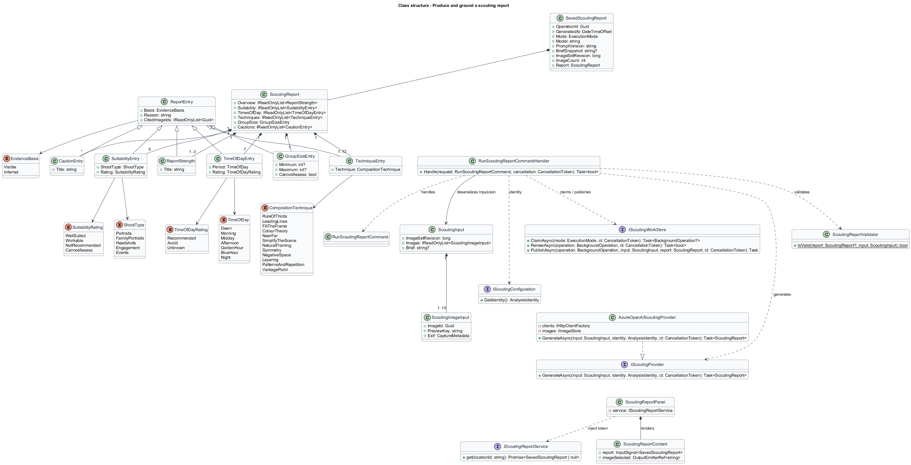
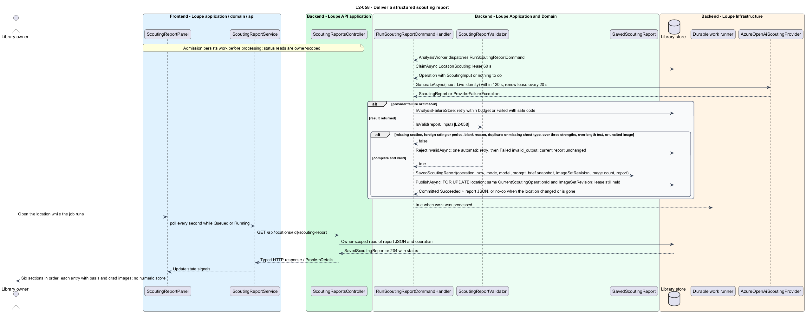
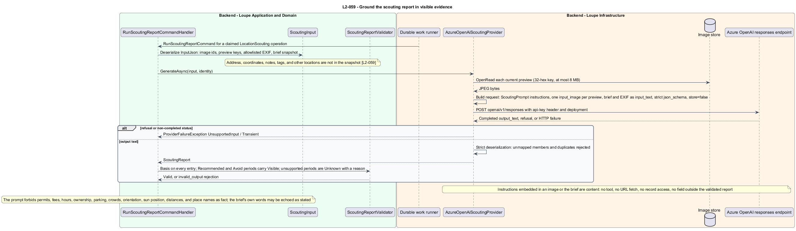
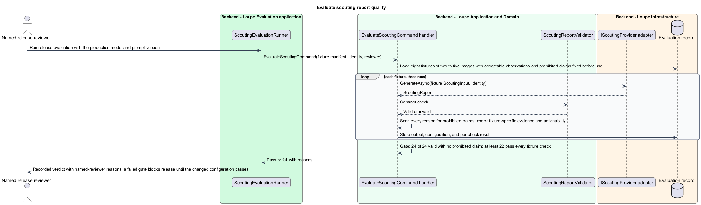

# Produce and ground a scouting report

## Overview

A **scouting report** — AI-generated assessment of a location, built only from the location's current images, its scouting brief, and allowlisted camera settings — tells the owner what shoots the place suits, when its light works, which compositions apply, how many people fit, and what to watch for. Each of its entries carries an **evidence basis** — Visible, when the images show the fact, or Inferred, when the entry reasons beyond them — and cites the image identifiers it relies on. The report uses fixed vocabularies: five **shoot types** (Portraits, Family portraits, Headshots, Engagement, Events), four **suitability ratings** (Well suited, Workable, Not recommended, Cannot assess), seven **times of day** (Dawn, Morning, Midday, Afternoon, Golden hour, Blue hour, Night) each rated Recommended, Avoid, or Unknown, and twelve **composition techniques** (Rule of thirds, Leading lines, Fill the frame, Colour theory, Near-far, Simplify the scene, Natural framing, Symmetry, Negative space, Layering, Patterns and repetition, Vantage point). A **group size** is a minimum and maximum count of people with 1 ≤ minimum ≤ maximum ≤ 500, or Cannot assess. Numeric quality scores are not part of the report.

This feature covers how the worker produces a report, how its structure is validated, what the provider receives and never receives, and how the release evaluation establishes that reports stay grounded. Requesting, reusing, regenerating, and outdating a report are covered in [request-scouting-report](../request-scouting-report/README.md). The pipeline is the one that produces critiques, reference suggestions, and photographer summaries today, extended with one more operation type.

This is a proposed design for the defined requirements. `docs/mocks/locations.html`, `docs/mocks/location.html`, and `docs/mocks/find-location.html` are the visual and interaction reference that `L2-055` names. The repository contains no Locations implementation. Components named below extend the implemented References, Critique, Search, and Deletion slices by their real names; proposed UI copy is design text, not a quotation.

## Description

`LocationDetailPage` lives in `frontend/projects/loupe` and owns routing and dialogs. `ScoutingReportPanel` lives in `frontend/projects/domain` and consumes `IScoutingReportService` through `SCOUTING_REPORT_SERVICE`. The contract and token share `scouting-report.service.contract.ts` in `frontend/projects/api`. `ScoutingReportService` is the separate production HTTP adapter. Composition substitutes `MockScoutingReportService` under Playwright. State uses signals, and HTTP and observable conversion stay inside the adapter. `ScoutingReportContent` in `components` renders a report from inputs alone. Component class, template, and styles occupy separate files.

`ScoutingReportsController` lives in `backend/src/Loupe.Api/Controllers` under `Loupe.Api.Controllers`. It binds requests, dispatches MediatR **12.5.0**, and returns results. Requests, handlers, and validators live in `Loupe.Application/Scouting`. `ScoutingReport`, `ScoutingInput`, and `SavedScoutingReport` live in `Loupe.Domain/Scouting`; the domain references no other project. `IScoutingProvider`, `IScoutingConfiguration`, and `IScoutingWorkStore` belong to Application. Infrastructure implements persistence and the Azure OpenAI adapter. Each type occupies its own named file.

`ScoutingInput` is the immutable snapshot admitted into `BackgroundOperation.InputJson`: the `ImageSetRevision`, one `ScoutingImageInput` per current image with its identifier, preview key, and allowlisted `CaptureMetadata`, and the brief as saved at admission. `ScoutingReport` holds six sections in fixed order: `Overview` of one to three `ReportStrength` entries, `Suitability` with one `SuitabilityEntry` per shoot type, `TimesOfDay` with one `TimeOfDayEntry` per period, `Techniques` of one to twelve `TechniqueEntry` values, one `GroupSizeEntry`, and zero or more `CautionEntry` values; the `ShootType`, `SuitabilityRating`, `TimeOfDay`, `TimeOfDayRating`, `CompositionTechnique`, and `EvidenceBasis` enumerations hold the shared vocabularies. Every entry carries `Basis`, a `Reason` of 1–1,000 characters, and `CitedImageIds` of at least one identifier. `SavedScoutingReport` — `OperationId`, `GeneratedAt`, `Mode`, `Model`, `PromptVersion`, `BriefSnapshot`, `ImageSetRevision`, `ImageCount`, and `Report` — is stored in `Location.ScoutingReportJson`, as `SavedCritique` is stored in `Photograph.CritiqueJson`. `OperationType` gains `LocationScouting`.

`AnalysisWorker` adds `RunScoutingReportCommand` to its round-robin, and `Program.cs` adds `RunScoutingReportCommandHandler` to the MediatR whitelist. The handler claims one `LocationScouting` operation through `IScoutingWorkStore.ClaimAsync`, deserializes `ScoutingInput`, calls `IScoutingProvider.GenerateAsync` under the 120-second timeout with lease renewal every 20 seconds, and routes failures through `IAnalysisFailureStore`: transient and rate-limited responses retry within the three-attempt budget with the 5-second then 30-second waits, invalid structured output retries once, and unsupported input, denied access, or invalid credentials fail without retry. A lost lease cancels the attempt so only the lease holder commits.

`ScoutingReportValidator.IsValid(report, input)` rejects a result that misses a section, duplicates or omits a shoot type or period, uses a rating, period, technique, or basis outside the shared sets, gives a Recommended or Avoid period a basis other than Visible, leaves every period Unknown without reasons or has no Recommended period when one is supportable, exceeds three strengths, lists a technique twice, leaves a reason blank or over 1,000 characters, gives a group size outside 1–500 or with minimum above maximum, or cites an image identifier outside the analysed set. A rejected result is invalid structured output under `L2-034`: it is not saved, and the location's current report is unchanged. Only a completely valid report reaches `IScoutingWorkStore.PublishAsync`, which locks the location `FOR UPDATE`, checks that the row exists, that `CurrentScoutingOperationId` is this operation, and that `ImageSetRevision` equals the input's, then writes `SavedScoutingReport`, marks the operation Succeeded, and increments `Revision`. Any mismatch returns without committing, so a deleted location or a changed image set never receives a stale report.

`AzureOpenAiScoutingProvider` follows `AzureOpenAiCritiqueProvider`: it posts to the resource's `openai/v1/responses` endpoint with the `api-key` header, the deployment name, `store=false`, `ScoutingPrompt.Instructions`, one `input_image` per current preview, and `ScoutingResponseFormat`, a strict `json_schema` named `loupe_scouting_report` with every property required. The request carries only the images, the brief, and the allowlisted EXIF fields — camera, lens, aperture, shutter speed, ISO, focal length, capture time. It never carries the address, coordinates, notes, tags, or any other location's data. `ScoutingPrompt` requires each entry to state whether its basis is visible or inferred; forbids asserting permits, fees, opening hours, ownership, parking, crowd levels, compass orientation, exact sun position, distances, or a place name or address as fact; permits echoing such detail only as the brief states it; makes a period the images cannot support Unknown with a reason rather than a guess; and treats instructions embedded in an image or the brief as content that changes nothing except the validated report fields. `IScoutingConfiguration.GetIdentity()` returns the Live `AnalysisIdentity` with the configured model and prompt version `location-scouting-v1`, or raises `IntegrationNotConfiguredException` when Azure OpenAI is not configured. Responses over 2 MB, refusals, and non-completed statuses map to the shared `ProviderFailureKind` values.

`ScoutingReportContent` renders the six sections in order under the AI generated label with the generation timestamp, model, brief snapshot, and image-set revision; each entry shows its rating or period pill, its Visible or Inferred basis, its reason, and thumbnails of its cited images that select the same image in the gallery. No number, star, or percentage appears.

`ScoutingEvaluationRunner` and `EvaluateScoutingCommand` belong to the proposed `backend/src/Loupe.Evaluation` project beside `CritiqueEvaluationRunner`. The runner consumes a checked-in manifest of at least eight licensed or synthetic location fixtures of two to five images each — an open park, an urban street with strong lines, a window-lit interior, a narrow alley, a waterfront, a large hall, a playground, and a night-lit scene — each fixing its acceptable observations and prohibited claims before use. It runs each fixture three times against the configured production model, records configuration, output, and the named reviewer's reasons, and requires all 24 outputs to satisfy the `ScoutingReportValidator` contract with no prohibited claim and at least 22 to satisfy every fixture-specific evidence and actionability check. A failed evaluation, or a changed model or prompt that affects scouting behavior, fails the release quality gate until the changed configuration passes the same evaluation. Fixture assets, licensing evidence, and reviewer identity are `<TO SUPPLY>`; deterministic acceptance fixtures remain unchanged unless specification review changes expected behavior.

The following contract surface names the proposed operations. Background commands run in the worker after a separate admission request; local evaluation commands run in the evaluation project.

| Application request | Entry point | Input |
| --- | --- | --- |
| `RunScoutingReportCommand` | `GET /api/operations/{id}` | `worker uses the admitted ScoutingInput snapshot` |
| `EvaluateScoutingCommand` | `local evaluation runner` | `fixture manifest, model/prompt identity, reviewer` |

All operations inherit [shared contracts and open dependencies](../../README.md). Owner identity comes from authenticated server context, never from trusted client input. Mutations validate complete input before side effects and use conditional writes. API errors use the shared status mapping in [L2.md](../../../specs/L2.md#shared-acceptance-definitions). Visual implementation uses mirrored `--lp-` tokens and the specification's viewport matrix.

Implementation proceeds one behavior at a time using the linked Given-When-Then criteria. Each acceptance test first fails for its expected missing behavior. API integration tests cover persistence and failures. Playwright tests use one page object per screen and injected service mocks. Real-provider release checks supplement deterministic fixtures where applicable. Each acceptance file identifies L2 coverage and each test names its criterion. Regression checks pass before the next behavior starts; no architecture tests are introduced.

## Requirements

The table preserves source wording verbatim, including its use of "must". Quoted requirements are the sole exception to the design prose's shall/should/may convention. Each linked source section also supplies the acceptance criteria; deployment choices and unexecuted release evidence remain explicitly identified.

| L2 ID | Refines (L1) | Requirement |
| --- | --- | --- |
| `L2-058` | `L1-015` | A successful scouting report must contain an overview of one to three strengths with reasons; a suitability entry for every shoot type with a rating and reason; a time-of-day entry for every period with a rating, reason, and evidence basis; at least one composition technique from the defined set with a location-specific explanation; a group size with reason or Cannot assess with reason; and zero or more cautions describing visible hazards, distractions, or limitations. Every entry must cite at least one image identifier from the image set the report analysed. Numeric quality scores are not part of the first version. |
| `L2-059` | `L1-015` | The report must distinguish visible observations from inferences and must not assert facts that the images cannot show. The provider receives only the location's current images, the scouting brief, and allowlisted EXIF. The release evaluation must use a checked-in set of at least eight licensed or synthetic location fixtures of two to five images each: an open park, an urban street with strong lines, a window-lit interior, a narrow alley, a waterfront, a large hall, a playground, and a night-lit scene. Each fixture must define acceptable observations and prohibited claims before use. |

Acceptance criteria: [L2-058](../../../specs/L2.md#l2-058-deliver-a-structured-scouting-report), [L2-059](../../../specs/L2.md#l2-059-ground-the-scouting-report-in-visible-evidence).

## Diagrams

The context view places this capability within the owner's private Loupe library. The configured AI provider appears because the slice sends it bounded content.

The container view separates Angular interaction, the .NET API, the worker that leases durable work, authoritative persistence, and the evaluation project.

The component view shows the worker dispatching the run command into Application, the validator, the work store, and the provider port that Infrastructure implements.

The class view names the proposed report structure, its vocabularies, the run command, the ports, and the interface-bound frontend service. Typed associations and dependencies show which element owns behavior.

The produce sequence traces `L2-058` through the worker run, validation, and conditional publication. The accompanying Description defines state changes and significant recovery paths.

The grounding sequence traces `L2-059` through request composition, the exclusions, and the treatment of hostile content as data.

The release runner fixes acceptable observations and prohibited claims before executing live scouting runs. It records the model and configuration and checks the contract, the claim ban, and the fixture-specific thresholds.

