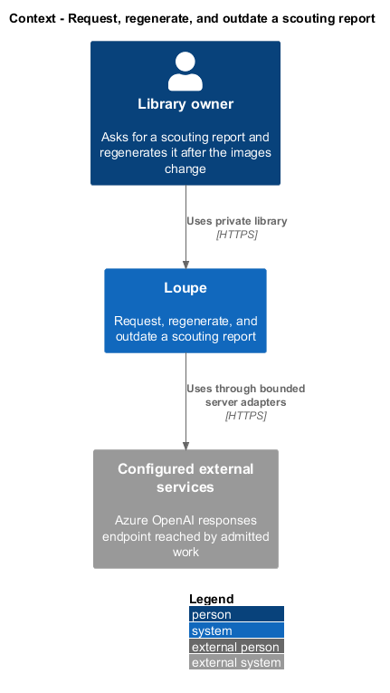
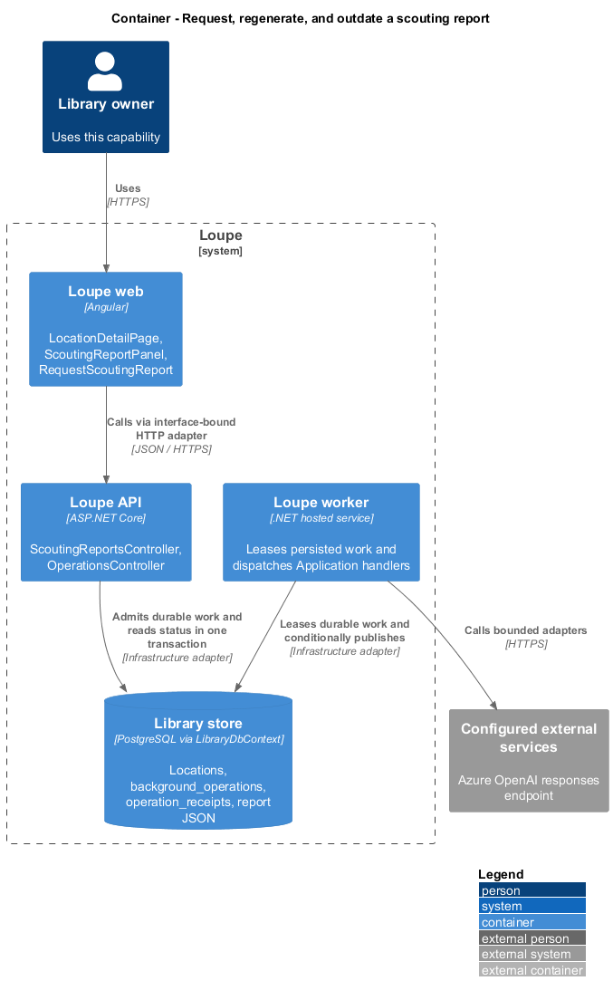
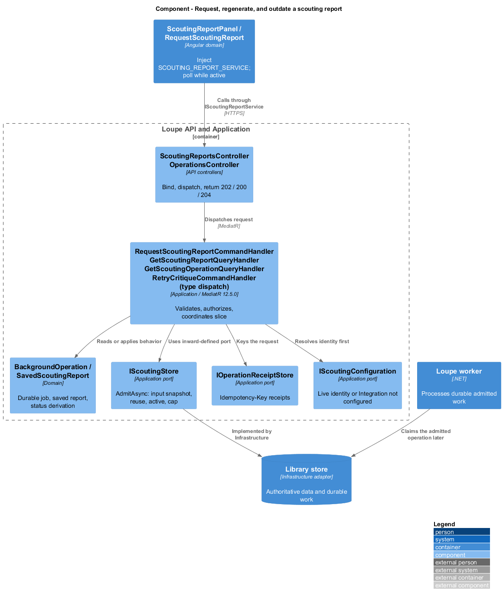
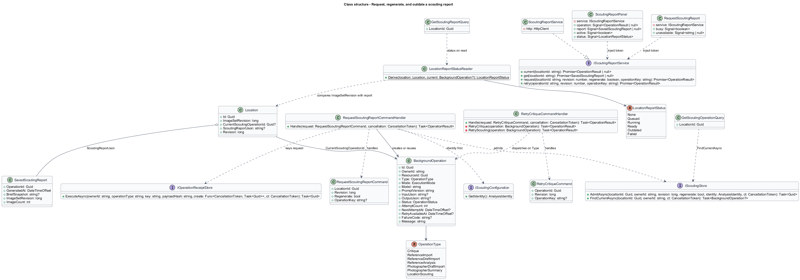
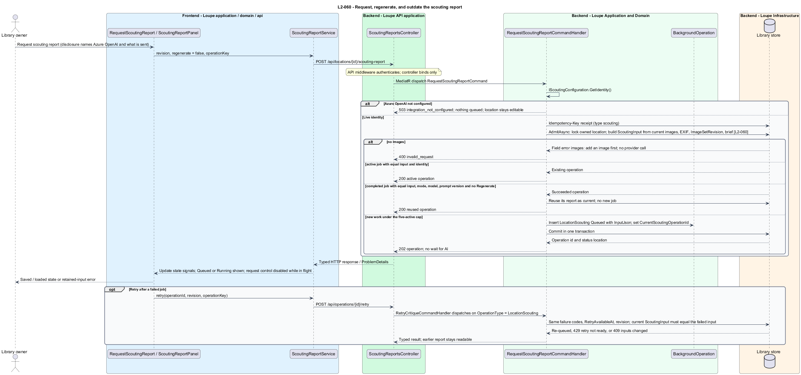
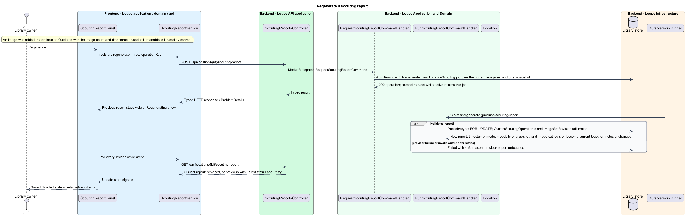

# Request, regenerate, and outdate a scouting report

## Overview

A scouting report exists only because the owner asked for one. **Requesting** — explicit action on a location with at least one image that admits one durable `LocationScouting` operation over the location's current image set and brief snapshot — never happens as a side effect of saving. **Regenerating** — explicit request for a new report when a completed one already exists — creates a new job; without it, an unchanged input reuses the completed report with no provider call. A report is **Outdated** — still readable, still what search uses, but produced from an image set that has since changed — whenever the location's image-set revision differs from the revision the report recorded; nothing removes it until a validated replacement commits.

This feature covers admission, reuse, regeneration, retry, status reads, the Outdated derivation, and the display provenance. Producing and validating the report itself is covered in [produce-scouting-report](../produce-scouting-report/README.md). Job lifecycle, retries, admission caps, and live-only execution are the shared processing rules of `L2-033` through `L2-036`, implemented today for critiques, reference suggestions, and photographer summaries.

This is a proposed design for the defined requirements. `docs/mocks/locations.html`, `docs/mocks/location.html`, and `docs/mocks/find-location.html` are the visual and interaction reference that `L2-055` names. The repository contains no Locations implementation. Components named below extend the implemented References, Critique, Search, and Deletion slices by their real names; proposed UI copy is design text, not a quotation.

## Description

`LocationDetailPage` lives in `frontend/projects/loupe` and owns routing and dialogs. `ScoutingReportPanel` and `RequestScoutingReport` live in `frontend/projects/domain` and consume `IScoutingReportService` through `SCOUTING_REPORT_SERVICE`. The contract and token share `scouting-report.service.contract.ts` in `frontend/projects/api`. `ScoutingReportService` is the separate production HTTP adapter. Composition substitutes `MockScoutingReportService` under Playwright. State uses signals, and HTTP and observable conversion stay inside the adapter. Presentational controls in `components` consume inputs and emit outputs. Component class, template, and styles occupy separate files.

`ScoutingReportsController` lives in `backend/src/Loupe.Api/Controllers` under `Loupe.Api.Controllers`. It binds requests, dispatches MediatR **12.5.0**, and returns results. Requests, handlers, and validators live in `Loupe.Application/Scouting`. `BackgroundOperation` and `SavedScoutingReport` live in `Loupe.Domain`; the domain references no other project. `IScoutingStore`, `IOperationReceiptStore`, and `IScoutingConfiguration` belong to Application. Infrastructure implements persistence and configuration. Each type occupies its own named file.

`RequestScoutingReportCommandHandler` takes the location identifier, the opened `Revision`, a `Regenerate` flag, and the `Idempotency-Key`. It resolves `IScoutingConfiguration.GetIdentity()` first: without configured Azure OpenAI credentials this raises `IntegrationNotConfiguredException`, `ApiExceptionHandler` returns 503 `integration_not_configured` with `Retry-After`, no work is queued, and the location stays editable. It then keys the request through `IOperationReceiptStore` with type `scouting` and a fingerprint of the location, revision, and flag, so an accidental repeat returns the same operation. `IScoutingStore.AdmitAsync(locationId, ownerId, revision, regenerate, identity)` has the per-job shape of `IPhotographerSummaryStore.AdmitAsync` with the reuse and regenerate rules of `BackgroundOperationStore.AdmitCritiqueAsync`. Inside one transaction under `AnalysisAdmissionLock` it locks the owned location, checks the revision, and builds the `ScoutingInput` from the current images, their allowlisted EXIF, the image-set revision, and the brief. A location with no images raises the field error `images` "Add an image before requesting a scouting report." and makes no provider call. An active operation for the location with the same input and identity is returned as-is. A Succeeded operation with the same input, mode, model, and prompt version is reused without a provider call when `Regenerate` is false: its report becomes current again with no new job. Otherwise, under the five-active-job cap that raises `AnalysisLimitException`, the store inserts a `BackgroundOperation` of type `LocationScouting` with `InputJson`, sets `Location.CurrentScoutingOperationId`, and the API answers 202 with the operation and its status location at `/api/operations/{id}`. Browsing and editing continue while the job runs; a second request while it is active returns the active job.

`GetScoutingReportQueryHandler` returns the current `SavedScoutingReport` with its status, or 204 when none exists, and `GetScoutingOperationQueryHandler` returns the current `OperationResult` for the location. The report status, `LocationReportStatus`, is derived on read: None without a report or job, Queued or Running from the current operation, Failed when the current operation failed and no report exists, Outdated when `SavedScoutingReport.ImageSetRevision` differs from `Location.ImageSetRevision`, and Ready otherwise. Outdated is a comparison, never a write: adding or removing an image only increments the location's revision, and the report stays readable with the image count and timestamp it used. The report remains what Find a location reads until a replacement commits.

Regeneration and failure keep the previous report visible. A regenerated report replaces the current one only when `RunScoutingReportCommandHandler` publishes through `IScoutingWorkStore.PublishAsync`, after complete validation, together with its generation timestamp, execution mode, model provenance, brief snapshot, and image-set revision; personal notes are never part of that write. A failed job shows its safe reason with Retry, and any earlier report stays readable. `POST /api/operations/{id}/retry` today dispatches `RetryCritiqueCommand`, whose `RetryCritiqueCommandHandler` rejects any operation type other than `Critique`; this design widens that handler into a dispatch by `OperationType`. The `Critique` branch is unchanged. The `LocationScouting` branch permits retry for the same failure codes, honors `RetryAvailableAt` with `RetryNotReadyException`, checks the revision, compares the current `ScoutingInput` and identity with the failed operation's — a changed image set or brief raises `AnalysisInputsChangedException` and requires a new request — and re-queues the operation under `CurrentScoutingOperationId`. Retry timing and classes follow `L2-034`.

Editing the brief after a report exists leaves the report current; the display identifies the brief snapshot it used and offers Regenerate to apply the new brief. Every displayed report carries the AI generated label, its timestamp, model provenance, brief snapshot, and image-set revision, rendered separately from notes.

`RequestScoutingReport` shows Request scouting report only when at least one image exists, with the nearby disclosure that the images, brief, and camera settings are sent to Azure OpenAI and that the address, coordinates, notes, and tags stay on the server; selecting it authorizes the operation without a second approval dialog. It shows the Integration not configured copy when the service reports that code, and the explanation that an image is needed when the location has none. `ScoutingReportPanel` follows `PhotographerSummaryPanel`: it loads `current` and `get` together, polls once per second while the operation is Queued or Running, generates a `crypto.randomUUID()` operation key per request, disables the request control while a job is in flight so duplicate activation cannot create another operation, and offers Regenerate on a Ready or Outdated report and Retry on a failed one. `OperationResult.type` gains `'LocationScouting'`. `IScoutingReportService` declares `current(locationId)`, `get(locationId)`, `request(locationId, revision, regenerate, operationKey)`, and `retry(operationId, revision, operationKey)`; `MockScoutingReportService` forwards to `window.loupeScoutingReports`.

The following contract surface names the proposed operations. Background commands run in the worker after a separate admission request; local evaluation commands run in the evaluation project.

| Application request | Entry point | Input |
| --- | --- | --- |
| `RequestScoutingReportCommand` | `POST /api/locations/{id}/scouting-report` | `revision, regenerate; Idempotency-Key` |
| `GetScoutingReportQuery` | `GET /api/locations/{id}/scouting-report` | `locationId` |
| `GetScoutingOperationQuery` | `GET /api/locations/{id}/scouting-report/operation` | `locationId` |
| `RetryCritiqueCommand` (widened by `OperationType`) | `POST /api/operations/{id}/retry` | `revision; Idempotency-Key` |

All operations inherit [shared contracts and open dependencies](../../README.md). Owner identity comes from authenticated server context, never from trusted client input. Mutations validate complete input before side effects and use conditional writes. API errors use the shared status mapping in [L2.md](../../../specs/L2.md#shared-acceptance-definitions). Visual implementation uses mirrored `--lp-` tokens and the specification's viewport matrix.

Implementation proceeds one behavior at a time using the linked Given-When-Then criteria. Each acceptance test first fails for its expected missing behavior. API integration tests cover persistence and failures. Playwright tests use one page object per screen and injected service mocks. Real-provider release checks supplement deterministic fixtures where applicable. Each acceptance file identifies L2 coverage and each test names its criterion. Regression checks pass before the next behavior starts; no architecture tests are introduced.

## Requirements

The table preserves source wording verbatim, including its use of "must". Quoted requirements are the sole exception to the design prose's shall/should/may convention. Each linked source section also supplies the acceptance criteria; deployment choices and unexecuted release evidence remain explicitly identified.

| L2 ID | Refines (L1) | Requirement |
| --- | --- | --- |
| `L2-060` | `L1-015` | Users must explicitly request a scouting report from a location with at least one image. The report is generated over the location's current image set and brief snapshot. Changing the image set marks the current report Outdated without removing it; a regenerated report replaces the current one only after complete validation. Job lifecycle, retries, reuse, admission, and live-only execution follow L2-033 through L2-036. |

Acceptance criteria: [L2-060](../../../specs/L2.md#l2-060-request-regenerate-and-outdate-the-scouting-report).

## Diagrams

The context view places this capability within the owner's private Loupe library. The configured AI provider appears because admitted work reaches it through the worker.

The container view separates Angular interaction, the .NET API, the worker, and authoritative persistence. Durable background work appears where processing continues after admission.

The component view shows dispatch into Application handlers and inward-defined ports. Infrastructure supplies the persistence and configuration implementations.

The class view names the proposed requests, handlers, ports, status derivation, and interface-bound frontend service. Typed associations and dependencies show which element owns behavior.

The request sequence traces `L2-060` through admission, with the no-image, not-configured, reuse, active-job, and retry paths as alternates. The accompanying Description defines state changes and significant recovery paths.

The regenerate sequence shows an explicit new job, the previous report staying visible and Outdated while the image set differs, and the conditional replacement or the failure that leaves the previous report in place.

