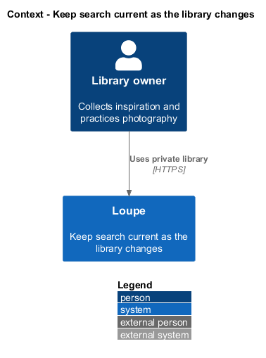
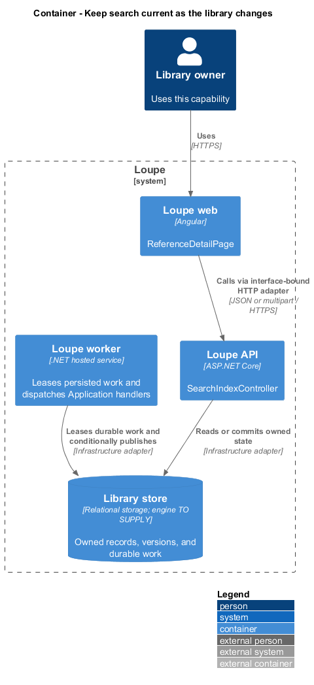
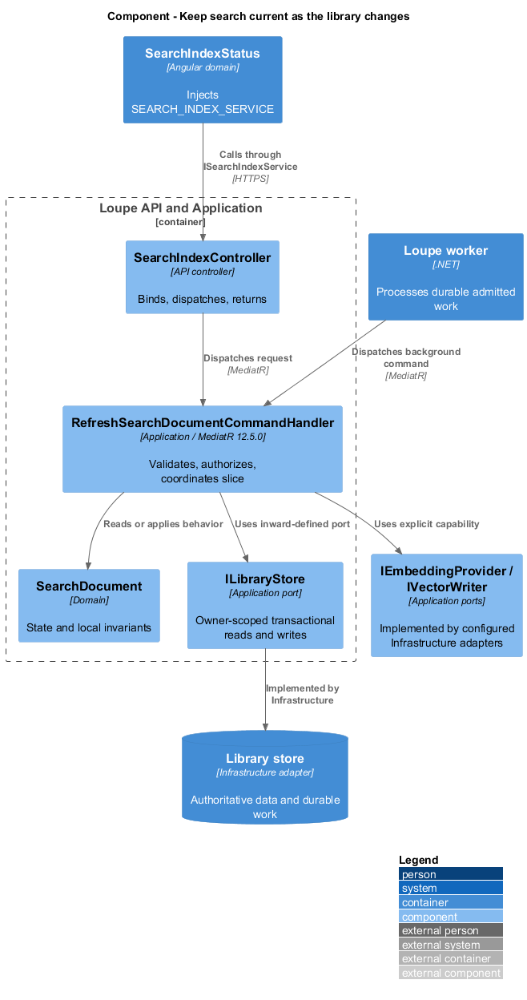
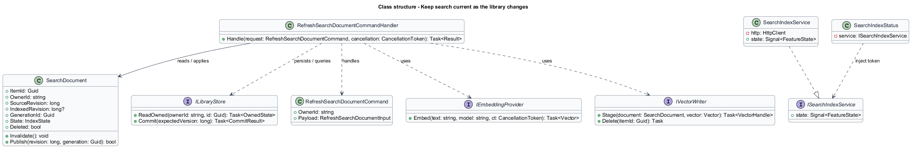
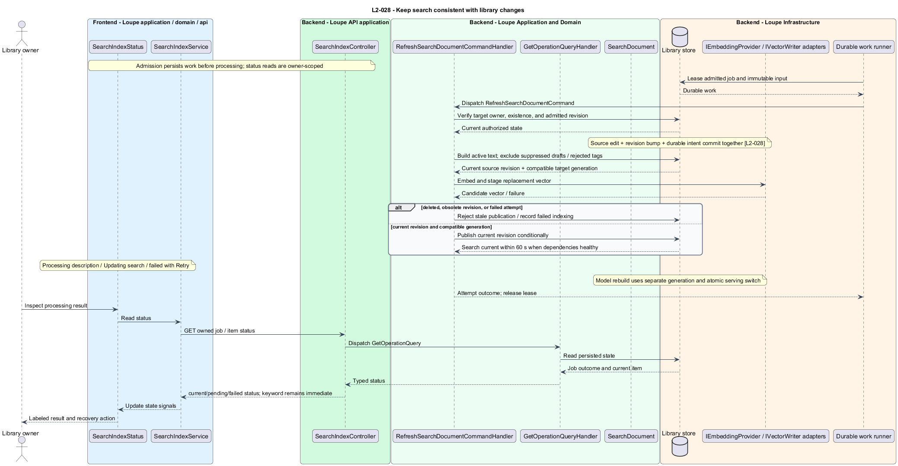
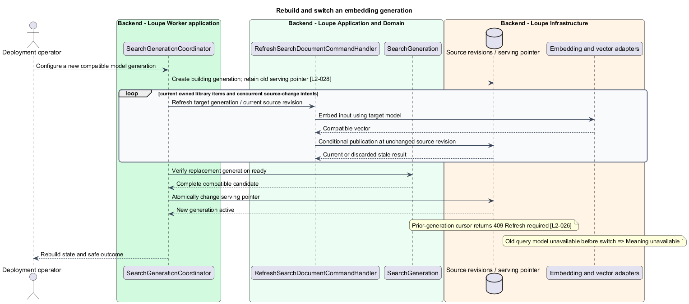

# Keep search current as the library changes

## Overview

A **search source revision** — version of fields used to describe a library item — identifies whether a vector still represents current content. A **search generation** — coherent index paired with one embedding model version — prevents incompatible comparisons. Durable refresh work keeps semantic search recoverable while keyword reads remain immediate.

This is a proposed design for the defined requirements. Existing files are illustrative HTML mockups; the repository contains no corresponding production implementation.

## Description

`ReferenceDetailPage` lives in `frontend/projects/loupe` and owns routing and dialogs. `SearchIndexStatus` lives in `frontend/projects/domain` and consumes `ISearchIndexService` through `SEARCH_INDEX_SERVICE`. The contract and token share `search-index.service.contract.ts` in `frontend/projects/api`. `SearchIndexService` is the separate production HTTP adapter. Composition substitutes a mock implementation under Playwright. State uses signals, and HTTP and observable conversion stay inside the adapter. Presentational controls in `components` consume inputs and emit outputs. Component class, template, and styles occupy separate files.

`SearchIndexController` lives in `backend/src/Loupe.Api/Controllers` under `Loupe.Api.Controllers`. It binds requests, dispatches MediatR **12.5.0**, and returns results. Requests, handlers, and validators live in the matching feature namespace in `Loupe.Application`. `SearchDocument` lives in `Loupe.Domain`; the domain references no other project. `ILibraryStore` and capability ports belong to Application. Infrastructure implements persistence and external adapters. Each type occupies its own named file.

Every library mutation updates authoritative fields and `SearchDocument.SourceRevision` in the same database transaction. It also persists an indexing intent in a transactional outbox, a table of work awaiting execution. Semantic reads require `IndexedRevision == SourceRevision` and the active generation. Old vectors therefore stop participating at mutation acknowledgment, before physical cleanup.

`SearchInputBuilder` reads current title/name, active description/summary, notes, active tags, attribution, linked photographer name, and hostname. Board membership remains a live filter rather than descriptive text. An image without an active description uses its labeled machine visual description only when its draft is current and not suppressed by rejection or clearing. Pending tags, rejected/deleted tag values, previous-URL machine content, and My Work never enter this input.

Live embedding inference runs inside the trusted Loupe deployment through `LocalEmbeddingProvider`. This design choice preserves notes as semantic input without transmitting them to an external AI provider, as prohibited by `L2-041`. Item and query inference use the same real local model/version. The exact model and inference library are `<TO SUPPLY>` and remain subject to the semantic quality and capacity gates. Controlled providers are test fixtures only. External critique, visual-metadata, and summary providers receive no notes.

`SearchIndexWorker` leases durable intents and dispatches `RefreshSearchDocumentCommand`. `IEmbeddingProvider` produces a vector for the target model. `IVectorWriter` stages it, and publication conditionally records indexed revision only if the item, ownership, deletion state, and source revision still match. A stale completion is discarded and current durable work remains eligible. Failed work records Search indexing failed with a retry action; keyword reads and editing remain usable.

Healthy refresh completes within 60 seconds of mutation acknowledgment when description generation is complete. When visual analysis is needed, the UI reports Processing description and starts that 60-second window at analysis success. Other pending refreshes show Updating search. An unchanged current vector reports current. Worker capacity follows `L2-048`; maintenance is exempt from the five requested-job cap but obeys shared provider concurrency under `L2-035`. Retries follow `L2-034`.

Photographer renames invalidate affected linked-reference text in the same transaction; keyword queries join the current name immediately. Board changes affect live filters immediately. All keyword, semantic, and related queries apply authoritative ownership and deletion checks before rows or counts are returned, even when the external vector store contains stale candidates.

A model change builds a separate generation with compatible item vectors and its query model. The serving pointer switches atomically only after the replacement is ready; mutation intents keep both building and serving generations current during rebuild. Meaning search stays on the coherent old generation while its query model remains available. Otherwise it reports temporary unavailability. A switch invalidates old cursors. Physical cleanup and item deletion follow `L2-029` through `L2-032`, including deletion precedence during restore.

The following contract surface names the proposed operations. Background commands run in the worker after a separate admission request; local evaluation commands run in the evaluation project.

| Application request | Entry point | Input |
| --- | --- | --- |
| `RefreshSearchDocumentCommand` | `POST /api/search-index/{kind}/{id}/retry; GET status` | `itemId, sourceRevision, generationId` |

All operations inherit [shared contracts and open dependencies](../../README.md). Owner identity comes from authenticated server context, never from trusted client input. Mutations validate complete input before side effects and use conditional writes. API errors use the shared status mapping in [L2.md](../../../specs/L2.md#shared-acceptance-definitions). Visual implementation uses mirrored `--lp-` tokens and the specification's viewport matrix.

Implementation proceeds one behavior at a time using the linked Given-When-Then criteria. Each acceptance test first fails for its expected missing behavior. API integration tests cover persistence and failures. Playwright tests use one page object per screen and injected service mocks. Real-provider release checks supplement deterministic fixtures where applicable. Each acceptance file identifies L2 coverage and each test names its criterion. Regression checks pass before the next behavior starts; no architecture tests are introduced.

## Requirements

The table preserves source wording verbatim, including its use of “must”. Quoted requirements are the sole exception to the design prose's shall/should/may convention. Each linked source section also supplies the acceptance criteria; deployment choices and unexecuted release evidence remain explicitly identified.

| L2 ID | Refines (L1) | Requirement |
| --- | --- | --- |
| `L2-028` | `L1-007` | Keyword reads and filters must reflect persisted edits immediately. Semantic indexing must be durable, versioned, and visibly report pending/current/failed status. Old vectors must stop participating as soon as their source changes; deleted items must never be exposed while cleanup is pending. |

Acceptance criteria: [L2-028](../../../specs/L2.md#l2-028-keep-search-consistent-with-library-changes).

## Diagrams

The context view places this capability within the owner's private Loupe library. External services appear only where the slice uses provider or source content.

The container view separates Angular interaction, the .NET API, and authoritative persistence. Durable background work appears where processing continues after admission.

The component view shows dispatch into Application handlers and inward-defined ports. Infrastructure supplies the persistence and provider implementations.

The class view names the proposed state, requests, handlers, and interface-bound frontend service. Typed associations and dependencies show which element owns behavior.

The keep search consistent with library changes sequence traces `L2-028` through its enforcing operations. The accompanying Description defines state changes and significant recovery paths.

A model rebuild keeps the serving and building generations separate. Source edits invalidate stale vectors in both, and an atomic serving switch invalidates previous cursors.

