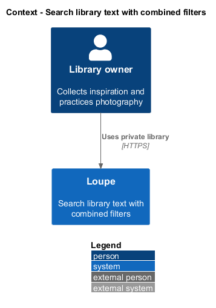
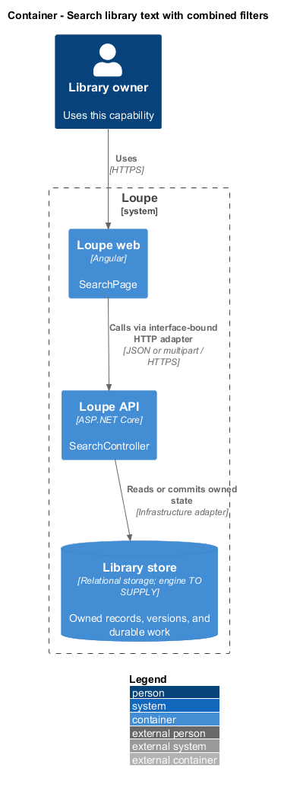
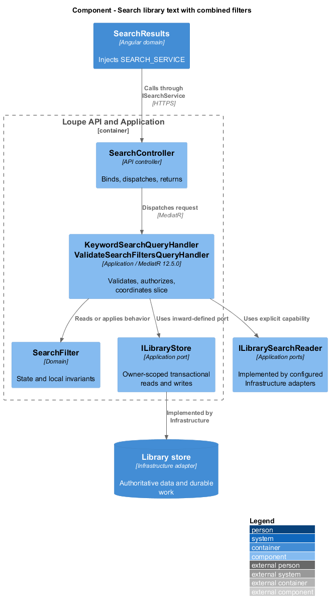
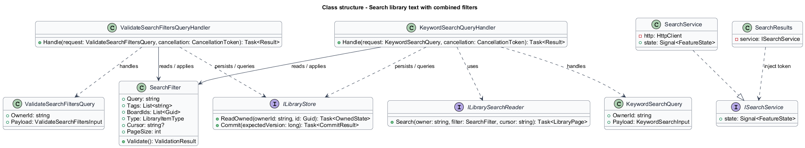
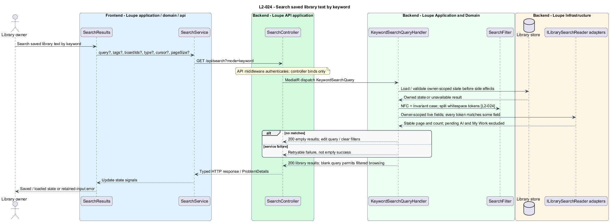
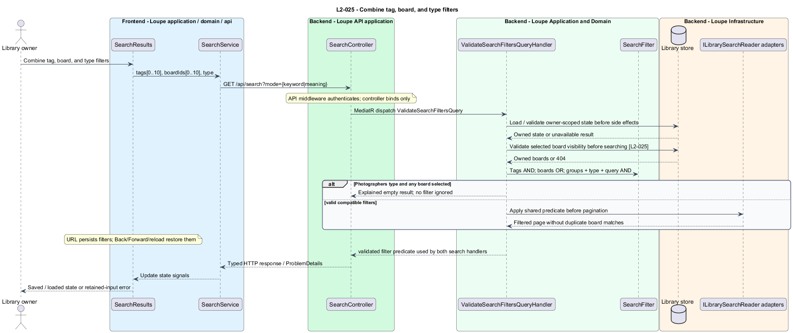

# Search library text with combined filters

## Overview

**Keyword search** — normalized substring matching across saved library fields — finds references and photographer bookmarks. A **filter group** — selected tags, boards, or item type — narrows results alongside the query. My Work photographs and critiques never enter this searchable library.

Keyword search is implemented across the API and Angular application. This delivery explicitly excludes Meaning search, embeddings, durable indexing and semantic related results. The original requirements below still describe the larger target; they are not a claim that semantic search is complete.

## Description

`SearchPage` lives in `frontend/projects/loupe` and owns routing and dialogs. `SearchResults` lives in `frontend/projects/domain` and consumes `ISearchService` through `SEARCH_SERVICE`. The contract and token share `search.service.contract.ts` in `frontend/projects/api`. `SearchService` is the separate production HTTP adapter. Composition substitutes a mock implementation under Playwright. State uses signals, and HTTP and observable conversion stay inside the adapter. Presentational controls in `components` consume inputs and emit outputs. Component class, template, and styles occupy separate files.

`SearchController` lives in `backend/src/Loupe.Api/Controllers` under `Loupe.Api.Controllers`. It binds requests, dispatches MediatR **12.5.0**, and returns results. `SearchQuery`, `SearchQueryHandler`, `SearchFilter` and `ISearchStore` live in `Loupe.Application.Search`. Infrastructure implements the store against PostgreSQL. Each backend type occupies its own named file.

`SearchPage` owns `q`, optional `mode=keyword`, repeated `tags` and `boardIds`, and `type` parameters in the URL. `SearchResults` injects `SEARCH_SERVICE` and holds result/request state in signals. Browser Back, Forward, and reload restore the same parameters; clearing filters preserves query, type and mode. Each response is applied only if its request identity still matches the active query. Duplicate in-flight page requests are suppressed.

`SearchQueryHandler` normalizes text with NFC, splits queries on whitespace, and requires every token to occur in at least one eligible field. The parameterized PostgreSQL query matches normalized uppercase substrings. Fields are title/name, active description/summary, notes, active tags, textual attribution, linked photographer name, and source/portfolio hostname. Board names and pending AI suggestions are excluded. A blank query browses filtered items; over 500 Unicode scalar values returns 400 before search execution.

The query handler permits up to ten tags and ten board identifiers, plus All, References, or Photographers. Tags combine with AND and board membership with OR. Query, tag group, board group, and type combine with AND. Any board selection excludes photographer bookmarks. Photographers plus a board therefore returns explained empty results; neither filter is ignored. Unknown valid tags yield no matches. Unknown or foreign boards return 404 before querying results.

`SearchStore` reads current owner-scoped relational state and joins active tags and linked photographer names. Existence predicates for boards avoid duplicate references across selected boards. Rows and count use the same predicate; the creation-order cursor does not promise a frozen snapshot across concurrent library edits. Results follow descending creation time then ascending identifier, with owner/query/filter/page-size-scoped cursors. Each result includes kind, title/name, preview or placeholder, and protected original-source action. Photographer cards include full linked-reference counts and at most three preview URLs.

The application-owned Boards and tags dialog reads complete private active tag choices from both references and photographer bookmarks, and reuses the board service. Apply commits its draft selections; Cancel/Escape discard them. Unknown selections remain removable. A deleted board in a saved URL offers removal without silently broadening the query.

Tag facets include `normalizedName` and `selectedNames` alongside `name` and `count`. Optional `selectedTags` parameters resolve URL spelling variants on the server using the same normalization as persisted tag identities. The browser does not reproduce .NET casing with JavaScript uppercase: for example, `straße` and `strasse` remain independently selectable. The dialog batches over-limit URL selections for identity resolution without hiding them, so invalid URLs can still be corrected.

The UI separates successful No results from retryable service failure. Empty results offer query editing or filter clearing. A failed next page retains loaded cards and retries its cursor; an invalid cursor requires explicit Refresh results. Unsupported modes get an explicit Use Keyword correction, never a silent fallback. Four-area navigation and the `/` shortcut make Search reachable while retaining unsaved-edit route guards. The shortcut ignores editable controls, open dialogs, modifiers and composition.

The implemented contract is:

| Application request | Entry point | Input |
| --- | --- | --- |
| `SearchQuery` | `GET /api/search` | `query?, mode=keyword, tags[0..10], boardIds[0..10], type?, cursor?, pageSize?` |
| `ListSearchTagsQuery` | `GET /api/search/tags` | Optional `selectedTags[0..10]` for canonical alias resolution |

All operations inherit [shared contracts and open dependencies](../../README.md). Owner identity comes from authenticated server context, never from trusted client input. API errors use the shared status mapping in [L2.md](../../../specs/L2.md#shared-acceptance-definitions). Visual implementation uses mirrored `--lp-` tokens and the approved HTML mocks, including their 640px mobile tab/dialog transition and mixed-card grid. This branch's approved mock precedence supersedes contradictory older viewport column counts. The keyword-only mode presentation and explicit Cancel action are intentional scope/interaction decisions.

Implementation proceeds one behavior at a time using Given-When-Then criteria and expected RED/GREEN acceptance. API integration tests cover persistence and failures. Chromium Playwright tests use page objects and injected service mocks. No live AI provider is required for keyword search, and no semantic-quality evidence is claimed.

The independent [design-system search example](../../../../design-system/search.html) demonstrates the delivered keyword states and filter interactions using synthetic local data. It has no runtime application or API dependency and reuses the authoritative design tokens.

## Requirements

The table preserves source wording verbatim, including its use of “must”. Quoted requirements are the sole exception to the design prose's shall/should/may convention. Each linked source section also supplies the acceptance criteria; deployment choices and unexecuted release evidence remain explicitly identified.

| L2 ID | Refines (L1) | Requirement |
| --- | --- | --- |
| `L2-024` | `L1-007` | Search must offer explicit Keyword and Meaning modes, with Keyword the default. Keyword matching must be case-insensitive after Unicode NFC normalization, split the query on whitespace, and require every token to occur as a substring in at least one eligible field. Eligible fields are title/name, active description or summary, notes, active tags, textual attribution, linked photographer name, and source/portfolio hostname. Board names require the board filter instead of text matching. My Work and critiques are excluded. |
| `L2-025` | `L1-007` | Both search modes must accept up to 10 selected active tags, up to 10 board IDs, and item type All, References, or Photographers. Tags combine with AND; boards combine with OR; these groups, query, and item type combine with AND. Selecting any board excludes photographer bookmarks because only references belong to boards. |

Acceptance criteria: [L2-024](../../../specs/L2.md#l2-024-search-saved-library-text-by-keyword), [L2-025](../../../specs/L2.md#l2-025-combine-tag-board-and-type-filters).

## Diagrams

These diagrams describe the original proposed design, including future capabilities and illustrative type names. The implemented keyword contract above is authoritative for this delivery.

The context view places this capability within the owner's private Loupe library. External services appear only where the slice uses provider or source content.

The container view separates Angular interaction, the .NET API, and authoritative persistence. Durable background work appears where processing continues after admission.

The component view shows dispatch into Application handlers and inward-defined ports. Infrastructure supplies the persistence and provider implementations.

The class view names the proposed state, requests, handlers, and interface-bound frontend service. Typed associations and dependencies show which element owns behavior.

The search saved library text by keyword sequence traces `L2-024` through its enforcing operations. The accompanying Description defines state changes and significant recovery paths.

The combine tag, board, and type filters sequence traces `L2-025` through its enforcing operations. The accompanying Description defines state changes and significant recovery paths.

