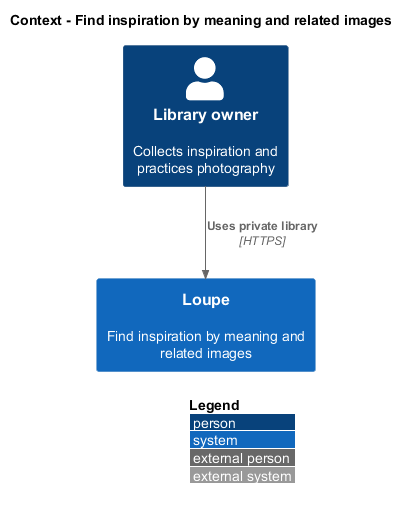
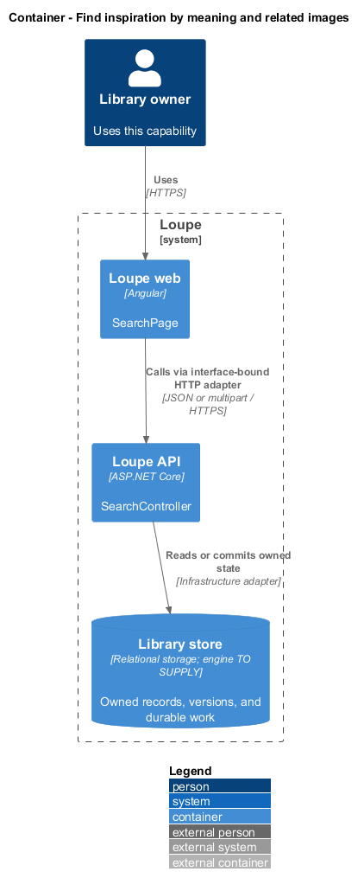
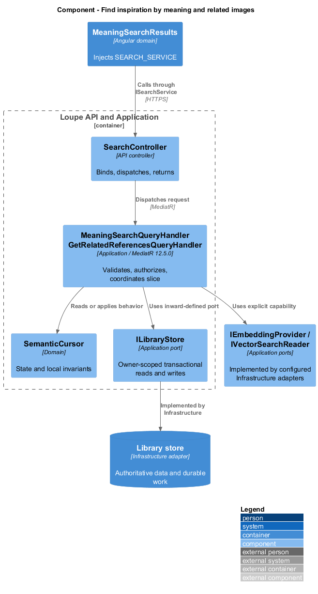
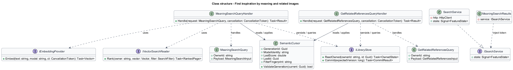
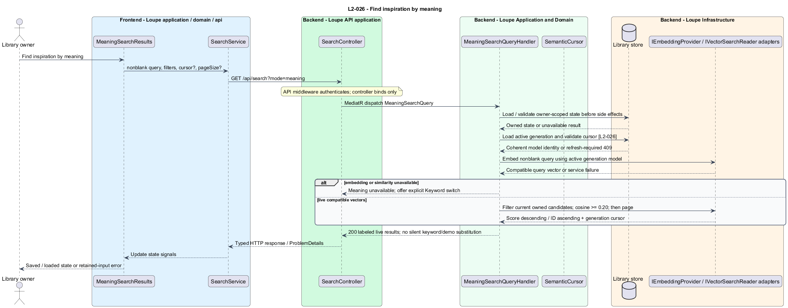
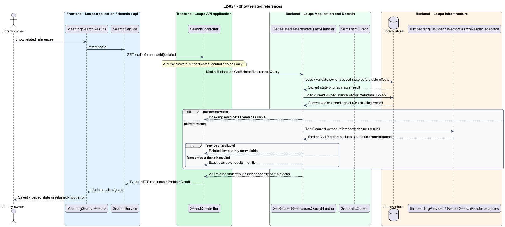
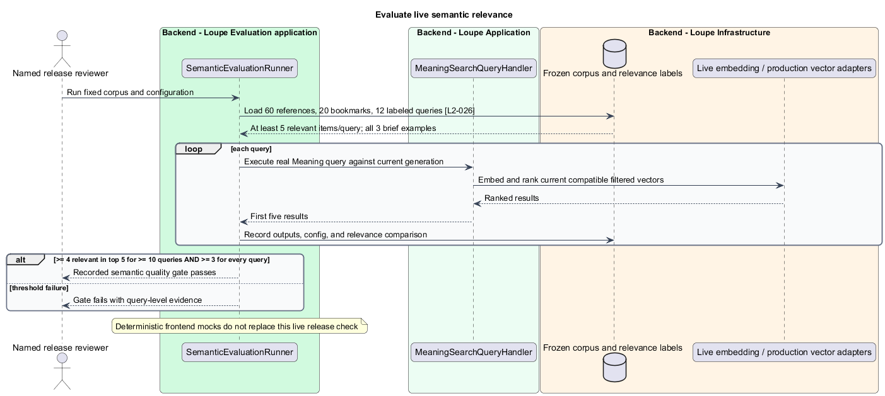

# Find inspiration by meaning and related images

## Overview

**Meaning search** — ranking saved inspiration by vector similarity to a query — retrieves visual ideas beyond exact keywords. A **vector** — numeric representation produced by an embedding model — is comparable only with vectors from the same compatible model version. Related-reference retrieval uses an existing reference vector instead of a text query.

This is a proposed design for the defined requirements. Existing files are illustrative HTML mockups; the repository contains no corresponding production implementation.

## Description

`SearchPage` lives in `frontend/projects/loupe` and owns routing and dialogs. `MeaningSearchResults` lives in `frontend/projects/domain` and consumes `ISearchService` through `SEARCH_SERVICE`. The contract and token share `search.service.contract.ts` in `frontend/projects/api`. `SearchService` is the separate production HTTP adapter. Composition substitutes a mock implementation under Playwright. State uses signals, and HTTP and observable conversion stay inside the adapter. Presentational controls in `components` consume inputs and emit outputs. Component class, template, and styles occupy separate files.

`SearchController` lives in `backend/src/Loupe.Api/Controllers` under `Loupe.Api.Controllers`. It binds requests, dispatches MediatR **12.5.0**, and returns results. Requests, handlers, and validators live in the matching feature namespace in `Loupe.Application`. `SemanticCursor` lives in `Loupe.Domain`; the domain references no other project. `ILibraryStore` and capability ports belong to Application. Infrastructure implements persistence and external adapters. Each type occupies its own named file.

`MeaningSearchResults` injects `SEARCH_SERVICE`. `MeaningSearchQueryHandler` rejects blank queries without an embedding call and shares field and filter validation with Keyword search. `IEmbeddingProvider` produces a live query vector for the currently served `SearchGeneration`. `IVectorSearchReader` ranks compatible current item vectors by cosine similarity descending, then identifier ascending. The baseline threshold is 0.20 inclusive.

`LocalEmbeddingProvider` performs real Live inference inside the trusted deployment for both queries and items. This permits note-bearing semantic input without sending private notes to external AI providers under `L2-041`. The configured local model/version is identical on both paths; controlled simulation exists only in tests.

Candidates are constrained by current owner, deletion state, source revision, model identity, active tags, board memberships, and item type before pagination. The search port returns a complete filtered page and count; a bounded unfiltered top-k followed by trimming does not satisfy the contract. If the chosen store cannot join authoritative state, its adapter iterates candidates to exhaustion or a full page before returning. Coherent reads and generation validation prevent stale ownership or deletion from leaking into results and counts.

`SemanticCursor` binds generation, query/filter fingerprint, page size, last score, and identifier. A changed generation produces 409 with Refresh required rather than mixing pages. A request that changes query or filters starts a new traversal. Embedding/search failure exposes Meaning unavailable and an explicit switch to Keyword. Historical sample generations are excluded from live similarity.

`GetRelatedReferencesQueryHandler` uses the source reference's current vector and the same 0.20 threshold. It returns at most six owned references, sorted by similarity and identifier, excluding the source, bookmarks, My Work, and deleted items. No current vector yields Indexing; provider failure yields Temporarily unavailable. Both states leave reference detail usable. Fewer matches remain fewer; no unrelated filler is inserted.

`SemanticEvaluationRunner`, in `backend/src/Loupe.Evaluation`, uses a frozen corpus of 60 references and 20 photographer bookmarks with 12 queries and at least five pre-labeled relevant items per query. It includes the three product-brief examples. At least ten queries place four relevant results in their first five; every query places at least three. The run records production embedding model and configuration. Corpus, labels, provider, vector-store adapter, and generation-switch implementation are `<TO SUPPLY>`; deterministic fixtures do not establish live quality.

The following contract surface names the proposed operations. Background commands run in the worker after a separate admission request; local evaluation commands run in the evaluation project.

| Application request | Entry point | Input |
| --- | --- | --- |
| `MeaningSearchQuery` | `GET /api/search?mode=meaning` | `nonblank query, filters, cursor?, pageSize?` |
| `GetRelatedReferencesQuery` | `GET /api/references/{id}/related` | `referenceId` |

All operations inherit [shared contracts and open dependencies](../../README.md). Owner identity comes from authenticated server context, never from trusted client input. Mutations validate complete input before side effects and use conditional writes. API errors use the shared status mapping in [L2.md](../../../specs/L2.md#shared-acceptance-definitions). Visual implementation uses mirrored `--lp-` tokens and the specification's viewport matrix.

Implementation proceeds one behavior at a time using the linked Given-When-Then criteria. Each acceptance test first fails for its expected missing behavior. API integration tests cover persistence and failures. Playwright tests use one page object per screen and injected service mocks. Real-provider release checks supplement deterministic fixtures where applicable. Each acceptance file identifies L2 coverage and each test names its criterion. Regression checks pass before the next behavior starts; no architecture tests are introduced.

## Requirements

The table preserves source wording verbatim, including its use of “must”. Quoted requirements are the sole exception to the design prose's shall/should/may convention. Each linked source section also supplies the acceptance criteria; deployment choices and unexecuted release evidence remain explicitly identified.

| L2 ID | Refines (L1) | Requirement |
| --- | --- | --- |
| `L2-026` | `L1-007` | Meaning search must rank vector similarity over the current eligible description and text metadata, using a machine visual description for an image without an active description unless it was rejected/cleared. It must use real embeddings in live mode. Query and item vectors must use a compatible model/version. Results rank by cosine similarity descending, then identifier ascending; only scores of at least 0.20 are eligible in the baseline configuration. |
| `L2-027` | `L1-007` | Reference detail must show up to six related owned references using the current reference vector and the same similarity measure/threshold as Meaning search. The source reference, My Work, and photographer bookmarks are excluded. |

Acceptance criteria: [L2-026](../../../specs/L2.md#l2-026-find-inspiration-by-meaning), [L2-027](../../../specs/L2.md#l2-027-show-related-references).

## Diagrams

The context view places this capability within the owner's private Loupe library. External services appear only where the slice uses provider or source content.

The container view separates Angular interaction, the .NET API, and authoritative persistence. Durable background work appears where processing continues after admission.

The component view shows dispatch into Application handlers and inward-defined ports. Infrastructure supplies the persistence and provider implementations.

The class view names the proposed state, requests, handlers, and interface-bound frontend service. Typed associations and dependencies show which element owns behavior.

The find inspiration by meaning sequence traces `L2-026` through its enforcing operations. The accompanying Description defines state changes and significant recovery paths.

The show related references sequence traces `L2-027` through its enforcing operations. The accompanying Description defines state changes and significant recovery paths.

The release runner fixes relevance labels before executing live semantic queries. It records the model and corpus and checks both per-query and aggregate relevance thresholds.

