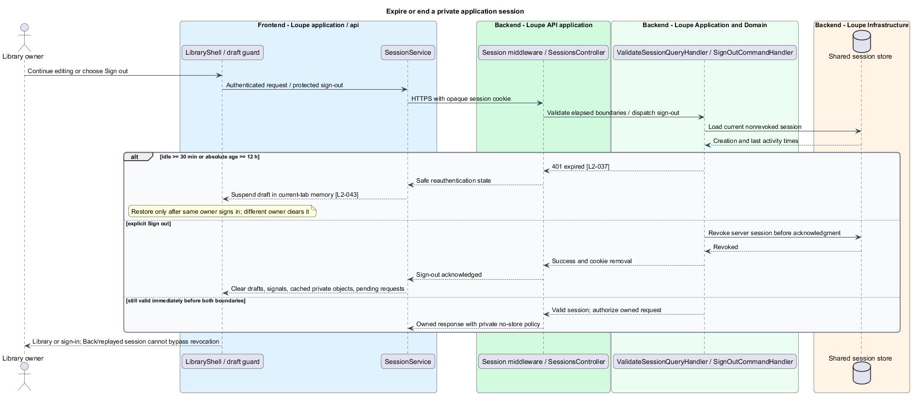

# Sign in and access only the owned library

## Overview

An **application session** — server-held authorization state established after OpenID Connect authentication — identifies the owner of a private library. **Ownership enforcement** — restriction of every record, relationship, media stream, and search result to that owner — prevents identifier substitution from exposing another library.

This is a proposed design for the defined requirements. Existing files are illustrative HTML mockups; the repository contains no corresponding production implementation.

## Description

`SignInPage` lives in `frontend/projects/loupe` and owns routing and dialogs. `SessionStatus` lives in `frontend/projects/domain` and consumes `ISessionService` through `SESSION_SERVICE`. The contract and token share `session.service.contract.ts` in `frontend/projects/api`. `SessionService` is the separate production HTTP adapter. Composition substitutes a mock implementation under Playwright. State uses signals, and HTTP and observable conversion stay inside the adapter. Presentational controls in `components` consume inputs and emit outputs. Component class, template, and styles occupy separate files.

`SessionsController` lives in `backend/src/Loupe.Api/Controllers` under `Loupe.Api.Controllers`. It binds requests, dispatches MediatR **12.5.0**, and returns results. Requests, handlers, and validators live in the matching feature namespace in `Loupe.Application`. `ApplicationSession` lives in `Loupe.Domain`; the domain references no other project. `ILibraryStore` and capability ports belong to Application. Infrastructure implements persistence and external adapters. Each type occupies its own named file.

The API acts as the browser's session boundary. `OpenIdConnectAuthenticationAdapter` validates issuer, audience, signature, expiry, state, and nonce before `CompleteSignInCommandHandler` creates a session. Redirect targets are validated local paths. Failed callbacks establish no session and return safe retry guidance without tokens in application URLs or errors. The authorization-code exchange and tokens remain server-side. The selected identity provider and deployment callback values are `<TO SUPPLY>`.

`SessionCookieWriter` returns an opaque Secure, HttpOnly cookie, rotates its identifier on successful login, and applies a SameSite policy compatible with the configured callback. The main session cookie defaults to Lax; any cross-site identity correlation cookie uses only the secure policy required by that callback. Tokens and credentials never use browser local/session storage. Browser forms allow password managers and paste, with no added cognitive puzzle.

`ValidateSessionQueryHandler` rejects at 30 minutes idle or 12 hours absolute, using server time and last qualifying authenticated activity. Tests exercise immediately before and at both boundaries. `SignOutCommandHandler` revokes server state before acknowledgment. `SessionService` clears signals, pending requests, object URLs, and private drafts on explicit sign-out. Expiry handling delegates same-tab temporary draft preservation to the navigation feature.

`ICurrentOwner` derives ownership from the validated session; payload owner fields are rejected or ignored without reassignment. Every query, mutation, operation, relationship, comparison, picker, vector candidate, count, suggestion, and media read filters by owner and deletion state. Composite ownership checks prevent a permitted reference from linking a foreign board or bookmark. Absent and foreign items share 404; unauthenticated API/media reads return 401.

Private API, page, and media responses use `Cache-Control: no-store, private`. Private media streams pass through authenticated authorization and never expose a public bucket/CDN URL. The application service worker, if introduced, excludes private responses. Sign-out and deletion evict application-held objects so Back/refresh cannot restore private content from application caches. Controlled identity fixtures and two-user direct API substitution cases verify these boundaries.

The following contract surface names the proposed operations. Background commands run in the worker after a separate admission request; local evaluation commands run in the evaluation project.

| Application request | Entry point | Input |
| --- | --- | --- |
| `CompleteSignInCommand` | `OIDC callback; POST /api/session/sign-out` | `validated code exchange or sign-out` |
| `GetOwnedResourceQuery` | `all private API/media endpoints` | `resourceId; server-derived owner` |

All operations inherit [shared contracts and open dependencies](../../README.md). Owner identity comes from authenticated server context, never from trusted client input. Mutations validate complete input before side effects and use conditional writes. API errors use the shared status mapping in [L2.md](../../../specs/L2.md#shared-acceptance-definitions). Visual implementation uses mirrored `--lp-` tokens and the specification's viewport matrix.

Implementation proceeds one behavior at a time using the linked Given-When-Then criteria. Each acceptance test first fails for its expected missing behavior. API integration tests cover persistence and failures. Playwright tests use one page object per screen and injected service mocks. Real-provider release checks supplement deterministic fixtures where applicable. Each acceptance file identifies L2 coverage and each test names its criterion. Regression checks pass before the next behavior starts; no architecture tests are introduced.

## Requirements

The table preserves source wording verbatim, including its use of “must”. Quoted requirements are the sole exception to the design prose's shall/should/may convention. Each linked source section also supplies the acceptance criteria; deployment choices and unexecuted release evidence remain explicitly identified.

| L2 ID | Refines (L1) | Requirement |
| --- | --- | --- |
| `L2-037` | `L1-010` | The configured OpenID Connect sign-in must establish a private application session only after successful issuer, audience, signature, expiry, state, and nonce validation. Default application session expiry is 30 minutes idle or 12 hours absolute. Credentials and tokens must not be stored in browser local/session storage. Tests must use a controlled identity provider, including invalid callbacks. |
| `L2-038` | `L1-010` | Ownership must govern records, media, boards, relationships, operations, search results/counts, and suggestions. Clients must never choose the authenticated owner through a submitted user ID. All private response data must be non-publicly cached. |

Acceptance criteria: [L2-037](../../../specs/L2.md#l2-037-authenticate-users-and-end-sessions), [L2-038](../../../specs/L2.md#l2-038-enforce-ownership-at-every-data-boundary).

## Diagrams

The context view places this capability within the owner's private Loupe library. External services appear only where the slice uses provider or source content.

The container view separates Angular interaction, the .NET API, and authoritative persistence. Durable background work appears where processing continues after admission.

The component view shows dispatch into Application handlers and inward-defined ports. Infrastructure supplies the persistence and provider implementations.

The class view names the proposed state, requests, handlers, and interface-bound frontend service. Typed associations and dependencies show which element owns behavior.

The authenticate users and end sessions sequence traces `L2-037` through its enforcing operations. The accompanying Description defines state changes and significant recovery paths.

The enforce ownership at every data boundary sequence traces `L2-038` through its enforcing operations. The accompanying Description defines state changes and significant recovery paths.

Server-side session checks enforce idle and absolute expiry. Explicit sign-out revokes the session and clears private browser state; expiry preserves drafts only under the same-user memory rule.

