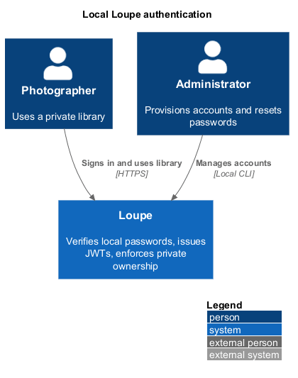
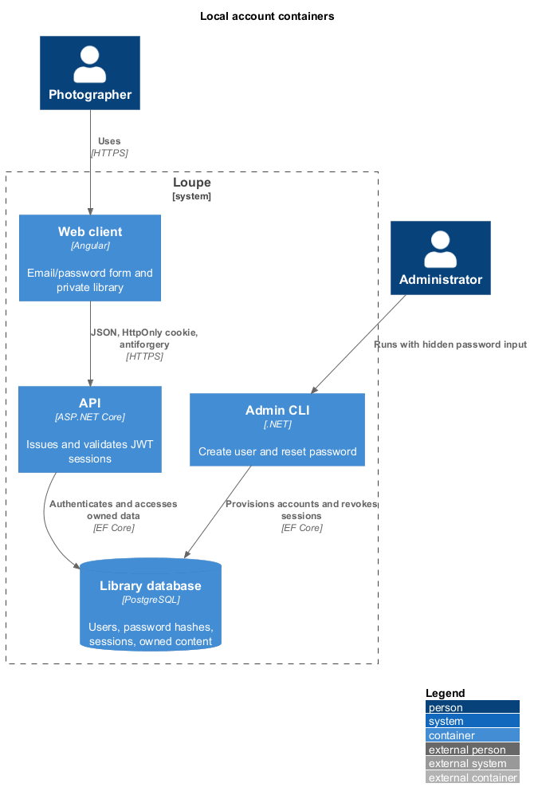
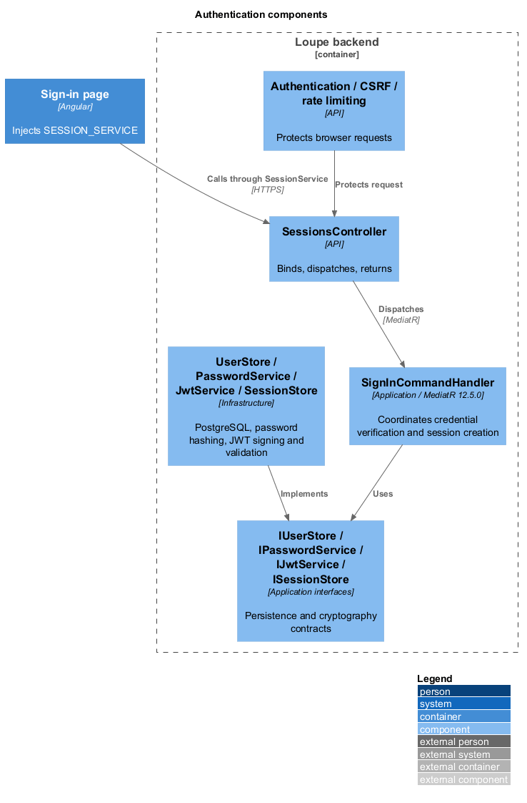
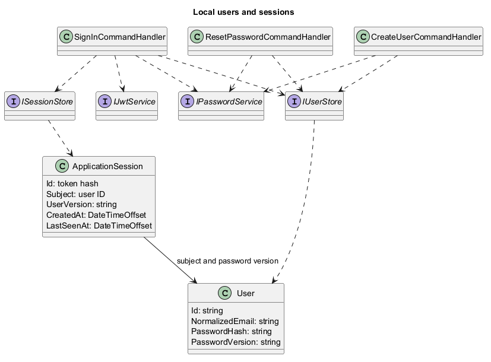
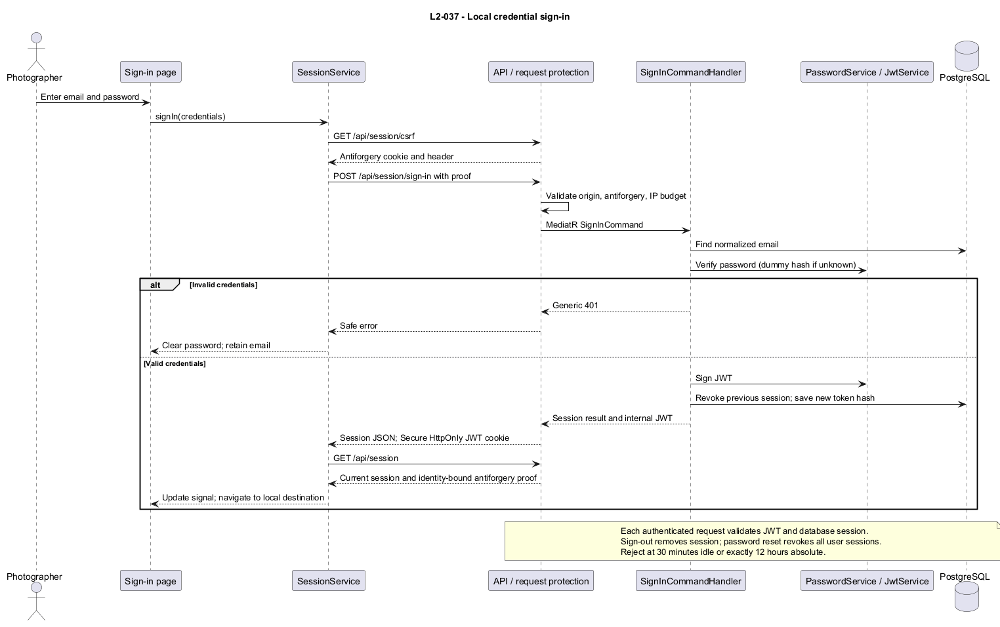
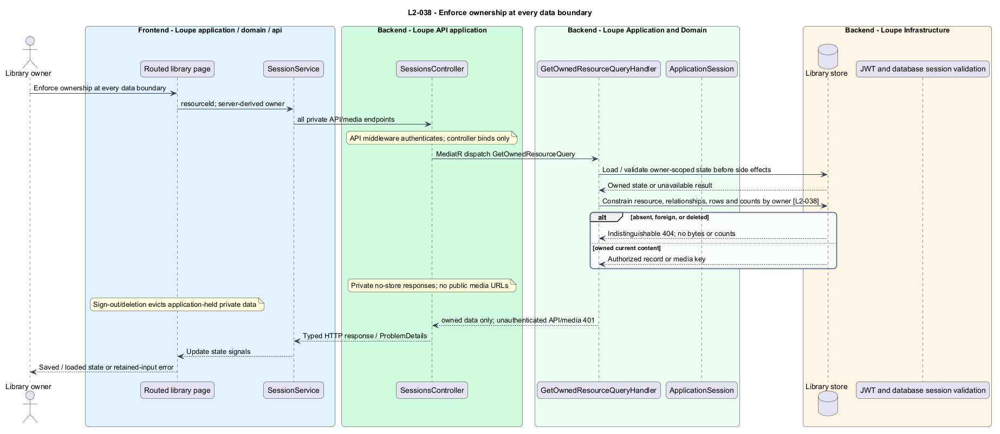

# Sign in and access only the owned library

## Overview

Loupe verifies administrator-provisioned database accounts and issues signed JWTs
in HttpOnly cookies. PostgreSQL sessions retain immediate revocation and exact
idle/absolute expiry. Existing external identities are not mapped to new accounts.

## Description

The routed Angular sign-in page consumes `ISessionService` through
`SESSION_SERVICE`. The API adapter obtains anonymous antiforgery proof, posts
email/password credentials, and loads the authenticated session and refreshed
antiforgery header. The page validates local return destinations, retains email
on failure, clears passwords after attempts, and holds UI state in signals.
Playwright injects the mock adapter. Password managers and paste remain available.

`SessionsController` binds and dispatches `SignInCommand` through MediatR 12.5.0.
The Application handler validates credentials using `IUserStore` and
`IPasswordService`, creates an `ApplicationSession`, asks `IJwtService` to sign a
JWT, and persists the token hash. Infrastructure owns EF Core/PostgreSQL,
ASP.NET Core PasswordHasher, and Microsoft IdentityModel. Domain types have no
framework dependency. The result writer sets the Secure, HttpOnly, SameSite=Lax
host cookie; neither passwords nor JWTs enter URLs, response JSON or browser storage.

Authentication validates HS256, issuer, audience, lifetime, required claims, and
the subject against the stored session. Database reads require the user's current
password version and enforce 30 minutes idle and exactly 12 hours absolute.
JWT timestamps round up only for whole-second representation; database expiry
remains authoritative at subsecond boundaries. Sign-in replaces the old session;
sign-out removes it before responding. Resetting a password changes its version
and deletes all user sessions atomically, preventing an in-flight old-password
login from restoring access after reset.

Anonymous sign-in requires trusted-origin antiforgery protection. The per-process
IP limiter permits ten protected attempts per minute and returns 429 with
Retry-After. Unknown accounts undergo dummy hash verification and credential
errors use generic responses. See the [operating guide](../../../../backend/README.md#local-accounts-and-authentication)
for signing-key provisioning, proxy/scale assumptions, and cutover instructions.

The operator CLI dispatches `CreateUserCommand` and `ResetPasswordCommand` through
MediatR. It shares account persistence and password hashing with the API, takes
passwords through hidden prompts or stdin, and requires only database configuration.
Emails are normalized for unique lookup; passwords are never trimmed.

`ICurrentOwner` derives the existing ownership key from Loupe's stable issuer and
the new user ID. Private queries, mutations and media filter by that owner.
Foreign and absent records return the same 404; anonymous requests return 401.
Private responses prohibit caching. The migration invalidates previous sessions
without deleting or reassigning photographs, references, or their media.

## Interfaces

| Entry point | Application operation | Result |
| --- | --- | --- |
| GET /api/session/csrf | Framework antiforgery bootstrap | 204 and X-CSRF-Token |
| POST /api/session/sign-in | SignInCommand | SessionResult and JWT cookie |
| GET /api/session | GetSessionQuery | SessionResult and refreshed antiforgery proof |
| POST /api/session/sign-out | RevokeSessionCommand | 204 and removed cookie |
| Admin create-user | CreateUserCommand | Generated local user ID |
| Admin reset-password | ResetPasswordCommand | Replaced password and revoked sessions |

## Requirements and verification

[L2-037](../../../specs/L2.md#l2-037-authenticate-users-and-end-sessions) and
[L2-038](../../../specs/L2.md#l2-038-enforce-ownership-at-every-data-boundary) refine
L1-010. Each slice follows failing acceptance tests before implementation, then
relevant regressions. API tests use real PostgreSQL, CLI provisioning, real
password verification and signing, controlled clocks, malformed JWTs, and multiple
API instances. Migration tests retain legacy content without exposing it to fresh
accounts. Chromium tests use page objects and injected mocks across the shared
viewport matrix. No architecture tests are used.

## Diagrams

