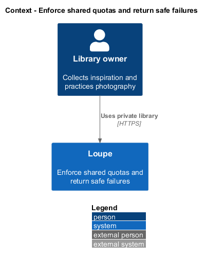
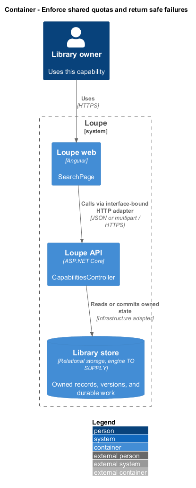
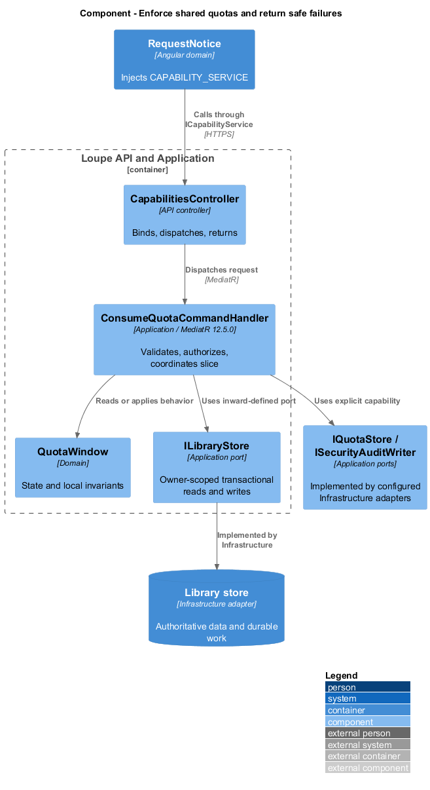
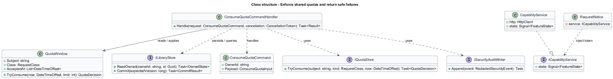
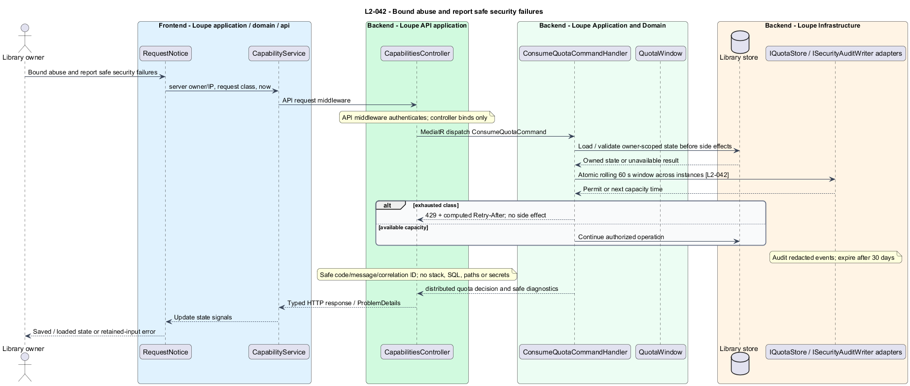

# Enforce shared quotas and return safe failures

## Overview

A **rolling quota** — request allowance over the preceding 60 elapsed seconds — bounds use across API instances. A **safe failure** — error containing a useful code, message, and correlation identifier without private implementation data — supports recovery without exposing secrets.

This is a proposed design for the defined requirements. Existing files are illustrative HTML mockups; the repository contains no corresponding production implementation.

## Description

`SearchPage` lives in `frontend/projects/loupe` and owns routing and dialogs. `RequestNotice` lives in `frontend/projects/domain` and consumes `ICapabilityService` through `CAPABILITY_SERVICE`. The contract and token share `capability.service.contract.ts` in `frontend/projects/api`. `CapabilityService` is the separate production HTTP adapter. Composition substitutes a mock implementation under Playwright. State uses signals, and HTTP and observable conversion stay inside the adapter. Presentational controls in `components` consume inputs and emit outputs. Component class, template, and styles occupy separate files.

`CapabilitiesController` lives in `backend/src/Loupe.Api/Controllers` under `Loupe.Api.Controllers`. It binds requests, dispatches MediatR **12.5.0**, and returns results. Requests, handlers, and validators live in the matching feature namespace in `Loupe.Application`. `QuotaWindow` lives in `Loupe.Domain`; the domain references no other project. `ILibraryStore` and capability ports belong to Application. Infrastructure implements persistence and external adapters. Each type occupies its own named file.

`DistributedQuotaMiddleware` uses shared atomic storage rather than per-process counters. It permits 120 authenticated JSON reads, 30 non-upload mutations, and ten uploads per user in each rolling 60 seconds. Status reads share the read class. Authenticated byte-stream media does not consume that JSON quota. Unauthenticated API traffic permits 60 requests per source IP; proxy address trust is explicitly configured.

The boundary request succeeds; the next returns 429 before side effects. Retry-After is the ceiling in seconds until the earliest accepted timestamp releases capacity. Different users have independent windows, and two API instances share one count. AI admission additionally observes its five-job and provider-call limits. Client notices display deployed limits and retain attempted input for retry.

`ApiProblemMapper` includes safe code, message, field errors when relevant, and correlation ID. It excludes stack traces, SQL, paths, raw provider responses, secrets, and other owners' information. `SecurityAuditWriter` records failed sign-ins, denied access, quota rejection, deletion, and provider/config changes with timestamp, type, outcome, correlation ID, and pseudonymous actor. Audit records expire after 30 days.

Release review evaluates applicable OWASP Top 10:2025 attack paths through behavior checks and configuration evidence. No unresolved critical/high finding passes release. This review adds no source-layout or architecture tests. Distributed quota storage and pseudonymous-actor key management are `<TO SUPPLY>` deployment choices.

The following contract surface names the proposed operations. Background commands run in the worker after a separate admission request; local evaluation commands run in the evaluation project.

| Application request | Entry point | Input |
| --- | --- | --- |
| `ConsumeQuotaCommand` | `API request middleware` | `server owner/IP, request class, now` |

All operations inherit [shared contracts and open dependencies](../../README.md). Owner identity comes from authenticated server context, never from trusted client input. Mutations validate complete input before side effects and use conditional writes. API errors use the shared status mapping in [L2.md](../../../specs/L2.md#shared-acceptance-definitions). Visual implementation uses mirrored `--lp-` tokens and the specification's viewport matrix.

Implementation proceeds one behavior at a time using the linked Given-When-Then criteria. Each acceptance test first fails for its expected missing behavior. API integration tests cover persistence and failures. Playwright tests use one page object per screen and injected service mocks. Real-provider release checks supplement deterministic fixtures where applicable. Each acceptance file identifies L2 coverage and each test names its criterion. Regression checks pass before the next behavior starts; no architecture tests are introduced.

## Requirements

The table preserves source wording verbatim, including its use of “must”. Quoted requirements are the sole exception to the design prose's shall/should/may convention. Each linked source section also supplies the acceptance criteria; deployment choices and unexecuted release evidence remain explicitly identified.

| L2 ID | Refines (L1) | Requirement |
| --- | --- | --- |
| `L2-042` | `L1-010` | Default per-user quotas must permit 120 API reads, 30 non-upload mutations, and 10 uploads per rolling 60 seconds; status reads share the read quota. Unauthenticated API requests are limited to 60 per source IP per rolling 60 seconds. AI admission also follows L2-035. Media delivery uses authenticated byte-stream access and does not consume the JSON read quota. Limits must apply across application instances. |

Acceptance criteria: [L2-042](../../../specs/L2.md#l2-042-bound-abuse-and-report-safe-security-failures).

## Diagrams

The context view places this capability within the owner's private Loupe library. External services appear only where the slice uses provider or source content.

The container view separates Angular interaction, the .NET API, and authoritative persistence. Durable background work appears where processing continues after admission.

The component view shows dispatch into Application handlers and inward-defined ports. Infrastructure supplies the persistence and provider implementations.

The class view names the proposed state, requests, handlers, and interface-bound frontend service. Typed associations and dependencies show which element owns behavior.

The bound abuse and report safe security failures sequence traces `L2-042` through its enforcing operations. The accompanying Description defines state changes and significant recovery paths.

