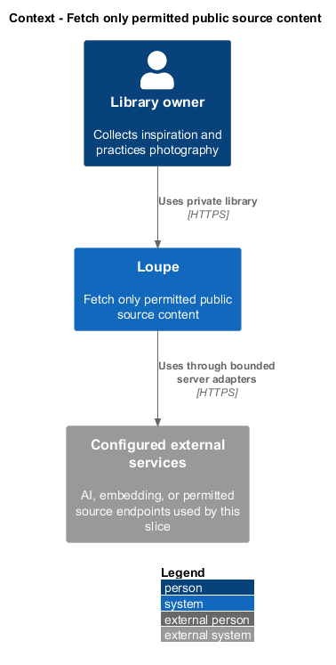
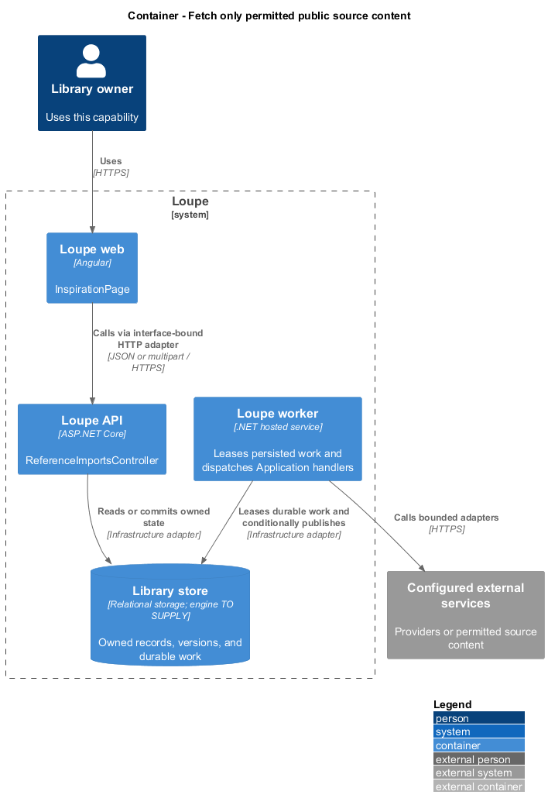
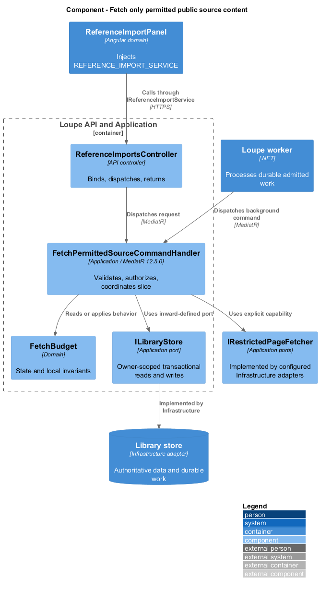
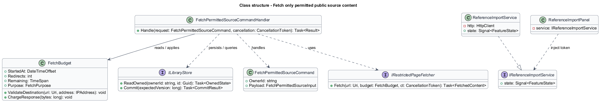
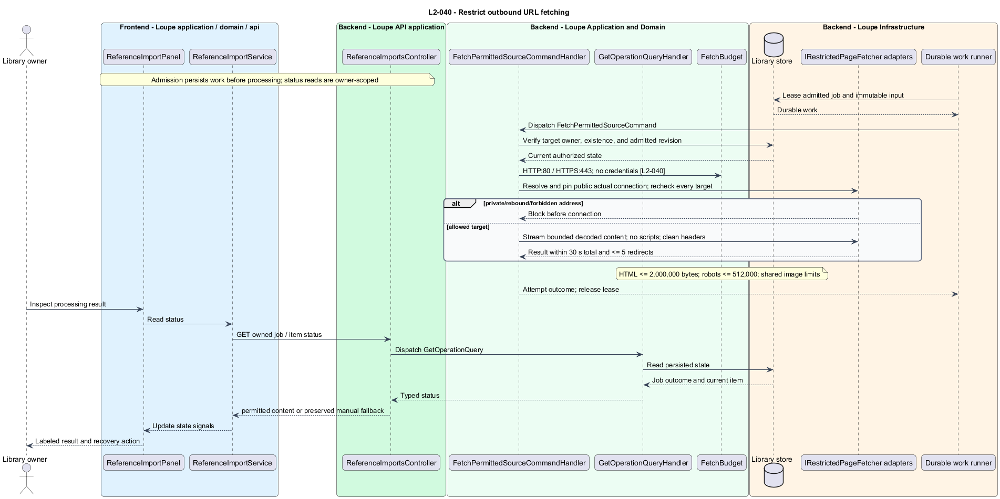

# Fetch only permitted public source content

## Overview

A **restricted fetch** — network request whose URL, resolved address, and entire redirect chain pass public-destination policy — retrieves portfolio and reference content. A **fetch budget** — shared time, redirect, and decoded-byte limits for one import — also covers robots and preview requests.

This is a proposed design for the defined requirements. Existing files are illustrative HTML mockups; the repository contains no corresponding production implementation.

## Description

`InspirationPage` lives in `frontend/projects/loupe` and owns routing and dialogs. `ReferenceImportPanel` lives in `frontend/projects/domain` and consumes `IReferenceImportService` through `REFERENCE_IMPORT_SERVICE`. The contract and token share `reference-import.service.contract.ts` in `frontend/projects/api`. `ReferenceImportService` is the separate production HTTP adapter. Composition substitutes a mock implementation under Playwright. State uses signals, and HTTP and observable conversion stay inside the adapter. Presentational controls in `components` consume inputs and emit outputs. Component class, template, and styles occupy separate files.

`ReferenceImportsController` lives in `backend/src/Loupe.Api/Controllers` under `Loupe.Api.Controllers`. It binds requests, dispatches MediatR **12.5.0**, and returns results. Requests, handlers, and validators live in the matching feature namespace in `Loupe.Application`. `FetchBudget` lives in `Loupe.Domain`; the domain references no other project. `ILibraryStore` and capability ports belong to Application. Infrastructure implements persistence and external adapters. Each type occupies its own named file.

`RestrictedPageFetcher` implements the Application port `IRestrictedPageFetcher`. It permits HTTP port 80 and HTTPS port 443 without embedded credentials. `PublicAddressPolicy` rejects private, loopback, link-local, reserved, multicast, unspecified, and cloud-metadata addresses across IPv4 and IPv6, including mapped forms. DNS validation pins the actual connection address; TLS hostname verification still uses the original allowed host. Re-resolution and each redirect repeat the full policy.

Automatic redirect handling is disabled. `FetchBudget` admits at most five redirects and 30 seconds total network time across the entire import, including robots and preview candidates. Redirect loops terminate. Streaming decoded-body limits are 2,000,000 bytes for HTML, 512,000 for robots, and the shared 25,000,000-byte image limit plus decoded image bounds. Decompression counts toward decoded limits. No script engine executes remote code.

`Loupe/1.0` is the proposed importer user-agent identifier; robots evaluation uses that same identity. A clean request-header allowlist excludes user cookies, access tokens, provider credentials, and unrelated authorization. Preview and robots URLs never inherit trust merely from a permitted original page. Failure stops before connecting to forbidden addresses and returns safe validation or manual fallback. An import keeps its saved link when a later target fails.

Controlled DNS, redirects, body streams, and a network observer prove that rebinding, IPv4-mapped IPv6, and internal redirect fixtures produce no forbidden connection. The design follows address validation and redirect controls described by the [OWASP SSRF prevention guidance](https://cheatsheetseries.owasp.org/cheatsheets/Server_Side_Request_Forgery_Prevention_Cheat_Sheet.html). The HTTP transport's connection-pinning adapter remains an implementation choice; no unrestricted fallback is permitted.

The following contract surface names the proposed operations. Background commands run in the worker after a separate admission request; local evaluation commands run in the evaluation project.

| Application request | Entry point | Input |
| --- | --- | --- |
| `FetchPermittedSourceCommand` | `import/summary worker fetch` | `URL and shared FetchBudget` |

All operations inherit [shared contracts and open dependencies](../../README.md). Owner identity comes from authenticated server context, never from trusted client input. Mutations validate complete input before side effects and use conditional writes. API errors use the shared status mapping in [L2.md](../../../specs/L2.md#shared-acceptance-definitions). Visual implementation uses mirrored `--lp-` tokens and the specification's viewport matrix.

Implementation proceeds one behavior at a time using the linked Given-When-Then criteria. Each acceptance test first fails for its expected missing behavior. API integration tests cover persistence and failures. Playwright tests use one page object per screen and injected service mocks. Real-provider release checks supplement deterministic fixtures where applicable. Each acceptance file identifies L2 coverage and each test names its criterion. Regression checks pass before the next behavior starts; no architecture tests are introduced.

## Requirements

The table preserves source wording verbatim, including its use of “must”. Quoted requirements are the sole exception to the design prose's shall/should/may convention. Each linked source section also supplies the acceptance criteria; deployment choices and unexecuted release evidence remain explicitly identified.

| L2 ID | Refines (L1) | Requirement |
| --- | --- | --- |
| `L2-040` | `L1-010` | User-provided URLs and every redirect/preview/robots target must allow only HTTP port 80 or HTTPS port 443, without embedded credentials. Resolved destinations must be public unicast addresses; private, loopback, link-local, reserved, multicast, unspecified, and cloud-metadata addresses must be blocked for IPv4 and IPv6. DNS validation must apply to the actual connected address. An import allows five redirects and a 30-second total network budget, including robots/preview requests; HTML is limited to 2,000,000 decoded bytes, robots to 512,000, and images to the shared upload limits. No remote scripts execute. |

Acceptance criteria: [L2-040](../../../specs/L2.md#l2-040-restrict-outbound-url-fetching).

## Diagrams

The context view places this capability within the owner's private Loupe library. External services appear only where the slice uses provider or source content.

The container view separates Angular interaction, the .NET API, and authoritative persistence. Durable background work appears where processing continues after admission.

The component view shows dispatch into Application handlers and inward-defined ports. Infrastructure supplies the persistence and provider implementations.

The class view names the proposed state, requests, handlers, and interface-bound frontend service. Typed associations and dependencies show which element owns behavior.

The restrict outbound url fetching sequence traces `L2-040` through its enforcing operations. The accompanying Description defines state changes and significant recovery paths.

