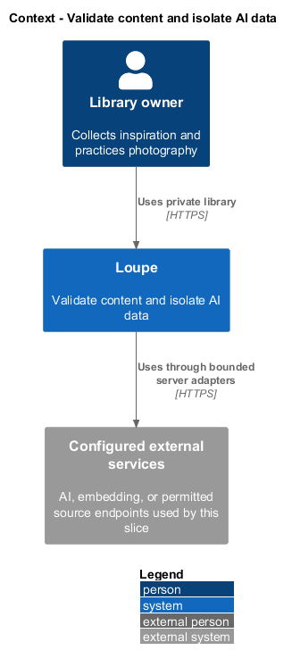
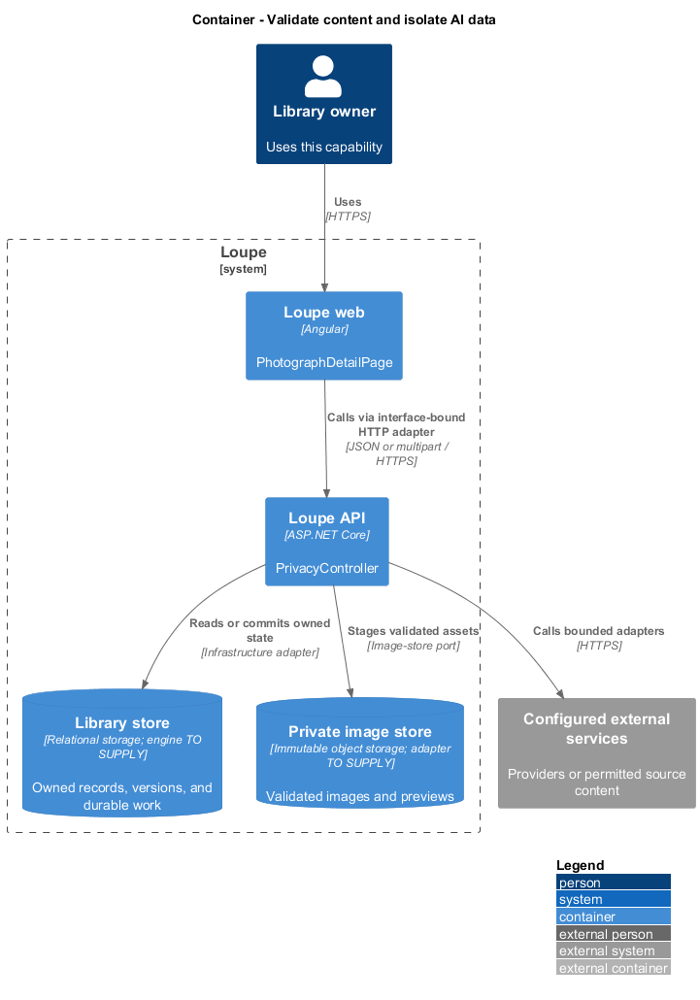
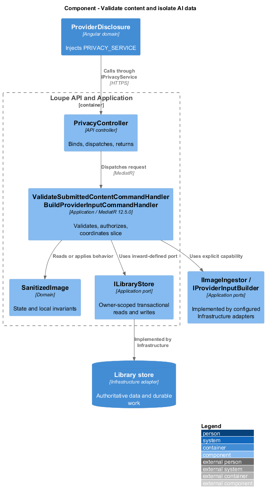
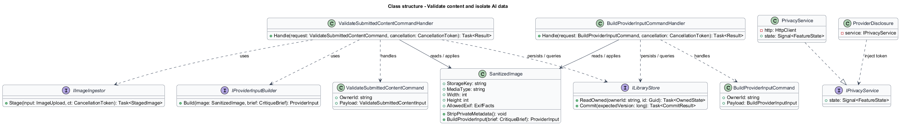
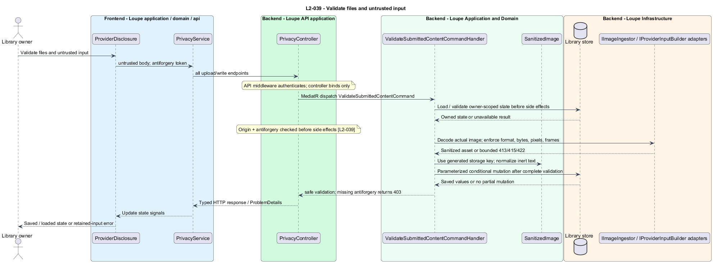
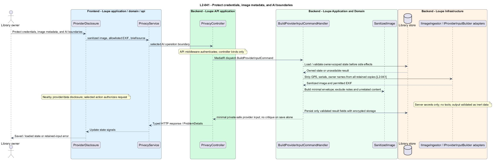

# Validate content and isolate AI data

## Overview

**Sanitized image** — validated image copy stripped of GPS, serial numbers, and owner names — protects retained media and downstream analysis. A **provider envelope** — minimal allowed input for one requested operation — isolates AI calls from unrelated library data and secrets.

This is a proposed design for the defined requirements. Existing files are illustrative HTML mockups; the repository contains no corresponding production implementation.

## Description

`PhotographDetailPage` lives in `frontend/projects/loupe` and owns routing and dialogs. `ProviderDisclosure` lives in `frontend/projects/domain` and consumes `IPrivacyService` through `PRIVACY_SERVICE`. The contract and token share `privacy.service.contract.ts` in `frontend/projects/api`. `PrivacyService` is the separate production HTTP adapter. Composition substitutes a mock implementation under Playwright. State uses signals, and HTTP and observable conversion stay inside the adapter. Presentational controls in `components` consume inputs and emit outputs. Component class, template, and styles occupy separate files.

`PrivacyController` lives in `backend/src/Loupe.Api/Controllers` under `Loupe.Api.Controllers`. It binds requests, dispatches MediatR **12.5.0**, and returns results. Requests, handlers, and validators live in the matching feature namespace in `Loupe.Application`. `SanitizedImage` lives in `Loupe.Domain`; the domain references no other project. `ILibraryStore` and capability ports belong to Application. Infrastructure implements persistence and external adapters. Each type occupies its own named file.

`IImageIngestor` checks decoded bytes independently of filename and declared MIME, enforces the shared byte/pixel/frame bounds, and generates server-chosen storage keys. Traversal strings in a display filename never affect paths. Private EXIF is removed from every retained original-quality copy, preview, and extracted record before durable commit. Raw temporary ingestion bytes use protected staging and are discarded after sanitation or failed upload cleanup. Grid previews also obey 640-pixel/200,000-byte bounds.

`ProviderInputBuilder` includes only the requested sanitized image, necessary brief/source content, and allowlisted camera/lens, aperture, shutter speed, ISO, focal length, and capture time. GPS, serial numbers, owner names, personal notes, and unrelated records are excluded. `ProviderDisclosure` identifies the configured provider and input beside the action. Selecting it authorizes that operation without a second approval dialog; saving without critique selection sends no critique request.

AI adapters have no tools or authority to execute returned instructions. Page text, image instructions, notes, and output are untrusted data. Schema validation restricts publication to the operation's result fields. Text rendering uses inert bindings, and persistence/search adapters parameterize queries. Invalid JSON, identifiers, collection lengths, or enums produce bounded validation errors without partial mutations.

`AntiforgeryOriginMiddleware` checks configured trusted browser origins and antiforgery tokens before cookie-authenticated writes. Missing/invalid protection returns 403 before side effects. The Angular HTTP adapter sends the antiforgery token, not a stored authentication token. Microsoft documents this cookie-authentication protection in its [ASP.NET Core antiforgery guidance](https://learn.microsoft.com/en-us/aspnet/core/security/anti-request-forgery).

Production endpoints enforce HTTPS. Database, media, and backups use encryption; provider credentials come from server configuration or a secret store. Log/error projection excludes planted secret values and private payloads. Provider data-retention behavior is documented from actual configuration, with no unsupported deletion promise. Secret-store and encryption-key management adapters are `<TO SUPPLY>`.

The following contract surface names the proposed operations. Background commands run in the worker after a separate admission request; local evaluation commands run in the evaluation project.

| Application request | Entry point | Input |
| --- | --- | --- |
| `ValidateSubmittedContentCommand` | `all upload/write endpoints` | `untrusted body; antiforgery token` |
| `BuildProviderInputCommand` | `selected AI operation boundary` | `sanitized image, allowlisted EXIF, brief/source` |

All operations inherit [shared contracts and open dependencies](../../README.md). Owner identity comes from authenticated server context, never from trusted client input. Mutations validate complete input before side effects and use conditional writes. API errors use the shared status mapping in [L2.md](../../../specs/L2.md#shared-acceptance-definitions). Visual implementation uses mirrored `--lp-` tokens and the specification's viewport matrix.

Implementation proceeds one behavior at a time using the linked Given-When-Then criteria. Each acceptance test first fails for its expected missing behavior. API integration tests cover persistence and failures. Playwright tests use one page object per screen and injected service mocks. Real-provider release checks supplement deterministic fixtures where applicable. Each acceptance file identifies L2 coverage and each test names its criterion. Regression checks pass before the next behavior starts; no architecture tests are introduced.

## Requirements

The table preserves source wording verbatim, including its use of “must”. Quoted requirements are the sole exception to the design prose's shall/should/may convention. Each linked source section also supplies the acceptance criteria; deployment choices and unexecuted release evidence remain explicitly identified.

| L2 ID | Refines (L1) | Requirement |
| --- | --- | --- |
| `L2-039` | `L1-010` | The server must validate decoded content independently of filenames, MIME claims, and browser checks. Text must render inertly; storage keys must be generated by the server. Uploaded filenames and metadata must not control paths or executable content. Application writes using cookies must validate antiforgery tokens and trusted origins; allowed browser origins must be explicitly configured. |
| `L2-041` | `L1-010` | Provider credentials must stay server-side. Production transport and persistent database/media/backup storage must use encryption. Only the requested image, necessary brief/source content, and allowlisted EXIF (camera/lens, aperture, shutter speed, ISO, focal length, capture time) can be sent for that operation; GPS, serial numbers, owner names, unrelated library content, and personal notes must be excluded. AI output must be data, never executable instructions. |

Acceptance criteria: [L2-039](../../../specs/L2.md#l2-039-validate-files-and-untrusted-input), [L2-041](../../../specs/L2.md#l2-041-protect-credentials-image-metadata-and-ai-boundaries).

## Diagrams

The context view places this capability within the owner's private Loupe library. External services appear only where the slice uses provider or source content.

The container view separates Angular interaction, the .NET API, and authoritative persistence. Durable background work appears where processing continues after admission.

The component view shows dispatch into Application handlers and inward-defined ports. Infrastructure supplies the persistence and provider implementations.

The class view names the proposed state, requests, handlers, and interface-bound frontend service. Typed associations and dependencies show which element owns behavior.

The validate files and untrusted input sequence traces `L2-039` through its enforcing operations. The accompanying Description defines state changes and significant recovery paths.

The protect credentials, image metadata, and ai boundaries sequence traces `L2-041` through its enforcing operations. The accompanying Description defines state changes and significant recovery paths.

