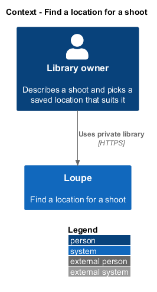
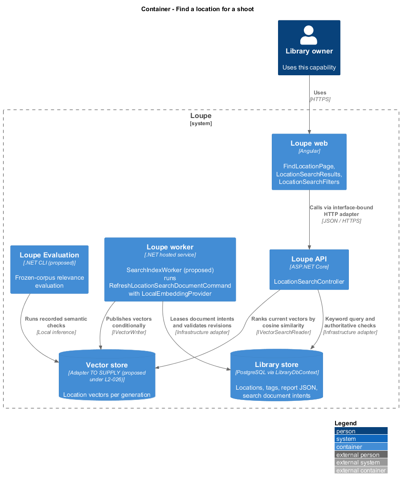
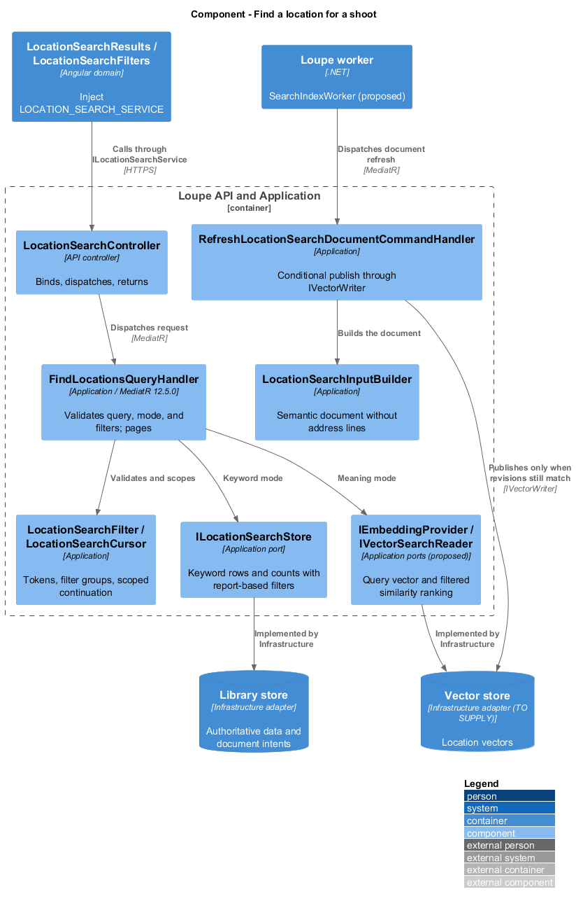
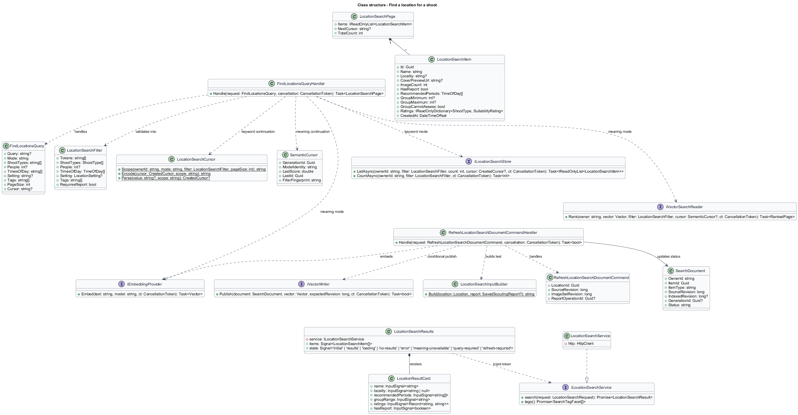
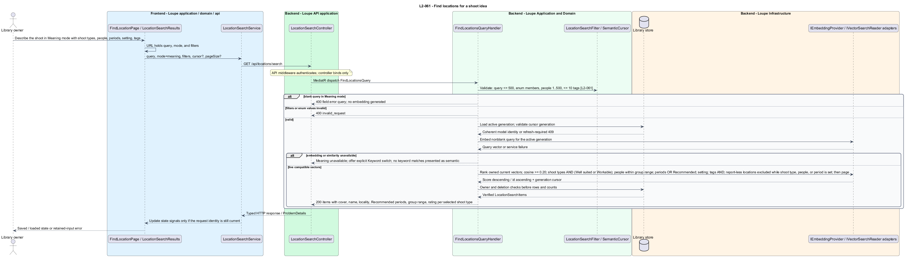
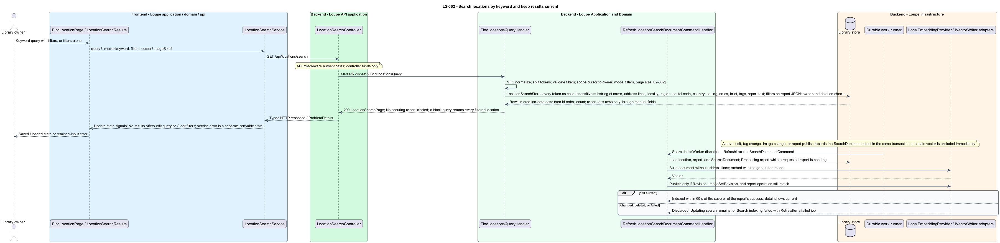
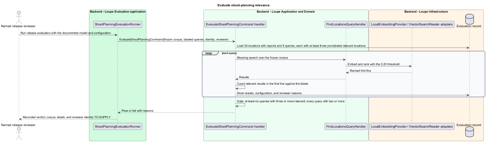

# Find a location for a shoot

## Overview

**Find a location** — search inside the Locations area that ranks the owner's own locations against a shoot idea — lets the owner describe a shoot in plain language, add structured filters, and read each result's suggested times of day, suitability, and group-size fit. It has two modes. **Keyword** — the default — requires every whitespace-separated token to occur in at least one of the location's text fields or its current report's text. **Meaning** — ranking by vector similarity of a **location vector** built from the name, locality, region, country, setting, active tags, notes, scouting brief, and the current report's text, with the street address lines excluded — finds locations without the exact words. The **shoot filters** — shoot types combined with AND where each selected type is rated Well suited or Workable, a people count within the report's group range, times of day combined with OR over Recommended periods, a setting, and up to ten active tags combined with AND — read the scouting report, so a location without a report is excluded while a shoot-type, people-count, or time-of-day filter is active and remains findable through its manual fields otherwise.

This feature covers both modes, the filters, keyword freshness, semantic indexing of locations, and the relevance evaluation. Locations belong only to Find a location; the inspiration Search designed in [search-by-keyword](../../search/search-by-keyword/README.md) excludes them. Meaning mode reuses the embedding model, the 0.20 threshold, the ranking, and the generation-bound cursor of [search-by-meaning](../../search/search-by-meaning/README.md), and indexing follows the durability, freshness, and deletion rules of [refresh-search](../../search/refresh-search/README.md).

This is a proposed design for the defined requirements. `docs/mocks/locations.html`, `docs/mocks/location.html`, and `docs/mocks/find-location.html` are the visual and interaction reference that `L2-055` names. The repository contains no Locations implementation. Keyword search over references and photographers is implemented in `SearchStore`; the embedding provider, vector reader, index worker, and generation cursor that Meaning mode and freshness depend on are the proposed designs of `L2-026` and `L2-028` and do not exist in code, so Keyword mode is implementable now and Meaning mode follows delivery of that infrastructure, as the acceptance order in `L2.md` sequences it. Components named below extend the implemented References, Critique, Search, and Deletion slices by their real names; proposed UI copy is design text, not a quotation.

## Description

`FindLocationPage` lives in `frontend/projects/loupe` and owns routing, the URL state, and the `LocationSearchFiltersDialog`. `LocationSearchResults` and `LocationSearchFilters` live in `frontend/projects/domain` and consume `ILocationSearchService` through `LOCATION_SEARCH_SERVICE`. The contract and token share `location-search.service.contract.ts` in `frontend/projects/api`. `LocationSearchService` is the separate production HTTP adapter. Composition substitutes `MockLocationSearchService` under Playwright. State uses signals, and HTTP and observable conversion stay inside the adapter. `LocationResultCard` in `components` takes display inputs and emits selection. Component class, template, and styles occupy separate files.

`LocationSearchController` lives in `backend/src/Loupe.Api/Controllers` under `Loupe.Api.Controllers`. It binds requests, dispatches MediatR **12.5.0**, and returns results. Requests, handlers, and validators live in `Loupe.Application/ShootPlanning`. `Location` and `SearchDocument` live in `Loupe.Domain`; the domain references no other project. `ILocationSearchStore`, `IEmbeddingProvider`, `IVectorSearchReader`, and `IVectorWriter` belong to Application. Infrastructure implements persistence and the vector adapters. Each type occupies its own named file.

`FindLocationsQueryHandler` returns a `LocationSearchPage` of `LocationSearchItem` values with the next cursor and total count. It validates the query and filters before any read: query 0–500 characters normalized with NFC; `Mode` keyword or meaning; each shoot type, period, and setting from its enumeration; a people count within 1–500; at most ten tags through `TagName`; violations return the shared 400. `LocationSearchFilter` carries the tokens and the filter groups. `LocationSearchCursor` binds the owner, the mode, the filter fingerprint, and the page size to a `CreatedCursor` in Keyword mode and to a `SemanticCursor` in Meaning mode, as `SearchQueryHandler` and `MeaningSearchQueryHandler` do. Filters combine with the query and with each other by AND and apply before pagination, so a page is never underfilled while eligible candidates remain.

Keyword mode uses `ILocationSearchStore`, implemented by `LocationSearchStore` in the manner of `SearchStore`: a parameterized SQL query over the owner's locations that concatenates name, address lines, locality, region, postal code, country, setting, notes, scouting brief, active tag names, and the text of the current report extracted from `ScoutingReportJson`, and requires every token as a case-insensitive NFC substring. The filters evaluate against the report JSON: every selected shoot type rated Well suited or Workable, the people count within the group range and never matching Cannot assess, at least one selected period Recommended, the setting equal, and every selected tag present. Rows without a report are excluded exactly when a shoot-type, people-count, or time-of-day filter is set; a setting or tag filter alone keeps them, and results label them No scouting report. A blank query with filters returns every location satisfying the filters. Results order by creation date descending then identifier, and an edit is visible on the next keyword read. The inspiration `SearchQueryHandler` and `SearchStore` are untouched; locations never enter them, and Find a location never returns references, photographs, or bookmarks.

Meaning mode requires a nonblank query; a blank one returns a field error without generating an embedding. `IEmbeddingProvider` embeds the query for the active `SearchGeneration`, and `IVectorSearchReader` ranks the owner's current location vectors by cosine similarity descending then identifier ascending, keeping scores of at least 0.20, applying the same filters before pagination. Ties are stable, and a cursor from a different generation returns the refresh-required 409. Provider or vector-store failure reports Meaning unavailable and offers switching to Keyword; keyword matches are never presented as semantic results.

`LocationSearchInputBuilder` builds the semantic document from name, locality, region, country, setting, active tags, notes, scouting brief, and the current report's text; the street address lines never enter it. `ILocationStore`, `ILocationImageStore`, and `ScoutingWorkStore.PublishAsync` record the location's `SearchDocument` intent in the same transaction as their change, following the refresh-search pattern. `RefreshLocationSearchDocumentCommand` runs through the `SearchIndexWorker`; its `RefreshLocationSearchDocumentCommandHandler` embeds the document with `LocalEmbeddingProvider`, and publishes through `IVectorWriter` only when the location still exists with the same `Revision`, `ImageSetRevision`, and report operation. A stale vector stops participating at mutation acknowledgment, before physical replacement. A healthy refresh completes within 60 seconds of the save, or within 60 seconds of a scouting report's success when a report was requested with the save; the detail shows Processing report during that wait, Updating search while the replacement is pending, and Search indexing failed with Retry after a failed job, while keyword search and editing remain available. Every keyword and meaning read applies owner and deletion checks before rows and counts, so a deleted location's stale vector never surfaces.

`ShootPlanningEvaluationRunner` and `EvaluateShootPlanningCommand` belong to the proposed `backend/src/Loupe.Evaluation` project beside `SemanticEvaluationRunner`. The runner uses a frozen corpus of 30 locations with reports, 8 queries with at least three pre-labeled relevant locations each, and documented model and configuration. It requires at least three of the first five results to be relevant for at least six queries and at least two for every query, assessed by a named reviewer with recorded reasons. Corpus, labels, and reviewer identity are `<TO SUPPLY>`; deterministic fixtures do not establish live quality.

`FindLocationPage` keeps query, mode, and filters in the URL, so reload and browser Back and Forward restore the same state and a response applies only when its request identity still matches. `LocationSearchFilters` renders the shoot-type, people, time-of-day, setting, and tag controls, with the dialog for narrow viewports and tag selection. `LocationSearchResults` shows the results head, the Matched by meaning label in Meaning mode, and the collection grid of `LocationResultCard` items — cover or placeholder, name, locality, Recommended periods, group range or Cannot assess, and a rating pill for each selected shoot type — each opening the location detail. It distinguishes No results, which offers editing the query or clearing filters, from the retryable service error, and from Meaning unavailable, which offers the Keyword switch. `ILocationSearchService` declares `search(request)` and `tags()`; `MockLocationSearchService` forwards to `window.loupeLocationSearch`, and the `find-location-page.js` page object owns the selectors.

The following contract surface names the proposed operations. Background commands run in the worker after a separate admission request; local evaluation commands run in the evaluation project.

| Application request | Entry point | Input |
| --- | --- | --- |
| `FindLocationsQuery` | `GET /api/locations/search` | `query?, mode=keyword\|meaning, shootTypes[], people?, timesOfDay[], setting?, tags[], pageSize?, cursor?` |
| `RefreshLocationSearchDocumentCommand` | `worker; intent recorded with the mutation` | `locationId, sourceRevision, imageSetRevision, reportOperationId?` |
| `EvaluateShootPlanningCommand` | `local evaluation runner` | `frozen corpus, labeled queries, model/configuration, reviewer` |

All operations inherit [shared contracts and open dependencies](../../README.md). Owner identity comes from authenticated server context, never from trusted client input. Mutations validate complete input before side effects and use conditional writes. API errors use the shared status mapping in [L2.md](../../../specs/L2.md#shared-acceptance-definitions). Visual implementation uses mirrored `--lp-` tokens and the specification's viewport matrix.

Implementation proceeds one behavior at a time using the linked Given-When-Then criteria. Each acceptance test first fails for its expected missing behavior. API integration tests cover persistence and failures. Playwright tests use one page object per screen and injected service mocks. Real-provider release checks supplement deterministic fixtures where applicable. Each acceptance file identifies L2 coverage and each test names its criterion. Regression checks pass before the next behavior starts; no architecture tests are introduced.

## Requirements

The table preserves source wording verbatim, including its use of "must". Quoted requirements are the sole exception to the design prose's shall/should/may convention. Each linked source section also supplies the acceptance criteria; deployment choices and unexecuted release evidence remain explicitly identified.

| L2 ID | Refines (L1) | Requirement |
| --- | --- | --- |
| `L2-061` | `L1-016` | Find a location must offer Keyword and Meaning modes, with Keyword the default. Meaning mode must rank vector similarity over a location vector built from the name, locality, region, country, setting, active tags, notes, scouting brief, and the current report's text; the street address lines are excluded. It must use the same embedding model, 0.20 similarity threshold, ranking, and cursor-generation rules as L2-026 and depends on that infrastructure. Filters are shoot types (AND; each selected type must be rated Well suited or Workable), people count (within the report's group range), times of day (OR over Recommended periods), setting, and up to ten active tags (AND). Filters combine with the query and each other with AND and apply before pagination. |
| `L2-062` | `L1-016` | Keyword mode must apply the L2-024 matching rule over the location name, address lines, locality, region, postal code, country, setting, notes, scouting brief, active tags, and the current report's text. Filters are those defined in L2-061. Location indexing must follow the L2-028 durability, freshness, and deletion rules. Locations belong only to Find a location; the inspiration Search excludes them. |

Acceptance criteria: [L2-061](../../../specs/L2.md#l2-061-find-locations-for-a-shoot-idea), [L2-062](../../../specs/L2.md#l2-062-search-locations-by-keyword-and-keep-results-current).

## Diagrams

The context view places this capability within the owner's private Loupe library. No external service appears: keyword search reads the library store, and semantic inference runs inside the deployment.

The container view separates Angular interaction, the .NET API, authoritative persistence, the vector store, the index worker, and the evaluation project.

The component view shows dispatch into the query handler, the keyword store, the semantic ports, and the refresh command the index worker runs.

The class view names the proposed query, filter, cursor, result, and refresh types, the ports, and the interface-bound frontend service. Typed associations and dependencies show which element owns behavior.

The meaning sequence traces `L2-061` through validation, embedding, filtered ranking, and the unavailable and blank-query alternates. The accompanying Description defines state changes and significant recovery paths.

The keyword sequence traces `L2-062` through the immediate keyword read and the durable document refresh that keeps semantic results current.

The release runner fixes relevance labels before executing live semantic queries over the frozen location corpus. It records the model and configuration and checks the per-query and aggregate thresholds.

